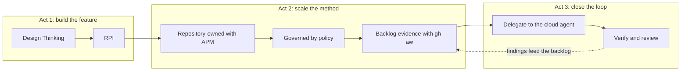

# AI SDLC with Github Copilot and HVE Core

A hands-on series of two workshops (240 minutes for GitHub Copilot Zero to Hero; an estimated 255 for the AI SDLC workshop). It starts with individual GitHub Copilot primitives and ends with a governed, agentic software development lifecycle: repository-owned packages, policy, structured Research → Plan → Implement → Review execution, automated backlog management, and controlled delegation to the Copilot cloud agent.

> **Before D-Day:** every attendee and administrator must complete the checklist for the delivery option your organization chose: [Codespaces](docs/before-d-day-codespace.md), [local dev container](docs/before-d-day-devcontainer.md) or [local tools](docs/before-d-day-local.md). The shared reference is [docs/prerequisites.md](docs/prerequisites.md); organization owners can walk through [docs/kick-off-call-checklist.md](docs/kick-off-call-checklist.md) live during the kick-off call. Most setup problems on the day come from licences, organization policies, and corporate networks, and none of them can be fixed in the room.

## At a glance

| | **GitHub Copilot Zero to Hero** | **AI SDLC with Github Copilot and HVE Core** |
| --- | --- | --- |
| Goal | Become fluent with Copilot primitives in VS Code, Copilot CLI and on github.com | Run a governed, agentic SDLC on a real repository |
| Repository | Your fork of [Philess/gh-copilot-demo](https://github.com/Philess/gh-copilot-demo) | Your private copy of this template |
| Lab guide | [docs/afternoon-1/workshop.md](docs/afternoon-1/workshop.md) | [docs/afternoon-2/workshop.md](docs/afternoon-2/workshop.md) |
| Audience | Developers new to Copilot or using only completions and chat; advanced developers and architects take the fast track | Developers, tech leads and platform engineers who completed GitHub Copilot Zero to Hero or have equivalent experience |

## Key concepts

| Concept | In one sentence | Practised in |
| --- | --- | --- |
| **Copilot primitives** | Custom instructions, prompt files, custom agents, Agent Skills, MCP servers and hooks: the building blocks that shape what Copilot knows and can do | GitHub Copilot Zero to Hero, Levels 5–7 and Deeper primitives |
| **Copilot CLI** | Copilot as a terminal agent that plans, edits and runs commands, with the same primitives as VS Code | GitHub Copilot Zero to Hero, Level 8; the AI SDLC workshop throughout |
| **Plugins and marketplaces** | A plugin bundles primitives into one installable unit; a marketplace is a Git repository that lists plugins for discovery | GitHub Copilot Zero to Hero, Level 9; the AI SDLC workshop, Levels 1 and 4 |
| **HVE-Core** | Microsoft's open-source library of Copilot agents, prompts, instructions and skills for hypervelocity engineering, including the Design Thinking coach and the RPI workflow | the AI SDLC workshop, Levels 1–3 |
| **Design Thinking coach** | An HVE-Core agent that guides a team from a vague request to a scoped, user-centred problem statement before any code is written | the AI SDLC workshop, Level 2 |
| **RPI (Research → Plan → Implement → Review)** | A structured agentic workflow that separates investigation, planning, implementation and review into explicit phases with durable artifacts | the AI SDLC workshop, Level 3 |
| **Context engineering** | Deciding what an agent sees: layered instructions, skills loaded on demand, and phase artifacts on disk instead of a long chat history | GitHub Copilot Zero to Hero, Deeper primitives; the AI SDLC workshop, Level 3 |
| **Verification as contract** | Tests, CI and branch rulesets define "done" for humans and agents alike, so delegated work is checked the same way as your own | the AI SDLC workshop, Levels 5a and 6 |
| **Agentic threat model** | Prompt injection, safe outputs, the agent firewall and token scope: what limits an agent that runs without you | the AI SDLC workshop, Levels 5b and 6 |
| **APM (Agent Package Manager)** | A package manager for agent primitives: declare dependencies in `apm.yml`, pin them in a lockfile, and enforce policy and audits in CI | the AI SDLC workshop, Level 4 |
| **GitHub Agentic Workflows (gh-aw)** | Markdown-defined workflows compiled to GitHub Actions, where a coding agent runs on a schedule or on events, with safe outputs such as issues and comments | the AI SDLC workshop, Levels 5a and 5b |
| **Copilot cloud agent** (formerly coding agent) | Assign an issue to Copilot; it works in a GitHub Actions environment and opens a pull request for human review | GitHub Copilot Zero to Hero, Level 6; the AI SDLC workshop, Levels 5b and 6 |
| **Model selection and usage** | Explicit model choice versus Auto model selection, and how usage is measured differently in each Copilot experience | the AI SDLC workshop, Recap and Extra Credits |

Each lab opens with a short refresher on these concepts. HydraFusion multi-model orchestration is a **Research Preview** and appears only as optional Extra Credit.

## GitHub Copilot Zero to Hero

Runs the official [GHCopilotHoL](https://moaw.dev/workshop/gh:Philess/GHCopilotHoL/main/docs/) lab on a fork of [Philess/gh-copilot-demo](https://github.com/Philess/gh-copilot-demo), then adds its own levels. The levels climb an **autonomy ladder**: each one hands Copilot more autonomy, so each one needs a stronger review step.

| Level | Topic | You will | What it adds, and why the previous level was not enough |
| --- | --- | --- | --- |
| Setup | Environment | Fork the demo, open it in your chosen environment, install Copilot CLI | |
| 1 | Code completion | Use inline suggestions and next edit suggestions | The baseline: Copilot suggests, you type |
| 2 | Copilot Chat | Ask, explain, fix and generate tests in chat | Completions see one file; Chat reasons over the context you attach |
| 3 | Agent basics | Let agent mode edit several files and run commands | Chat answers; an agent acts across files and tools |
| 4 | Plan and implement | Plan a change, then implement it with the agent | An agent that acts without a plan drifts; a plan gives you a gate |
| 5 | Advanced concepts | Custom instructions, prompt files, custom agents and MCP | Prompts are forgotten after the session; primitives make context durable and versioned |
| 6 | Agents on the platform | Assign an issue to the Copilot cloud agent and use your custom agents on github.com | Local agents need you at the keyboard; the cloud agent works asynchronously |
| 7 | Agent Skills | Create and use an Agent Skill | Instructions are always loaded; skills load procedures only when needed |
| 8 | Copilot CLI | Drive the same repository from the terminal | The same primitives, in a harness you can script |
| Advanced | Deeper primitives | Layer instructions, add a guardrail hook, review MCP governance | Primitives shape what the agent knows; hooks and MCP policy limit what it can do |
| 9 | Plugins and marketplaces | Browse and install plugins from a marketplace in Copilot CLI and VS Code | Files in one repository do not travel; plugins share them across repositories |
| Recap | | What to take back to your team | |

For advanced developers and architects, the **fast track** turns upstream Levels 1 to 4 into self-paced pre-work or a short facilitator demo, and spends the time saved on the **Deeper primitives** page. See [docs/tutor.md](docs/tutor.md).

## AI SDLC with Github Copilot and HVE Core

Attendees build one capability in a small music catalog app (**browse tracks and add them to an in-memory playlist**) while progressively adding governance and automation.

| Level | Topic | You will | What it adds, and why the previous level was not enough |
| --- | --- | --- | --- |
| 0 | Setup | Create your repository from the template and verify the environment | |
| 1 | HVE-Core CLI plugin | Install HVE-Core into Copilot CLI and explore its agents | GitHub Copilot Zero to Hero primitives were your own; HVE-Core brings a shared method |
| 2 | Design Thinking coach | Turn the playlist request into a scoped problem statement | Agents build exactly what you ask; first decide what is worth asking |
| 3 | RPI loop | Research, plan, implement and review the playlist feature, with context engineering and one real decision at the review gate | A single prompt mixes facts, decisions and edits; RPI separates them into reviewable artifacts |
| 4 | APM and repository agents | Register your curated marketplace in CLI/VS Code, install HVE, inspect source/version metadata, then install and audit pinned repository agents | Discovery does not enforce trust; personal setup does not travel with the code |
| 5 | Agentic workflows and delegation | Reconcile opted-in issues with committed plans and delivery evidence, then delegate a scoped RPI task | The backlog should reflect reality; people select work while automation records evidence |
| 6 | Review the delegated work | Request Copilot review on the RPI PR, inspect required checks, and verify issue/Project closure after human acceptance | The coding agent's self-review is not independent review or a merge decision |
| Recap | | Operating model, then an architect capstone: org rollout, measuring impact, brownfield adoption, method and model choice | |
| Extra Credits | | Model and harness measurement, HydraFusion (Research Preview) | |

### The crescendo

AI SDLC with Github Copilot and HVE Core tells one story in three acts: build a feature, scale the method that built it, then close the loop.



Each step reuses the previous output: Design Thinking decisions scope RPI, committed planning and PR evidence keep the backlog current, and a human selects the next cloud-agent task. Level 4 includes participant marketplace practice; GitHub Copilot app setup and browser-supported accessibility review remain tutor demonstrations. Its additional practice extends the estimated AI SDLC workshop delivery to 255 minutes without cutting APM.

## Delivery options

Both labs support three ways to work. Pick one per attendee before D-Day.

| Option | Summary | Best when | Before D-Day checklist |
| --- | --- | --- | --- |
| 🥇 **GitHub Codespaces** | Nothing to install; a preconfigured cloud environment | Your network and organization allow Codespaces (recommended) | [before-d-day-codespace.md](docs/before-d-day-codespace.md) |
| 🥈 **Local dev container** | The same environment in Docker or Podman on your machine | Codespaces is blocked, but containers are allowed | [before-d-day-devcontainer.md](docs/before-d-day-devcontainer.md) |
| 🥉 **Local tools** | Install Git, Node.js, .NET, GitHub CLI, Copilot CLI, APM and gh-aw yourself | Containers are not allowed | [before-d-day-local.md](docs/before-d-day-local.md) |

Each checklist is self-contained: organization settings, network rules, attendee installation, D-7 and D-1 checks, and troubleshooting for that option only. The [prerequisites](docs/prerequisites.md) page keeps the full comparison and the complete endpoint table.

## Pre-D-Day checklist (summary)

The complete lists, with commands and owners, are in the per-option checklists above.

**Every attendee**

- [ ] GitHub account with an active **Copilot Business or Enterprise** seat, visible at [github.com/settings/copilot](https://github.com/settings/copilot)
- [ ] **VS Code** with GitHub Copilot Chat, signed in to the same account, and Chat answers a prompt
- [ ] A delivery option chosen and tested:
  - Codespaces: a test Codespace opens in the browser and in VS Code
  - Dev container: **Docker** or **Podman** works (`docker run --rm hello-world`, or Podman with `dev.containers.dockerPath` set to `podman` and an optional `docker` alias)
  - Local tools: Git, Node.js 22, .NET 8 (GitHub Copilot Zero to Hero) and .NET 10 (the AI SDLC workshop), GitHub CLI, Copilot CLI, APM CLI and gh-aw all print a version
- [ ] GitHub Copilot Zero to Hero fork of `Philess/gh-copilot-demo` runs: API on port 3000 and viewer on port 3001
- [ ] Network checks pass from the network you will use on the day: `github.com`, `api.github.com`, `*.githubcopilot.com`, `*.github.dev`, the Codespaces tunnel at `global.rel.tunnels.api.visualstudio.com`, and `ghcr.io`

**Organization or enterprise owners**

- [ ] Copilot seats assigned to all attendees
- [ ] Copilot policies: Copilot CLI, Copilot cloud agent, MCP servers, allowed models, preview features, and plugins or marketplaces
- [ ] Codespaces enabled for attendees on private repositories, with a billing owner and spending limit
- [ ] No organization IP allow list on the organization hosting the attendee repositories (it disables Codespaces)
- [ ] GitHub Actions enabled, and `actions/*` and `github/gh-aw-actions/*` allowed
- [ ] Members can create private repositories from a template and fork public repositories
- [ ] Network team has the allowlist (`gh api meta --jq '.domains.codespaces'` for Codespaces, plus the Copilot allowlist), including TLS-inspection exclusions
- [ ] Budgets reviewed for Copilot usage, Actions minutes and Codespaces

## Repository contents

| Path | Purpose |
| --- | --- |
| [docs/prerequisites.md](docs/prerequisites.md) | Shared prerequisites, network allowlist, organization settings and checklists |
| [docs/before-d-day-codespace.md](docs/before-d-day-codespace.md), [docs/before-d-day-devcontainer.md](docs/before-d-day-devcontainer.md), [docs/before-d-day-local.md](docs/before-d-day-local.md) | Before D-Day checklist for each delivery option |
| [docs/kick-off-call-checklist.md](docs/kick-off-call-checklist.md) | D-Day readiness checklist (licences, Copilot features, Actions, Codespaces, network) to run live with the customer during the kick-off call |
| [docs/afternoon-1/workshop.md](docs/afternoon-1/workshop.md) | GitHub Copilot Zero to Hero lab guide |
| [docs/afternoon-2/workshop.md](docs/afternoon-2/workshop.md) | AI SDLC with Github Copilot and HVE Core lab guide |
| [docs/tutor.md](docs/tutor.md) | Facilitator guide: timing, pre-flight, risks and messaging guardrails |
| [solutions/afternoon-2](solutions/afternoon-2) | Reference solution files for the AI SDLC workshop |
| [tests/workshop/afternoon-2](tests/workshop/afternoon-2/README.md) | An agentic workflow that replays the AI SDLC workshop lab in a throwaway Codespace on every change to `main` and files an issue when a step fails |
| [CONTRIBUTING.md](CONTRIBUTING.md) | Writing rules, upstream pins, MOAW preview and validation |
| [docs/maintainer-handbook.md](docs/maintainer-handbook.md) | Design decisions, verified facts, open assumptions and how to resume the work |
| [docs/design/README.md](docs/design/README.md) | Curated Design Thinking outcomes: problem and scope, stakeholders, assumptions |

## Starter application (the AI SDLC workshop)

A small music catalog mono-repo:

- `src/api`: a .NET 10 minimal API exposing `GET /api/hello`, with 12 synthetic tracks in `Data/tracks.json`
- `src/front`: a React, TypeScript and Vite front end
- `tests/api`: xUnit integration tests

```bash
dotnet test
cd src/front
npm ci
npm test
```

## Prebuilt dev container image

The root `.devcontainer.json` pulls `ghcr.io/justrebl/ai-sdlc-workshop/devcontainer`, which already contains Git, Node.js 22, .NET 10, GitHub CLI, GitHub Copilot CLI and APM CLI. `postCreateCommand` then adds the `gh-aw` extension and restores the .NET and front-end dependencies. Authentication, the Copilot licence and organization policies still have to be configured as described in the [prerequisites](docs/prerequisites.md).

The image is defined in [`.github/devcontainer-image/`](.github/devcontainer-image/) and published to GitHub Container Registry by the [Devcontainer image workflow](.github/workflows/devcontainer-image.yml) only when a file under `.github/devcontainer-image/.devcontainer/` changes on `main`. Pull requests that touch it build the image without publishing. Each build is tagged `latest` and `tree-<hash>`, where `<hash>` is the first 12 characters of the folder's Git tree hash; the workshop tester pins its sandbox Codespace to the `tree-<hash>` tag of the tested commit.

If you create your own copy of this template, replace `justrebl/ai-sdlc-workshop` in the root `.devcontainer.json` with your lowercase `owner/repo`, push any change under `.github/devcontainer-image/.devcontainer/` to `main` to publish the first image, then set the `devcontainer` package visibility to **Public** in its package settings.

## Publishing on MOAW

The guides follow the [MOAW](https://moaw.dev) conventions. See [CONTRIBUTING.md](CONTRIBUTING.md) for preview URLs, writing rules and validation.

## Feedback

Open an issue at <https://github.com/Justrebl/AI-SDLC-Workshop/issues>.
