# AI SDLC with Github Copilot and HVE Core

*Version 1.0 - September 2026*

Welcome to this workshop. It follows **GitHub Copilot Zero to Hero**: there you used Copilot primitives one at a time. Here you combine them into a governed, AI-assisted software development lifecycle (SDLC) for a real repository.

Build a small Music Catalog feature: browse tracks and add them to **one in-memory playlist**, with duplicate rejection and a visible empty state. Then share the method, automate surrounding work, and review a delegated change.

<details>
<summary>How the AI SDLC workshop connects the SDLC stages</summary>

You will go from an idea to a merged change and then automate the work around it. AI SDLC with Github Copilot and HVE Core tells one story in three acts:

1. **Build the feature.**
   - Frame a deliberately small capability with the HVE-Core **Design Thinking Coach**.
   - Implement it with the **RPI** workflow (Research, Plan, Implement, Review), and make one real design decision at the review gate.
2. **Scale the method that built it.**
   - Make the method repository-owned and governed with **APM** and policy.
   - Compare that with discovering capabilities in a Copilot **plugin marketplace**.
   - Reconcile issues with committed planning and delivery evidence using **GitHub Agentic Workflows (gh-aw)**.
3. **Close the loop.**
   - Delegate one scoped RPI issue to **Copilot cloud agent** (formerly Copilot coding agent), behind a test contract.
   - Review its pull request with required checks and a separate Copilot code review.

The recap turns this into an operating model, then looks at it as an architect would: org rollout, measuring impact, brownfield adoption, and choosing a method and a model.

The shared application is the Music Catalog starter. It has a React + TypeScript + Vite front end in `src\front`, a .NET 10 minimal API in `src\api`, xUnit API tests in `tests\api`, and synthetic seed data in `src\api\Data\tracks.json`. The capability for today is fixed: **browse tracks and add tracks to a single in-memory playlist**. Duplicate adds are rejected. The empty playlist state is visible.

</details>

<div class="task" data-title="How to read this lab">

> Each level starts with a short **Topic**, then actions with observable checkpoints where needed. Expand optional explanations for more background; required actions and warnings stay visible. Copy-paste prompts are in code blocks. Reference solutions are in `solutions\afternoon-2`. Commit reviewed changes when a step calls for it.

</div>

<div class="warning" data-title="Product evolution">

> GitHub Copilot, Copilot CLI, HVE-Core, APM, Agent Plugins, gh-aw, and Copilot cloud agent evolve quickly. Screens, labels, commands, and availability may change after this workshop is written. When a feature looks different, check the current documentation linked in the relevant section and adapt without changing the learning objective.

</div>

## 🎓 Key concepts

You can start the lab without reading the full reference below. Return to it when a term is unfamiliar.

<details>
<summary>Reference: Copilot primitives, HVE, APM, workflows, and trust</summary>

### Copilot primitives (recap from GitHub Copilot Zero to Hero)

Primitives are the building blocks that you combine in this lab:

| Primitive | What it carries | Where it lives |
| --- | --- | --- |
| [Custom instructions](https://docs.github.com/en/copilot/how-tos/configure-custom-instructions/add-repository-instructions) | Always-on conventions | `.github\copilot-instructions.md`, `*.instructions.md` |
| [Prompt files](https://code.visualstudio.com/docs/copilot/customization/prompt-files) | Reusable tasks you invoke by name | `*.prompt.md` |
| [Custom agents](https://code.visualstudio.com/docs/copilot/customization/custom-agents) | A persona with its own tools and rules | `*.agent.md` |
| [Agent skills](https://docs.github.com/en/copilot/concepts/agents/about-agent-skills) | Task knowledge loaded on demand | `skills\<name>\SKILL.md` |
| [MCP servers](https://code.visualstudio.com/docs/copilot/customization/mcp-servers) | External tools and data | `mcp.json` |
| [Plugins](https://code.visualstudio.com/docs/copilot/customization/agent-plugins) and [marketplaces](https://docs.github.com/en/copilot/how-tos/copilot-cli/customize-copilot/plugins-finding-installing) | A bundle of primitives and a catalogue to share it | `plugin.json`, `marketplace.json` |

Principle: **context is the product**. The quality of an agent's output depends on the context that you give it. Primitives make that context explicit, reviewable, and versioned.

### HVE and HVE-Core

[HVE-Core](https://microsoft.github.io/hve-core/) (Hypervelocity Engineering Core) is an open-source, opinionated agentic SDLC framework from Microsoft. It ships agents, prompts, instructions, and skills as a Copilot plugin. Its central principle is **"AI carries the rules, humans keep the judgment."**

- **Design Thinking Coach**: guides a team through the problem space before any code is written: scope, research, synthesis, then ideas.
- **RPI (Research → Plan → Implement → Review)**: separates finding facts, deciding, changing code, and verifying. Each phase writes an artifact that a human can review, and each phase starts from a clean context.
- HVE-Core describes itself as *rapidly evolving*. Treat it as a source of patterns, and pin the version that you use.

### APM (Agent Package Manager)

[APM](https://microsoft.github.io/apm/) is a dependency manager for agent context. It applies the `package.json` model to agent context.

- `apm.yml` declares the skills, prompts, instructions, plugins, and MCP servers that a repository needs.
- The **lockfile** pins exact versions, so every developer and CI run gets the same context.
- **Policy** and `apm audit` restrict allowed sources, executable components, and MCP servers at enterprise, organization, or repository level.
- Principle: agent context is part of your **software supply chain**. Review, version, and govern it like code.

### GitHub Agentic Workflows (gh-aw)

[gh-aw](https://github.github.com/gh-aw/) lets you write repository automation in Markdown and run it as GitHub Actions. It is part of the GitHub Next [Continuous AI](https://githubnext.com/projects/continuous-ai) research.

- You write `*.md` and compile it to a `*.lock.yml` that Actions runs. Commit both files.
- The agent runs with **read-only permissions**. Writes such as issues, comments, and pull requests go through declared **safe outputs**.
- Principle: put automation on a schedule or an event, but keep strong guardrails and keep humans in the loop.

### Copilot cloud agent (formerly coding agent)

[Copilot cloud agent](https://docs.github.com/en/copilot/concepts/agents/cloud-agent/about-cloud-agent) works on an issue in its own GitHub Actions environment and opens a pull request for review.

- `copilot-setup-steps.yml` prepares its environment. Repository instructions and custom agents shape its behaviour.
- Branch protection, required reviews, and CI remain the gates. The agent proposes the change and humans approve it.
- By default, the agent checks its own changes with CodeQL, the GitHub Advisory Database, secret scanning and Copilot code review before it completes the pull request ([risks and mitigations](https://docs.github.com/en/copilot/concepts/agents/cloud-agent/risks-and-mitigations)).

### Copilot code review and secret scanning

- [Copilot code review](https://docs.github.com/en/copilot/concepts/agents/code-review) reviews a pull request like a human reviewer. It reads the repository custom instructions, such as `.github/copilot-instructions.md`, from the pull request's head branch.
- [Secret scanning](https://docs.github.com/en/code-security/secret-scanning/introduction/about-secret-scanning) detects credentials in the Git history. [Push protection](https://docs.github.com/en/code-security/secret-scanning/introduction/about-push-protection) blocks a push that contains a secret before it reaches the repository.
- Both act on pull requests and pushes. They review agent output in the same way as human output.

### Context, verification and trust

Three ideas connect the levels. Each one gets a short segment where it matters.

- **Context engineering** (Level 3): an agent only knows what is in its context window. Layered instructions, skills loaded on demand, and phase artifacts written to disk keep that context small and reviewable.
- **Verification as contract** (Levels 5 and 6): tests, CI and branch rulesets define "done". The same checks apply to your commits and to an agent's pull request.
- **Agentic threat model** (Levels 5 and 6): an agent that runs without you reads text that other people wrote. Read-only permissions, safe outputs, the agent firewall and narrow tokens limit what that text can make it do.

### Further reading

- [Customize Copilot in VS Code (overview)](https://code.visualstudio.com/docs/copilot/customization/overview)
- [GitHub Copilot CLI](https://docs.github.com/en/copilot/how-tos/copilot-cli)
- [HVE-Core repository](https://github.com/microsoft/hve-core)
- [Customize the Copilot cloud agent environment](https://docs.github.com/en/copilot/how-tos/copilot-on-github/customize-copilot/customize-cloud-agent)
- [Model Context Protocol](https://modelcontextprotocol.io/)
- [Copilot billing and usage](https://docs.github.com/en/copilot/concepts/billing-and-usage)

</details>

## 🚀 Dev Environment Setup

To complete this lab, you need:

- A GitHub account with a GitHub Copilot licence. Business or Enterprise is recommended. Copilot cloud agent, plugins, and gh-aw may need administrator enablement. See the [full prerequisites checklist](https://github.com/Justrebl/AI-SDLC-Workshop/blob/main/docs/prerequisites.md) for the policy, licence, and administrator checks, or the checklist for your delivery option: [Codespaces](https://github.com/Justrebl/AI-SDLC-Workshop/blob/main/docs/before-d-day-codespace.md), [local dev container](https://github.com/Justrebl/AI-SDLC-Workshop/blob/main/docs/before-d-day-devcontainer.md) or [local tools](https://github.com/Justrebl/AI-SDLC-Workshop/blob/main/docs/before-d-day-local.md).
- **Your own repository** created from the workshop template. Level 4 publishes repository agents, Level 5 runs a bounded workflow and assigns an issue to Copilot cloud agent, and Level 6 reviews its pull request, so the repository must belong to you.

Create your repository from the template: open [Justrebl/AI-SDLC-Workshop](https://github.com/Justrebl/AI-SDLC-Workshop), select **Use this template** → **Create a new repository**, and choose a **private** repository under your account. [Learn more about template repositories](https://docs.github.com/en/repositories/creating-and-managing-repositories/creating-a-repository-from-a-template).

<details>
<summary>🪛 setup/troubleshoot: repository creation alternatives</summary>

After signing in with `gh auth login`, replace `my-music-catalog` with any name:

```bash
gh repo create my-music-catalog --private --template Justrebl/AI-SDLC-Workshop --clone
cd my-music-catalog
```

If template creation is unavailable, use [GitHub Importer](https://docs.github.com/en/migrations/importing-source-code/using-github-importer/importing-a-repository-with-github-importer)
to import `https://github.com/Justrebl/AI-SDLC-Workshop` into your own private
repository. Importing preserves existing commits, so the later HVE commit prompt
has a valid `HEAD`; do not delete `.git` and make an unborn repository.
If your policy also blocks import, ask the tutor for an approved prepared copy.

Ask Copilot in your local workspace to clone your imported repository, replacing `OWNER` with your account. This is a repository setup request, not a commit request:

```text
Clone https://github.com/OWNER/my-music-catalog into a new my-music-catalog folder.
Stop if that destination already exists; do not overwrite it. Verify the origin
and default branch, then tell me which folder to open. Do not create a commit or push.
```

`gh repo view` should show your own repository with a `main` branch. If a later publication is rejected for missing the `workflow` scope, follow the Level 5 setup/troubleshoot block for workflow-file pushes, then retry the same scoped publication request.

</details>

The repository ships a [dev container](https://code.visualstudio.com/docs/devcontainers/containers) based on a **prebuilt image**. The image already contains Git, Node.js 22, .NET 10, GitHub CLI, Copilot CLI, and APM CLI. On first start, the dev container installs the gh-aw extension and restores the API and front-end dependencies.

Choose one of the following three options.

### 🥇 Option 1: Pre-configured GitHub Codespace

Use this option if you want everything ready in a browser or in VS Code, with nothing to install.

1. In your new repository, select **<> Code** → **Codespaces** → **+** (Create codespace on main). See [Creating a codespace](https://docs.github.com/en/codespaces/developing-in-a-codespace/creating-a-codespace-for-a-repository).
2. Wait for the `postCreateCommand` to finish in the terminal.

<div class="info" data-title="Codespaces usage">

> Codespaces usage is billed or counted against your included quota, depending on your account. Check [GitHub Codespaces billing](https://docs.github.com/en/billing/concepts/product-billing/github-codespaces), and stop or delete your codespace after the workshop.

</div>

### 🥈 Option 2: Local dev container

Use this option if you prefer to work locally with the same tooling as the codespace.

1. Install [Git](https://git-scm.com/downloads), [Docker Desktop](https://www.docker.com/products/docker-desktop/), and [VS Code](https://code.visualstudio.com/download) with the **Dev Containers** extension.
2. Clone your repository and open it in VS Code.
3. Run **Dev Containers: Reopen in Container** from the Command Palette.

### 🥉 Option 3: Local environment

Use this option if you cannot run containers. Install:

| Tool | Why |
| --- | --- |
| [Git](https://git-scm.com/downloads) | Checkpoint commits and APM dependency resolution |
| [VS Code](https://code.visualstudio.com/download) + GitHub Copilot Chat | Local agent work |
| [Node.js 22 LTS](https://nodejs.org/en/download) | Vite + React front end, and Copilot CLI |
| [.NET 10 SDK](https://dotnet.microsoft.com/download/dotnet/10.0) | Minimal API and xUnit tests |
| [GitHub CLI](https://cli.github.com/) | Repository operations and gh-aw |
| [Copilot CLI](https://docs.github.com/en/copilot/how-tos/copilot-cli/set-up-copilot-cli/install-copilot-cli) | HVE-Core plugin and marketplace exercises |
| [APM CLI](https://microsoft.github.io/apm/getting-started/installation/) | Repository-owned HVE-Core dependency and policy audit |

Use a Linux/Bash environment for the participant commands: the Codespace or dev
container terminal runs Linux; Windows attendees without containers use WSL 2
with a Linux distribution and VS Code's WSL connection. Install the tools inside
that environment and clone the repository there. Host-specific installation help
stays separate from the lab; do not translate the exercises into PowerShell or CMD.

Then clone your repository, run `gh extension install github/gh-aw`, `dotnet restore`, and `npm --prefix src/front ci`.

<div class="tip" data-title="Recommendation">

> Use Option 1 when you can. It saves setup time and gives the same environment to every participant and to the workshop tester.

</div>

## 🔐 Sign in and check your tools

From your workshop repository root, sign in to GitHub CLI, and then to Copilot CLI. Copilot CLI asks you to run `/login` on first start.

```bash
gh auth login
copilot
> `From Copilot` : exit
```

If **Confirm folder trust** appears, check that the displayed path is your workshop repository. Select **Yes** for this session, or **Yes, and remember this folder for future sessions** if you want to retain that trust, then press **Enter**. Choose **No (Esc)** if the path is unexpected or you do not trust the files. The screenshot shows a session started from `src/front`; use the repository root for the workshop.


Check the installed tool versions before starting the exercises. These commands report availability; they do not install or update anything:

```bash
node --version
dotnet --version
gh --version
copilot --version
apm --version
gh aw version
```

<details>
<summary>🪛 setup/troubleshoot: missing command-line tools</summary>

If a command is missing:

- In a codespace or dev container, run **Codespaces: Rebuild Container** or **Dev Containers: Rebuild Container**.
- Locally, reinstall the tool from the table in Option 3. Then open a new terminal so that `PATH` is refreshed.
- If `gh aw version` fails, run `gh extension install github/gh-aw`.

</details>

## Starter readiness (prerequisite)

Complete this once before the workshop, after opening your copy and restoring its dependencies. If you already completed these checks, go straight to Level 1; there is no separate app-validation level.

From the repository root, check both test suites and the working tree:

```powershell
dotnet test
npm --prefix src/front test
```

Ask Copilot to inspect repository readiness without making changes:

```text
Verify Git is installed and report its version. Inspect the current branch and working-tree state. Report any staged, unstaged
or untracked paths and whether HEAD exists. Do not stage, commit, discard or publish anything.
```

Success Criteria:
- xUnit and Vitest pass.
- The working tree is clean before agents edit the repository. A fresh template copy already has an initial commit; no extra baseline commit is needed.
- The starter only serves and displays `/api/hello`. The 12 synthetic tracks in `src\api\Data\tracks.json` are not exposed by an endpoint yet, and the playlist capability is not implemented.

**Git operations in this lab:** send the task-specific requests below to Copilot
instead of running Git recipes yourself. Use `/hve-core:git-commit.prompt` only
for local commits: it asks for whole-path selection and exact staged-set
confirmation, and does not push. Use `/hve-core:pull-request` for PR publication,
and ordinary scoped Copilot requests for inspection, branching and synchronization.
Review publication targets before authorizing writes. No request authorizes
discarding your work, bypassing protection or replacing human PR review.

The application lives in `src\api` and `src\front`, with API tests in `tests\api` and reference solutions in `solutions\afternoon-2`. If a check fails, resolve it using your [delivery-option prerequisites](https://github.com/Justrebl/AI-SDLC-Workshop/blob/main/docs/prerequisites.md) before starting Level 1.

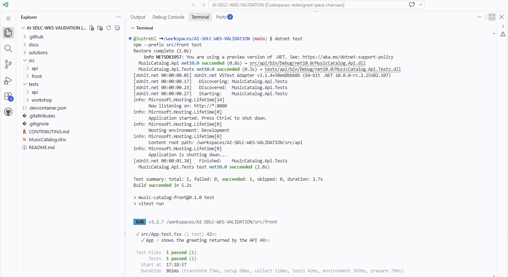

<div class="info" data-title="Documented capability labels">

> This workshop labels mechanisms as **documented capability**, **configuration**, **experimental**, **architectural recommendation**, or **workshop simulation**. Keep those labels when you adapt the material so participants do not confuse a verified product feature with a teaching pattern.

</div>

<div class="important" data-title="Synthetic data only">

> The 12 tracks in `src\api\Data\tracks.json` are synthetic sample data. Do not paste customer data, confidential backlog items, credentials, or production telemetry into prompts, issues, workflow runs, screenshots, or plugin manifests.

</div>

---

# Level 1: HVE orientation and HVE-Core CLI plugin

## Topic

Install HVE-Core as a personal Copilot CLI plugin and find DT Coach and RPI Agent for the next exercises.

**Why this level:** reuse a shared method instead of writing every agent's rules yourself. Level 4 will move that method into the repository for the team.

## Understand HVE-Core

HVE-Core is an opinionated agentic SDLC framework. Its published principle is: **AI carries the rules, humans keep the judgment.** In this workshop, HVE-Core is a methodology source, not a promise that every generated output is correct.

<details>
<summary>Which HVE agents the workshop uses</summary>

The core exercises use DT Coach, RPI Agent, Backlog Manager, Accessibility Reviewer, and Accessibility Planner. The extended tracks also use BRD Builder, PRD Builder, Functional Planner, Code Review, ADR Creator, and Security Reviewer.

In GitHub Copilot Zero to Hero, you wrote your own primitives. Here you install reusable agents, instructions, prompts, and skills for your own environment first; later levels address repository-owned context and team governance.

</details>

<div class="warning" data-title="Rapidly evolving framework">

> HVE-Core documentation describes it as rapidly evolving and best treated as a source of patterns and learning rather than a stable production dependency. Use it to structure work, then review and test like any other engineering output.

</div>

## Install the CLI plugin

### Step 1: Register the HVE-Core marketplace

Register HVE-Core's catalog so the CLI can resolve its plugin by name. Run from any terminal where `copilot` is available; if this marketplace is already registered, continue to installation:

```powershell
copilot plugin marketplace add microsoft/hve-core
```

Success Criteria:
- Copilot CLI registers the `hve-core` marketplace.

### Step 2: Install HVE-Core

Install HVE-Core's agents, prompts, and skills into your personal CLI environment. This package supplies the Research, Plan, Implement, Review method you will use later:

```powershell
copilot plugin install hve-core@hve-core
```

Success Criteria:
- The CLI reports that `hve-core` was installed successfully; it appears in the plugin view in the next step.

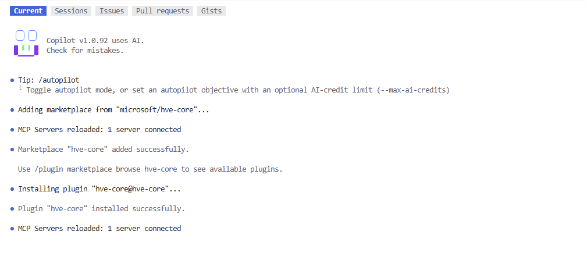

<div class="info" data-title="Documented capability">

> The two commands above come from the HVE-Core plugin documentation. HVE-Core instructions from plugins are not auto-applied as project instructions; project-level instructions still live in your repository.

</div>

### Step 3: Browse plugin commands

Open a repository-root CLI session to inspect the installed plugin before using it:

```powershell
copilot
```

Open the plugin view. HVE prompts use the `/hve-core:...` namespace; the later exercises select those entries from the slash-command menu:

```text
/plugin
```

Success Criteria:
- The plugin view lists HVE-Core, or the installed version's plugin help identifies how to open that list.
- `/hve-core:rpi-research` appears in the slash-command menu.

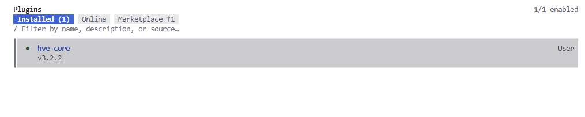

**For every HVE invocation:** type the short name, such as `/rpi-research`, select the matching HVE-Core entry, and press **Tab** to accept it. Add the task text before sending. Each block below shows the expanded `/hve-core:...` command and its prompt together as **one message**; do not submit the command line first. Built-in CLI commands such as `/agent <name>` and `/model auto intelligence` stay separate.

### Step 4: VS Code alternative

<div class="warning" data-title="Prefer the direct plugin">

> The direct HVE-Core Copilot CLI plugin is recommended: it is updated more often than the VS Code extension, which may lag behind the latest agents, commands, and skills. Use the extension as a fallback when the plugin path is blocked.

</div>

<details>
<summary>🪛 setup/troubleshoot: VS Code extension fallback</summary>

If the Copilot CLI plugin path is blocked, install the VS Code extension instead:

```text
ise-hve-essentials.hve-core
```


</details>

Success Criteria:
- If you use the VS Code alternative, DT Coach and RPI Agent appear in the Copilot Chat agent picker.

## Commit checkpoint

No repository file should change in this level. Ask Copilot to verify that checkpoint:

```text
Check whether the working tree is still clean after Level 1. Report changed paths
without modifying the index or files. Do not create a commit or push.
```

Success Criteria:
- Your working tree is still clean.

---

# Level 2: Design Thinking with DT Coach

## Scenario: Music Catalog

The starter is a small music-catalog application, not a streaming service. It currently displays a greeting from the API. Later, you will add catalog browsing and one in-memory playlist using synthetic tracks; no accounts or saved playlists are needed.

```text
src\
  api\
    Program.cs          ASP.NET Core API entry point: /api/hello
    Data\tracks.json    The synthetic track catalog
  front\
    src\App.tsx         React screen that currently reads /api/hello
    src\main.tsx        Front-end entry point
    vite.config.ts      Vite development server and /api proxy
```

## Topic

Start with a user problem, not a prescribed feature: how might someone choose music for a listening moment? DT Coach guides the exploration; you choose the context and ideas.

**Why this level:** experience HVE helping you think, not filling in predetermined answers. This **10–15 minute sampler is not completion of nine full methods**. Keep the exploration separate from the shared playlist coding exercise that follows.

<details>
<summary>How DT Coach and the planning agents support discovery</summary>

DT Coach supports nine methods: Methods 1–3 explore the problem, 4–6 explore possible solutions, and 7–9 consider implementation, testing, and iteration. You will plan or simulate the activities that need more time, real users, or working prototypes. These shortcuts do not satisfy the full methods' evidence gates.

An extended Product Manager track then turns these decisions into a BRD, a PRD, and GitHub issues with the HVE-Core planning agents.

### Let HVE carry the procedure

Give each specialist the goal, known facts, constraints, and relevant artifact. Let its HVE instructions, skills, templates, and quality gates do the structuring. Do not supply a document outline, grading rubric, or coding recipe just to make the output look right.

| Stage | Capability to notice | Your contribution |
| --- | --- | --- |
| **DT Coach** | Questions and challenges assumptions, maintains coaching state, and checks method readiness. | Share observations, explore ideas, and decide what needs real evidence. |
| **BRD Builder** | Links business needs to requirements and runs its own quality-review and handoff process. | Supply business facts, resolve questions, and review findings before approval. |
| **PRD Builder** | Derives testable product requirements from the reviewed inputs and checks coverage and quality. | Confirm the scope and judge unresolved questions or waivers. |
| **RPI** | Carries evidence through the plan, critique, implementation, validation, and acceptance review. | Make material decisions and inspect the returned artifacts. |

The copyable examples below are optional responses to actual questions, not a checklist of answers to force into the conversation. A missing-evidence warning or blocked handoff also demonstrates the framework's value; do not bypass it to match an example.

| Artifact | What it explains | What it is used for |
| --- | --- | --- |
| **BRD — Business Requirements Document** | Why the business needs a capability, who benefits, and which outcomes matter. | Align stakeholders on the need, value, and investment before defining a solution. |
| **PRD — Product Requirements Document** | What the product must do, its boundaries, and what counts as acceptable. | Give engineers, designers, and testers shared behaviour and acceptance criteria. |
| **GitHub issues** | The bounded work items that deliver the agreed requirements. | Track ownership, dependencies, and progress, with links back to the BRD and PRD. |

### BRD: why the business needs the capability

A **Business Requirements Document (BRD)** explains the problem worth solving, who benefits, and what a successful outcome would mean. It gives stakeholders a shared basis for deciding whether to invest in the work before the team commits to a solution.

A useful BRD records the business context, stakeholder and user needs, intended outcomes, scope, constraints, assumptions, risks, and unresolved questions. It distinguishes evidence from hypotheses: an agent must not invent customer interviews, adoption figures, or a return on investment. Success measures need stakeholder agreement; writing a metric into a document does not validate it.

For Music Catalog, the BRD frames the proposed listener need: keeping selected tracks together for a listening session. It explains the expected value, the single-playlist boundary, and how stakeholders will assess the proposal. That need and value remain hypotheses until supported by evidence; the document must not invent customer demand, revenue, or research findings.

Use the BRD to align sponsors and stakeholders, compare proposed scope with the agreed need, and revisit the rationale when priorities change. It is not a technical implementation plan or a collection of coding tasks.

### PRD: what the product must do

A **Product Requirements Document (PRD)** turns the agreed business need into a clear description of the product behaviour. It answers what users should be able to do, which states and failure cases must be handled, and how the team will decide that the capability is acceptable.

A useful PRD describes the user journey, functional requirements, relevant non-functional requirements such as accessibility, acceptance criteria, dependencies, and explicit exclusions. It should be detailed enough for engineers, designers, and testers to work from the same intent without unnecessarily prescribing the implementation.

For the playlist slice, the PRD specifies browsing tracks, adding a track to the single playlist, rejecting duplicate adds, displaying the empty state, and providing labelled, accessible controls. It also preserves the exclusions: no users, authentication, persistence, reorder, remove, search, or playlist creation. Those behaviours become acceptance criteria that the implementation and tests must satisfy.

Use the PRD to review proposed designs, plan delivery, derive test cases, and assess changes. It is not proof that a feature works: implementation, testing, and human review still provide that evidence. Architecture choices and the coding sequence belong in the subsequent technical plan or an architecture decision record when needed.

The chain is **framed need → BRD → PRD → reviewed backlog → implementation and validation**. Keep the documents proportional to the decision: this workshop uses short artifacts for a small slice, not paperwork for its own sake. If the scope changes, update the affected requirements and work items together rather than letting the backlog silently diverge from the agreed intent.

### How a Product Manager uses HVE principles

HVE-Core's principle is **"AI carries the rules, humans keep the judgment."** For a PM, this means delegating repeatable structuring and consistency work while retaining responsibility for the product decisions. The following is a practical interpretation for this workshop, not an additional HVE-Core policy.

1. **Frame before specifying.** Use DT Coach to make the problem, user need, assumptions, and boundaries explicit. In real product work, bring research and stakeholder evidence; the coach can organize that evidence but cannot substitute for it.
2. **Turn intent into reviewable artifacts.** Use BRD Builder and PRD Builder to draft structured requirements and surface gaps or contradictions. Review the drafts with the relevant stakeholders; generated text is a proposal, not approval.
3. **Make scope and success explicit.** Ask agents to preserve exclusions and produce observable acceptance criteria. The PM decides which outcomes matter, how to prioritize competing needs, and which trade-offs are acceptable.
4. **Separate planning from action.** Use Functional Planner to propose an issue hierarchy and Backlog Manager to recommend ordering and dependencies. Inspect the handoff before authorizing `/hve-core:backlog-execute` to create or change issues in the confirmed repository.
5. **Preserve traceability and curate the handoff.** Keep the reviewed BRD, PRD, and decisions linked to the backlog. Commit useful, agreed deliverables rather than raw agent conversations, sensitive meeting notes, or unsupported claims.
6. **Close the feedback loop.** Compare delivered behaviour and review findings with the PRD, then evaluate outcomes using actual evidence. Accept, reject, or revise follow-up work deliberately; passing tests does not by itself establish business value.

The PM's role therefore shifts from repeatedly formatting documents and tickets to checking evidence, resolving ambiguity, aligning stakeholders, and owning prioritization. HVE provides a repeatable path between those decisions and engineering work; it does not make the decisions authoritative merely because an agent produced them.

The [extended Product Manager track](#extended-track-product-manager-with-hve-core) demonstrates this handoff with BRD Builder, PRD Builder, Functional Planner, and Backlog Manager. It is optional: the core workshop proceeds with a reviewed implementation handoff after the open exploration.

</details>

## Start a DT project

### Step 1: Set Auto with the intelligence profile for the rest of the lab

Before starting the Design Thinking exercise, switch to **Auto** model selection with the **intelligence** profile. Keep this setting for the remaining interactive lab work, including the RPI phases.

In the workspace terminal, persist the Copilot CLI default before starting a new session:

```powershell
copilot model --global auto intelligence
copilot
```

Confirm that the new session selects **Auto** and the **intelligence** profile.
`--global` saves a user-wide CLI default in this environment, not a repository-local
setting: in a Codespace it persists for that environment; with local tools it
also affects new CLI sessions in other repositories. An existing session may
retain its selection; use `/model auto intelligence` there or start a new session.

<details>
<summary>🪛 setup/troubleshoot: model defaults and VS Code alternatives</summary>

If your installed CLI reports that `model` or `--global` is unsupported, update
to a version that supports this command. Until then, select Auto and intelligence
with `/model` in each session; that fallback does not establish a persisted default.

If you use VS Code Chat, select **Auto** in the model picker and **intelligence** if your version offers the profile. If that profile is unavailable, use Copilot CLI for the workshop's Auto intelligence configuration.

</details>

Auto chooses an available model allowed by your account and organization policies;
it does not guarantee a particular model. This CLI default does not configure
VS Code Chat or separate cloud-agent and workflow runs.

### Step 2: Select DT Coach in Copilot CLI or VS Code Chat

Use the surface where you installed HVE-Core in Level 1.

**Copilot CLI:** there is no persistent agent-picker dropdown. In the session configured above, open the agent selection menu with:

```text
/agent dt-coach
```

Confirm that DT Coach is the active agent before pasting the project prompt.

<details>
<summary>🪛 setup/troubleshoot: selecting DT Coach</summary>

If this opens a picker or the direct name is not recognized, run `/agent`, find **DT Coach** (it may appear as **DT-Coach** or a plugin-prefixed name), select it with the arrow keys, and press **Enter**.

If your instructions refer to `/agents`, check `/help` for the command supported by your installed version; Copilot CLI 1.0.90-3 lists the singular `/agent`. If DT Coach is missing, check `/plugin` and complete the HVE-Core installation from Level 1 before continuing.

**VS Code Chat:** open Chat, use the agent picker, and select **DT Coach**. If it is missing, confirm that the HVE-Core extension is installed and enabled.

</details>

### Step 3: Start a learner-led nine-method sampler

Choose a listening situation you want to explore: a commute, focused work, a shared evening, or your own example. These are starting points, not personas or validated research. Set your own 10–15 minute timer; the coach cannot reliably enforce elapsed time.

Type `/dt-start-project`, select the HVE-Core project-start prompt, and press **Tab**. Then add the project brief below and send the whole message:

```text
/hve-core:dt-start-project.prompt

Project name: Music Catalog listening experience — a workshop demonstration POC.
Starting question: How might we help someone choose music for a listening moment?
Help me brainstorm and sample all nine HVE Design Thinking methods within a 10–15 minute learning exercise. I will manage the timer. Keep proposed specifications POC-sized: no authentication, database, persistence, or external services; retain the existing src/api and src/front setup.
```

Explore ideas within the starter's ASP.NET Core API and React front end, without replacing its architecture or adding infrastructure. Keep any working-note edits limited to `.copilot-tracking/`; application code, tests, and published documentation stay unchanged during exploration. DT Coach's project notes belong under `.copilot-tracking/dt/music-catalog-listening-experience/`.

**Now follow the chat for the next 10 minutes.** Answer in your own words and contribute observations, ideas, or sketches: the conversation is the exercise. Let DT Coach guide the process rather than prescribing its questions or outputs. If time allows, continue up to 15 minutes.

#### Experiment, challenge, and move between methods

As you explore, try **"Challenge my assumption"**, **"Give me a contrasting idea"**, or **"Let's revisit research"**. Spend most of your time generating and comparing ideas; use the table to find a small activity for the current method, not as a checklist to complete in order. Later implementation and rollout work remain plans.

| Method | Small activity you can try | What the shortcut does not establish |
| --- | --- | --- |
| 1. Scope Conversations | Choose a listener and situation; describe what feels difficult. | Stakeholder agreement or validated demand. |
| 2. Design Research | Share an observation, or ask what neutral question you would ask a listener. | Research that nobody conducted. |
| 3. Input Synthesis | Separate observations from assumptions and write a "How might we…" question. | A representative research synthesis. |
| 4. Brainstorming | Add your own ideas, request contrasting alternatives, and resist choosing immediately. | That the first plausible solution is the best one. |
| 5. User Concepts | Choose a concept and describe the listener's short journey and its trade-off. | User validation of that concept. |
| 6. Low-Fidelity Prototypes | Sketch the flow in text or on paper; notice a confusing state. | A working application. |
| 7. High-Fidelity Prototypes | Identify what a functional prototype would need to prove and plan it. | Technical feasibility; no hi-fi prototype is built here. |
| 8. User Testing | Ask a peer to walk through the sketch, or plan a neutral task and observation. | Full Method 8 testing of a functional prototype. |
| 9. Iteration at Scale | Choose a next experiment, success signal, and reason to revisit an earlier method. | Scaled rollout or measured impact. |

When you need help deciding where to go next, use DT Coach's **Method Next** handoff, or type `/dt-method-next`, select the HVE-Core entry, and press **Tab**. Add this request before sending:

```text
/hve-core:dt-method-next.prompt

Assess project music-catalog-listening-experience and recommend the next method from its current coaching state.
```

Let the coach assess the project's current state. Its recommendation may be to stay with the current method or revisit an earlier one. If the evidence needed to advance is missing, ask for a preview of what comes next rather than marking the method complete.

#### Close the timebox

When your timer ends, say **"Timebox: recap what we actually tried and preview what remains."** The recap should distinguish activities you tried, work you only planned or previewed, and methods you did not reach. It is fine to stop before visiting all nine.

<div class="important" data-title="Workshop simulation">

> Do not invent evidence to fill gaps: a fictional user response is a simulation, a text sketch is low fidelity, and a test plan is not a test result. This sampler does not establish full method completion. The shared implementation contract later in this level is a separate facilitator-owned constraint, not a conclusion your exploration must reach.

</div>

Success Criteria:
- You supply the user/context and make choices rather than accepting a prewritten feature definition.
- DT Coach guides small activities across the nine methods, or explicitly reports which were only previewed or not reached.
- It does not implement code.
- It separates your observations from assumptions, and proposed tests from actual results.
- Any agent-written working notes stay under the local, ignored `.copilot-tracking/` folder.

<div class="tip" data-title="Approve local working-note edits">

> If DT Coach requests permission to create or update its `.copilot-tracking/` notes, you may approve that edit for the session when your client offers the option. Check the requested path and permission scope first; prefer an approval limited to the tracking folder rather than all repository writes.
>
> DT Coach's write boundary remains `.copilot-tracking/` only. Decline requests to edit application code, tests, or published documentation during this exercise. **Auto intelligence selects the model; it does not grant write permissions.** Keep normal approval prompts and do not use unrestricted **allow-all / YOLO** permissions for this exercise.

</div>

### Example outcome after visiting all nine methods

This example explores a mood-based listening experience for hi-fi enthusiasts at home. The recap distinguishes **Methods 1–6 sampled** from **Methods 7–9 planned** and states that no method met its full completion criteria. Your context, ideas, and recap can differ; this is not an answer to reproduce or an expansion of the Level 3 implementation scope.

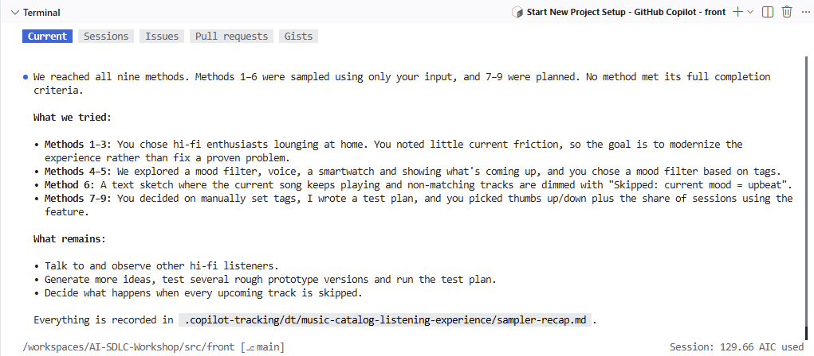

<details>
<summary>Toggle solution: example prompts for the nine methods</summary>

These nine prompts group and rephrase the conversation shown in the example. They are **illustrative learner contributions**, not nine official method commands or proof that the methods are complete. Start the project and send the short brief above first. Then use a prompt when the coach reaches the relevant method, adapting it to your own idea rather than pasting the whole sequence.

Let DT Coach choose its questions and activities. The example supplies a listener's context and choices; it does not replace the coach's method instructions or require a particular artifact shape.

**1. Scope Conversations — choose the listener and context**

```text
I would like to explore the experience of tech-savvy hi-fi enthusiasts listening at home. They choose music as they go and want to start listening immediately, then add upcoming tracks during the session. Help me clarify their goal without assuming the solution.
```

**2. Design Research — distinguish observations from assumptions**

```text
I have not identified a major frustration yet; I am exploring ways to modernize the experience. Treat this as a hypothesis, not validated research. What would we ask or observe to understand how these listeners choose their next tracks?
```

**3. Input Synthesis — frame an opportunity**

```text
Help me turn that context into a focused opportunity: how might we help listeners see what is coming next and adapt the music to their current mood without interrupting playback? Separate what we know from what we still need to learn.
```

**4. Brainstorming — explore contrasting ideas**

```text
Let us explore several approaches before choosing one: a preview of upcoming tracks, a mood filter such as "upbeat songs only", voice controls, or smartwatch interaction. Help me compare these ideas and suggest a contrasting alternative.
```

**5. User Concepts — choose a direction**

```text
For this exploration, I would like to try a mood filter using simple song tags such as "upbeat", "chill", and "lounge". The listener could use a toggle or dropdown. Help me describe the short user journey and the main trade-off.
```

**6. Low-Fidelity Prototypes — sketch the behaviour**

```text
Sketch the interaction in text. Keep the current song playing when the mood changes. Dim and skip only upcoming tracks that do not match, and show a reason such as "Skipped: current mood is upbeat." Help me spot a confusing state in this flow.
```

**7. High-Fidelity Prototypes — plan what to prove**

```text
Do not build a functional prototype yet. Help me plan what one would need to prove. I would enter mood tags manually in song metadata for now; automatic tagging could be a future option. What technical assumptions should we test first?
```

**8. User Testing — prepare a test, not invented results**

```text
I have no functional prototype or real test results yet. I would like to learn how to test the mood selector without leading the listener. How should we prepare?
```

**9. Iteration at Scale — choose signals and recap**

```text
For a future experiment, consider simple thumbs-up or thumbs-down feedback and the proportion of listening sessions that use the mood filter. Help me define what those signals could tell us and when we should revisit the idea. Then recap what we actually tried, what was only planned, and what remains across all nine methods.
```

The example is a discovery direction, not a request to implement filtering, voice controls, smartwatch integration, or automatic tagging. Keep it in local coaching notes; the shared playlist handoff later in this level remains separate.

</details>

## Debrief and hand off to the shared implementation slice

Keep the ideas you explored with DT Coach. For Level 3, however, everyone builds the same small playlist feature so the coding exercise stays focused and comparable across the room.

**This feature is chosen for the workshop, not a result that your DT session must produce or validate.** Your explored concept does not have to be a playlist. Keep other ideas, such as mood filtering, for possible future work. You still choose how the interface handles duplicate adds at Level 3's plan gate.

### Step 1: Prepare the shared implementation handoff

**For Level 3, build the playlist feature described below.** These requirements are supplied by the facilitator; you do not need to derive them from your DT exploration:

- **User-visible capability:** browse tracks and add them to one in-memory playlist.
- **API endpoints:** `GET /api/tracks`, `GET /api/playlist`, and `POST /api/playlist/tracks` with a JSON body containing `trackId`.
- **Front-end states:** visible catalog and playlist, with the empty-state text "Your playlist is empty. Add a track to get started."
- **Duplicate handling:** reject unknown track ids with HTTP 404 and duplicate adds with HTTP 409; make duplicate feedback visible and accessible, while leaving the UI approach open for the RPI plan gate.
- **Accessibility:** accessible, labelled controls and perceivable status feedback.
- **Out of scope:** users, authentication, persistence, reorder, remove, search, and playlist creation.

**Send the following prompt to DT Coach to prepare the recap used in the remaining lab steps.** It keeps your exploration separate from the supplied coding scope. A formal DT handoff is not needed for this workshop recap:

```text
Summarize the final decisions from our Music Catalog listening-experience exploration, distinguishing evidence, assumptions, and planned work.
Separately recap the shared playlist delivery contract in docs/afternoon-2/workshop.md under "Debrief and hand off to the shared implementation slice". This is the common Level 3 coding exercise, not a result of our exploration. Leave the duplicate-feedback UX choice open.
Do not claim that sampling validated the concept or completed a method. Keep working notes under .copilot-tracking/ only.
```

Success Criteria:
- The recap preserves your exploration and its evidence limits.
- The common coding scope is kept separate from your explored concept, without changing the supplied requirements.

<details>
<summary>[Optional] Separate exploratory from the implementation handoff</summary>

The following native HVE prompts support fuller DT projects and check the evidence needed for a formal handoff. They are not prerequisites for Level 3 and do not replace the required workshop recap above. Type `/hve-core:dt-` to discover the matching prompts in your client's slash-command menu.

- **`dt-handoff-problem-space.prompt`** packages completed Methods 1–3 discovery evidence for `/hve-core:rpi-research`.
- **`dt-handoff-solution-space.prompt`** packages completed Methods 4–6 concept and low-fidelity prototype evidence for `/hve-core:rpi-research`.
- **`dt-handoff-implementation-space.prompt`** packages completed Methods 7–9 technical, testing, and scaling evidence, plus earlier discovery lineage, for `/hve-core:rpi-research`.
- **`dt-canonical-deck.prompt`** creates or refreshes a canonical snapshot and can optionally build a presentation from available artifacts.
- **`dt-figma-export.prompt`** exports suitable artifacts to FigJam or Figma for collaborative review; it requires the Figma MCP server and permission to create the external file.

To try an Implementation Space handoff, type `/dt-handoff-implementation-space`, select the matching HVE-Core prompt, and press **Tab**. Add your actual project slug before sending, for example:

```text
/hve-core:dt-handoff-implementation-space.prompt

Use project slug music-catalog-listening-experience for the Implementation Space handoff.
```

The prompt checks coaching state and readiness before producing a research-ready handoff. **Sampling a method is not completing it:** if no Implementation Space method is complete, resume coaching for a real handoff rather than marking simulated tests or planned prototypes as completed evidence. An eligible handoff produces `handoff-summary-implementation-space.md` in your DT project folder and a research topic under `.copilot-tracking/research/`; it does not start implementation. For this lab, continue with the workshop-only recap regardless of whether a formal handoff is available.

</details>

### Step 2: Review the recap and coding scope

Check that the recap reflects your conversation and that the coding scope matches the requirements above. Your broader ideas remain in the exploration recap; they do not need to fit the playlist exercise. Ask the coach to correct any misunderstanding. Keep assumptions and proposed experiments distinct from actual research or test results.

### Step 3: Explore the local coaching notes

DT Coach maintains its working state during the conversation; you do not need to send a separate save prompt. Once it has finished writing, expand `.copilot-tracking` > `dt` > your project folder in VS Code Explorer and inspect what it created.

The example below includes `coaching-state.md`, `sampler-recap.md`, `implementation-handoff.md`, and a Method 8 `test-plan.md`. Your files depend on the conversation and methods visited; these filenames are examples, not a required checklist. Open the coaching state and any recap or method notes that actually exist.

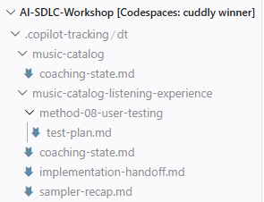

Open a coach-created note in Explorer to see how it captures your conversation. These are **local, ignored working notes**, not files to commit. The next step creates the shareable delivery brief; later, use VS Code's Source Control view to review the staged diff before committing that document.

### Step 4: Choose a later slice with DT Coach

Before leaving **DT Coach**, select one small idea from your conversation for Level 5's cloud-agent delegation. This is a proposed follow-up, not a validated concept or an addition to Level 3. Ask the coach to help narrow it:

```text
Help me choose one idea from our DT conversation for a later Music Catalog slice
to delegate to Copilot cloud agent in Level 5. Recommend a small change compatible
with the existing ASP.NET Core API, React front end and in-memory state.
Explain its user value, observable acceptance criteria, exclusions and assumptions.
Ask me to choose and confirm the idea. Keep the shared Level 3 playlist scope unchanged.
Do not implement it, invoke BRD/PRD Builder, create issues or claim validation.
Keep coaching notes under .copilot-tracking/ only.
```

Choose the idea yourself after discussing the trade-offs. Avoid features requiring authentication, persistence, external services or a new architecture. If the idea depends on Level 3, record that dependency. Do not invent research or defer a required Level 3 fix to supply future work.

**Success Criteria:** your recap records the chosen idea, your decision, its evidence limits and a bounded later-slice scope.

### Step 5: Save the reviewed delivery brief and later-slice decision

The coaching exercise ends here. Use HVE's **Documentation** agent to curate the shared delivery brief, rather than turning DT working notes into a committed artifact. In Copilot CLI, switch with:

```text
/agent hve-core:documentation
```

<details>
<summary>🪛 setup/troubleshoot: selecting Documentation</summary>

If the identifier is not recognized, use `/agent documentation` or choose **Documentation** from `/agent`. In VS Code, select **Documentation** in the agent picker.

</details>

With Documentation active, send:

```text
Write a curated Design Thinking decision record for the Music Catalog playlist slice to docs/project-planning/playlist-design-decisions.md.
Use author mode to create a short reference from the reviewed shared playlist delivery contract in docs/afternoon-2/workshop.md and the coach's recap. Do not present the exploration as validated research.
Keep private coaching notes and personal details out of the document. Limit published changes to this file.
```

Open the saved file and compare it with the reviewed contract. Correct differences before sharing it. This brief is the input for PRD Builder and Level 3, not a required reproduction of the coach's headings or filenames. Keep it uncommitted until [Curate what you commit](?step=2#curate-what-you-commit), where you review it with any BRD and PRD.

Keep **Documentation** selected and give it the confirmed later-slice decision from Step 4:

```text
Write a curated later-slice decision to docs/project-planning/dt-later-slice.md
from the DT Coach idea I selected and confirmed in this conversation.
Record the problem, user value, chosen scope, observable acceptance criteria,
exclusions, assumptions, dependencies and rationale. Mark it as proposed for
Level 5 cloud-agent delegation, not implemented or validated.
Keep the shared Level 3 scope unchanged. Do not invoke BRD/PRD Builder or create issues.
Exclude private notes and personal details; do not link to local tracking files.
Limit published changes to this file. If my choice is unavailable, ask rather than invent it.
```

Review this file against your actual decision and correct it before approving it. Include it in the Level 2 planning-document commit below; Level 5 will use the committed brief instead of your local DT notes. **No BRD or PRD is required for this later slice**, even if you take the optional Product Manager track for the shared playlist.

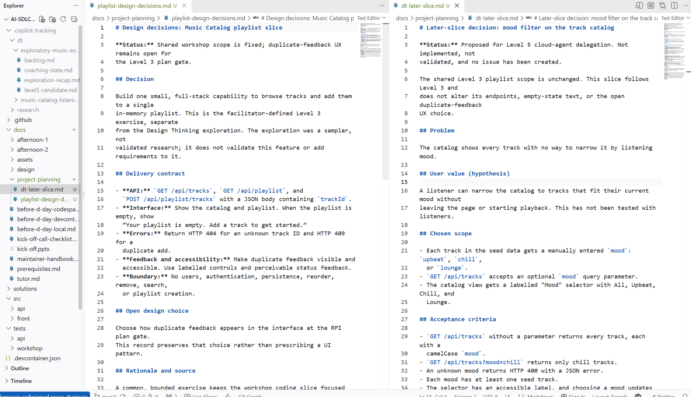

## Extended track: Product Manager with HVE-Core

<div class="info" data-title="Optional Tech Lead activities and required PR gate">

> This track adds about 40 minutes. Your facilitator tells you whether the room runs it hands-on, watches it as a demo, or skips it. Level 3 works without it: if you skip it, go to [Curate what you commit](?step=2#curate-what-you-commit).

</div>

This track follows the HVE-Core [TPM guide](https://microsoft.github.io/hve-core/docs/hve-guide/roles/tpm) and [Business Program Manager guide](https://microsoft.github.io/hve-core/docs/hve-guide/roles/business-program-manager). You turn the decisions you just locked into requirement documents, then into a tracked backlog of GitHub issues. In Level 3, a developer picks up that backlog.

### The PM agent chain

Use the agents in this order:

| Order | Stage in the TPM guide | HVE-Core agent or command | What it produces | Writes to GitHub? |
| --- | --- | --- | --- | --- |
| 1 | Discovery | **DT Coach** (done above) | A framed problem and locked decisions | No |
| 2 | Discovery, optional | **Meeting Analyst** | Requirements extracted from Microsoft 365 meeting transcripts | No |
| 3 | Product definition | **BRD Builder** | A business requirements document (BRD) in `docs\project-planning` | No |
| 4 | Product definition | **PRD Builder** | A product requirements document (PRD) in `docs\project-planning` | No |
| 5 | Decomposition | **Functional Planner** | A GitHub issue hierarchy plan and a handoff file you can review | No, read-only |
| 6 | Execution | **Backlog Manager** or `/hve-core:backlog-execute` | GitHub issues and sub-issues | **Yes**, after you confirm |
| 7 | Sprint planning | **Backlog Manager** with `/hve-core:backlog-plan` | A recommended order and dependencies | No, read-only |

Why this order:

- **Why before what.** The BRD states the business need and who benefits. The PRD states what the product does and how to test it. The TPM guide recommends writing the BRD before creating any work item.
- **Planning is separate from writing.** Functional Planner and `/hve-core:backlog-plan` cannot change the tracker. Only `/hve-core:backlog-execute` writes to GitHub, and only after you review the handoff and confirm the repository.
- **One owner per role.** In the Business Program Manager guide (beta), a BPM stops at the BRD and user stories, then works with a TPM, who manages the issues. In this track, you play both roles.

<div class="important" data-title="Workshop simulation">

> The role guides and agent behaviour are documented by HVE-Core. The stakeholder facts, the short question rounds, and one person playing both PM roles are a workshop simulation. Agent output still needs your review before it reaches GitHub.
>
> Organization policies still apply. Never paste credentials into chat or repository files.

</div>

### Step 1: Prepare your Copilot surface

In Copilot CLI, start a fresh conversation, then check the MCP connection configured during starter setup. Send these commands separately:

```text
/clear
```

```text
/mcp list
```

Clearing the conversation does not delete repository files. Your reviewed decisions are already saved under `docs/project-planning/`; the current `.copilot-tracking/` folder retains the local coaching context. BRD Builder will use those files as context rather than relying on the previous chat, keeping exploration assumptions separate from the shared playlist requirements.

Success Criteria:
- `github-mcp-server` appears connected. If it does not, return to the starter setup or ask the facilitator before continuing.

### Step 2 (facilitator demo, optional): Meeting Analyst

**Meeting Analyst** reads meeting transcripts from Microsoft 365 through the WorkIQ MCP server, extracts requirements, and hands off to PRD Builder. It needs a Microsoft 365 Copilot licence and WorkIQ, and it cannot read a local transcript file.

For this optional demo, run `/agent meeting-analyst` in Copilot CLI, or select **Meeting Analyst** in the VS Code agent picker.

The playlist slice has no real meetings, so attendees skip this step. The stakeholder facts in the next prompt stand in for a transcript.

### Step 3: Write the BRD

In Copilot CLI, switch to BRD Builder with this separate command; in VS Code, select **BRD Builder** in the agent picker:

```text
/agent brd-builder
```

Work in pairs: one person proposes the feature, and the other reviews it from a listener's perspective. If working alone, ask the facilitator to review it. Write the BRD as a Music Catalog product proposal: explain the listener need and expected value, not the purpose of this lab. Use the supplied playlist scope and treat the listener need as a hypothesis.

Then send the context below. The facts are inputs, not an outline the builder must reproduce:

```text
Create a business requirements document for the Music Catalog playlist slice.

Use only these facts. Do not invent stakeholders, metrics, or dates:
- Proposed user problem: a listener choosing music for a listening moment needs a way to collect tracks into a short listening list. Treat this as a hypothesis, not a finding from customer research.
- Expected value: keep the listener's selected tracks together during a session so they can see their choices without repeatedly scanning the full catalog. This benefit has not yet been measured.
- Stakeholders: I propose the feature; another person will review the need and scope from a listener's perspective. Confirm decision ownership and reviewer details with me rather than inventing names, sponsors, or approval.
- Business objective: a listener can browse the catalog and collect tracks in a single playlist during a session.
- Acceptance targets: a listener can browse tracks and add them to one playlist; a duplicate add is rejected with visible feedback; the empty playlist state is visible; controls are accessible by role and label. Implementation must pass the repository's API and front-end tests. These targets have not yet been demonstrated.
- Constraints: one playlist, in-memory state only, no users, authentication, persistence, reorder, remove, search, or playlist creation.
- Source: the reviewed delivery brief at docs/project-planning/playlist-design-decisions.md.

Read that decisions document and the current local DT notes under .copilot-tracking/ for context. Keep the supplied playlist scope authoritative; exploratory ideas and unvalidated assumptions do not add requirements.

Ask at most three clarifying questions, then write the BRD. Record anything you cannot confirm as an open question instead of guessing.
Help me prepare a short person-to-person review of the proposed need, objective, and scope. Wait for me to report the actual feedback; do not simulate the reviewer's response or record sign-off on their behalf.
Distinguish the intended user outcome from functional acceptance and technical checks. Ask how we should assess the expected value; leave unagreed measures, targets, and ownership as open questions.
Save the BRD in docs/project-planning/music-catalog-playlist-slice-brd.md and confirm the saved file path.
```

Let BRD Builder guide its own Discover, Define, and Govern process. Answer its actual questions rather than requesting each section yourself. Notice how it links the supplied business facts to requirements, identifies gaps, and uses its quality reviewer before handoff. The three-question limit keeps the workshop bounded; it does not waive missing evidence or approval gates.

**Review the proposal with another person.** Show them the draft and ask: "Would collecting tracks help with this listening situation?", "Is the single-session boundary clear?", and "What is missing or confusing?" Report their actual feedback to BRD Builder, including any disagreement, and review the revised draft together. If no reviewer is available, leave peer review pending rather than inventing a response. Agreement confirms the proposal is understood; it does not validate market demand, usability, or delivered behavior.

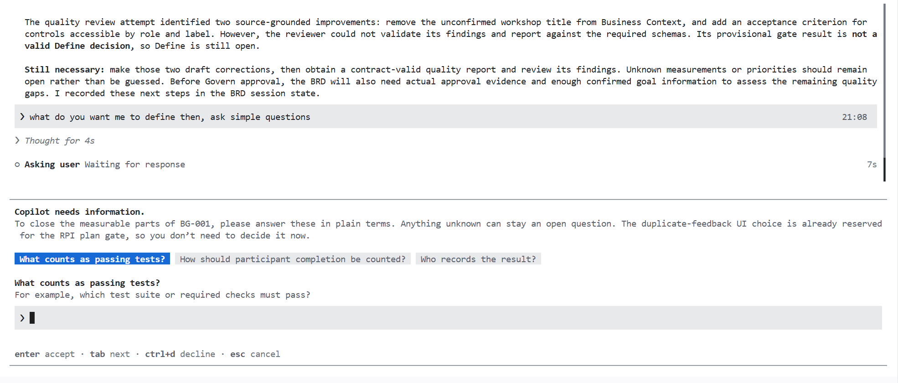

This earlier capture uses workshop-completion measurements; your conversation should instead focus on the listener's feature and the peer feedback above. It illustrates the guided question frame and an open Define gate after an unvalidated quality review, not answers to reproduce or evidence of approval.

<details>
<summary>🪛 setup/troubleshoot: resume a stalled guided BRD process</summary>

If BRD Builder stops guiding you through the next decision or returns a draft without explaining what remains, invoke `/hve-core:brd-quality-reviewer` to request an analysis of the saved BRD. If your client exposes it as an agent rather than a slash entry, select **BRD Quality Reviewer** with `/agent` or the VS Code agent picker. Give it the saved file path:

```text
Review docs/project-planning/music-catalog-playlist-slice-brd.md against the product context, reviewed delivery brief, and stakeholder feedback actually recorded. Identify missing evidence, unresolved questions, and quality findings. Do not invent answers or treat this review as approval.
```

Then return to **BRD Builder** with `/agent brd-builder` or the VS Code agent picker and send:

```text
Resume the guided BRD process using the quality review findings for docs/project-planning/music-catalog-playlist-slice-brd.md. Explain the next unresolved decision and guide me step by step through addressing the findings and remaining review gates. Ask for my input rather than assuming approval.
```

The reviewer diagnoses gaps; BRD Builder resumes the guided process. Review and approval gates still apply.

</details>

<details>
<summary>Toggle example: a step-by-step BRD conversation</summary>

This is a curated example, not a script for manufacturing approval. Send each message separately and wait for the agent's response. The starter above is step 1; do not send it twice. Use the later examples only when relevant, adapting them to the actual discussion. The three-question limit still applies; these are possible contributions, not a required questionnaire.

**1. Start the BRD process.** Select BRD Builder with `/agent brd-builder` and send the starter prompt above.

**2. Acknowledge the disclaimer after reading it.**

```text
I understand the requirements-planning disclaimer. Continue.
```

**3. Explain the business problem.**

```text
The proposed need is to keep selected tracks together for a listening session rather than repeatedly scanning the catalog to find earlier choices. The expected value is a clear view of those choices. Treat this as a hypothesis for stakeholder review, not a researched customer problem.
```

**4. Identify the stakeholders.**

```text
I am proposing the feature. Another person will review the need and scope from a listener's perspective. Ask me who owns the decision and who will review it; leave their identity and review status unconfirmed until I provide that information and the actual feedback.
```

**5. State the objective.**

```text
The objective is to help a listener organize their music choices for the current session. The proposed capability is to browse the catalog and collect tracks in one playlist. Help me distinguish the value we expect from the behavior we need to deliver.
```

**6. Confirm the success criteria without claiming they are already achieved.**

```text
A listener can browse tracks and add them to one playlist. Duplicate adds are rejected with visible feedback, the empty state is clear, and controls are accessible by role and label. API and front-end tests must pass. These are acceptance targets, not observed results. They do not establish the expected user value; help me identify an appropriate outcome measure for stakeholder agreement without inventing a target.
```

**7. Confirm the scope.**

```text
Use docs/project-planning/playlist-design-decisions.md as the reviewed delivery brief for this release. Keep mood filtering and other exploratory ideas outside this scope. Flag contradictions for a decision rather than silently changing the agreed boundary or presenting exploratory notes as validated evidence.
```

**8. Confirm the constraints.**

```text
Constraints: One playlist, in-memory state only, and no users, authentication, persistence, reorder, remove, search, or playlist creation.
```

**9. Prepare the peer review and record its evidence.**

```text
Help me explain the proposed listener need, single-session objective, and scope to my peer in plain language. I will discuss it with them and report what they actually said. Record unresolved questions and risks as such; do not invent feedback, owners, metrics, or dates.
```

**10. Inspect the draft produced by the builder.**

```text
Show the saved BRD draft and anything still preventing handoff.
```

**11. Bring back peer feedback and review unresolved items.**

Tell the builder what the other person agreed with, questioned, or requested, in your own words. Do not copy an invented positive review. Then ask:

```text
Update the draft using the peer feedback I reported, without expanding the fixed playlist scope. Explain any disagreement, quality-review findings, and open questions so we can review the handoff. Peer agreement is not proof that the feature works.
```

**12. Approve the handoff only after inspecting the document.** Send this only if you accept the actual review findings:

```text
I have reviewed the saved BRD, the actual stakeholder feedback, and the quality findings, and approve its handoff to PRD Builder. Preserve the agreed objectives, feature acceptance targets, and remaining open questions. Present any required waiver for my explicit approval. This approves the requirements handoff, not a release or acceptance of implemented behavior.
```

**13. Inspect the handoff evidence.**

```text
Show the handoff file path and sign-off status. Explain each waiver in one sentence and identify anything that still blocks the handoff.
```

The agent may maintain session and handoff metadata under `.copilot-tracking/`; the shareable BRD belongs in `docs/project-planning/`. A waiver is not a clean pass. If the review identifies unresolved gaps, inspect them and approve any waiver explicitly rather than asking the agent to force a particular status or version. The supplied success criteria remain in the BRD even when their achievement has not yet been demonstrated.

If the agent exceeds the clarification limit, send:

```text
Record unresolved details as open questions and proceed with the draft. Do not invent answers or bypass required review and approval gates.
```

</details>

**Check and share the saved result:** open `docs/project-planning/music-catalog-playlist-slice-brd.md` in Explorer (or the actual path confirmed by the agent). Verify the file exists and contains the reviewed problem, objectives, scope, constraints, risks, and open questions—not just a chat summary. Check that the shared playlist boundary is preserved and no invented metrics or customer validation appear. Ask for corrections before approving the handoff. Share this reviewed document with PRD Builder in Step 4; include it in the curated planning-document commit later in this level, not the private `.copilot-tracking/` session files.

Success Criteria:
- BRD Builder shows its requirements-planning disclaimer, then creates a BRD such as `docs\project-planning\music-catalog-playlist-slice-brd.md`. The exact file name can differ.
- Objectives and success criteria trace back to the supplied facts, with assumptions and open questions clearly identified.
- Actual peer feedback is recorded separately from assumptions, with disagreements or a pending review visible; no person-to-person approval is fabricated.
- Out-of-scope items are listed as out of scope.
- BRD Builder offers a handoff to PRD Builder.

### Step 4: Turn the BRD into a PRD

After approving the BRD and resolving its handoff gates, **explicitly switch to PRD Builder** before sending the next prompt. Share the actual native handoff path BRD Builder returned, when available; do not claim a blocked handoff is approved. In Copilot CLI, enter this command as a separate message:

```text
/agent hve-core:prd-builder
```

Confirm that **PRD Builder** is active.

<details>
<summary>🪛 setup/troubleshoot: selecting PRD Builder</summary>

If your installation uses an unprefixed name, run `/agent prd-builder` or choose it from `/agent`; in VS Code, select **PRD Builder** in the agent picker.

</details>

Then send the following prompt to move from the BRD work into product requirements:

```text
Move from the BRD work to a PRD for the Music Catalog playlist slice using the reviewed BRD at docs/project-planning/music-catalog-playlist-slice-brd.md and delivery brief at docs/project-planning/playlist-design-decisions.md.
Carry forward its constraints and open questions. Ask at most 3 clarifying questions, one at a time, and save the PRD at docs/project-planning/music-catalog-playlist-slice.md.
```

Let PRD Builder run its own discovery, authoring, traceability, and quality checks; do not paste a ready-made functional-requirement list. **Validate the scope PRD Builder actually presents.** When it shares its draft and asks to proceed, open that file and compare it with the reviewed BRD and delivery brief. Confirm or correct the scope before proceeding to validation and sign-off. Keep deferred DT ideas out of delivery.

Do not select **Yes** merely because the agent says "scope is unchanged." If the draft matches, send:

```text
I have reviewed the saved PRD and compared the scope you presented with the BRD and reviewed delivery brief. The scope is aligned. Run validation, show any findings or required waivers, and ask for my final approval before recording sign-off.
```

If the scope differs or the file is missing, select **No** or the freeform answer in the confirmation dialog and explain the correction:

```text
Do not sign off yet. Correct these scope differences against the reviewed BRD and delivery brief: <list the differences>. Save the revised PRD and show the updated scope for my review.
```

Review validation findings before giving final approval. A request to sign off as **v1.0.0** is an approval gate, not evidence that validation passed; do not force a version, waive unresolved findings silently, or treat a scope confirmation as blanket approval.

**Check both saved files before continuing:** open `docs/project-planning/music-catalog-playlist-slice-brd.md` (BRD) and `docs/project-planning/music-catalog-playlist-slice.md` (PRD), or the actual paths confirmed by the builders. Read their content, **Status**, **Version**, and recorded review/sign-off evidence. If both still show **Draft** and a version other than **1.0.0**, use the recovery prompt below. A draft or different version is a signal to investigate, not proof of a particular blocker; conversely, a `1.0.0` label alone does not establish approval. Do not proceed to backlog planning while either document has unresolved sign-off gates.

<details>
<summary>🪛 setup/troubleshoot: BRD and PRD remain draft before sign-off</summary>

Send this to the active **PRD Builder**, replacing the paths if your builders used different filenames:

```text
It seems the BRD and PRD sign-off may be blocked: both saved files show Draft status and versions other than 1.0.0.
Read docs/project-planning/music-catalog-playlist-slice-brd.md and docs/project-planning/music-catalog-playlist-slice.md, along with their current review, handoff, and session evidence under .copilot-tracking/.
Analyze why they remain draft. Distinguish actual blockers from normal work in progress or stale metadata, and explain which quality findings, missing evidence, decisions, or approvals remain unresolved.
Help me resolve them step by step, asking for the information or decisions you need. If an upstream BRD gate needs BRD Builder, explain the handoff so I can return to that agent before resuming the PRD.
Preserve the agreed scope. Do not force Approved status or version 1.0.0, invent evidence, or bypass review gates. Show the updated files and review findings, and ask for my explicit approval before recording sign-off.
```

Return to the relevant builder as directed, resolve the actual findings, and inspect both files again. A diagnosis is not approval; any required waiver needs your explicit decision.

</details>

Success Criteria:
- PRD Builder creates a PRD such as `docs\project-planning\music-catalog-playlist-slice.md`, with functional requirements, acceptance criteria, and non-functional requirements.
- The requirements match the fixed behaviour of Level 3, so the PM and the developer share one contract.
- The conversation records your scope confirmation or corrections and the validation findings reviewed before final sign-off.

Read both documents before you continue. Remove any scope creep. The issues you create next link to these documents.

### Step 5: Plan the GitHub issue hierarchy

Run `/agent functional-planner` in Copilot CLI, or select **Functional Planner** in VS Code. Copy paste the following prompt, replacing `<owner>/<repo>` with your repository and `<your-prd-file>.md` with the reviewed PRD filename confirmed in Step 4:

```text
Plan a GitHub issue hierarchy for <owner>/<repo> from the reviewed playlist PRD at docs/project-planning/<your-prd-file>.md.
Keep this planning-only and prepare the handoff for my review. Do not plan labels, milestones, or assignees.
```

Success Criteria:
- Functional Planner confirms the repository, reads the existing issues, and writes a planning log and a `handoff.md`. It tells you where they are.
- No new issue is created on GitHub during planning; existing issues may be read.

Open the handoff at the path Functional Planner reports. Review the proposed decomposition, requirement coverage, acceptance criteria, dependencies, and any unresolved findings against your saved PRD. Ask the planner to explain or revise anything that does not fit. There is no prescribed issue count or reference hierarchy to reproduce; the reviewed plan determines what the next step creates.

### Step 6: Create the issues

After reviewing Functional Planner's handoff, **explicitly switch to Backlog Manager**. In Copilot CLI, send this command as a separate message:

```text
/agent hve-core:backlog-manager
```

Confirm that **Backlog Manager** is active.

<details>
<summary>🪛 setup/troubleshoot: selecting Backlog Manager</summary>

If your installation uses an unprefixed name, run `/agent backlog-manager` or choose it from `/agent`; in VS Code, select **Backlog Manager** in the agent picker.

</details>

**Review the handoff and tick only the Human Review box.** Open `.copilot-tracking/github-issues/prds/music-catalog-playlist-slice/handoff.md`, or the actual handoff path Functional Planner reported. Read the proposed issues, scope, acceptance criteria, dependencies, and target repository. After resolving any outstanding review findings and approving the plan yourself, change only the bottom **Reviewed and validated by a qualified human reviewer** checkbox from `[ ]` to `[x]`, then save the file. Leave all other checkboxes unticked (`[ ]`) before execution. If you cannot approve the plan, leave the Human Review box unchecked and resolve the blockers before authorizing execution. This is a local, ignored handoff, not a file to commit.

Then send the following prompt, replacing `<owner>/<repo>` with your workshop repository and `<reviewed-handoff-path>` with the path Functional Planner reported:

```text
Execute the plan in the reviewed PRD handoff at <reviewed-handoff-path> and create the corresponding issues in GitHub repository <owner>/<repo>.
```

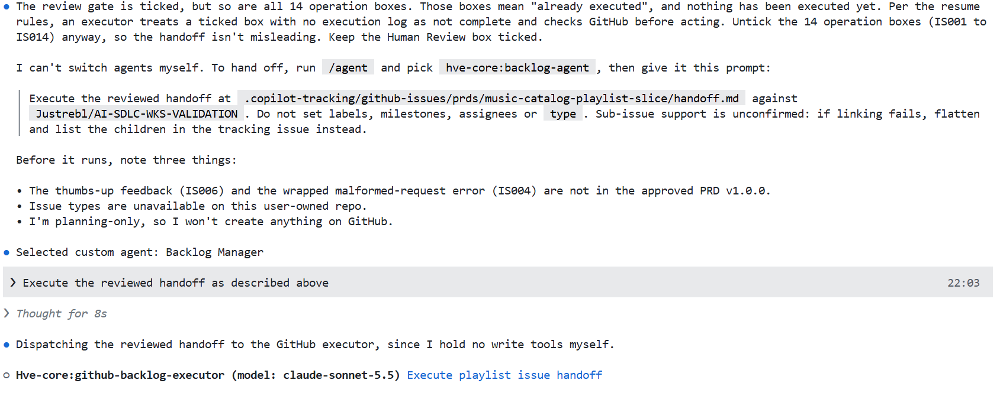

This example shows the transition from planning to Backlog Manager and its executor. It also flags incorrectly ticked operation boxes and differences from the approved PRD: resolve such findings before authorizing your own execution. Use your repository and handoff path, not the pictured values. Executor dispatch is not proof that issues were successfully created.

Success Criteria:
- Backlog Manager confirms GitHub and your repository, then hands the operations to its GitHub Backlog Executor subagent.
- After you confirm, Backlog Manager creates the approved issues in your repository and reports their URLs. Any planned sub-issue relationships match the reviewed handoff; failures or blocked operations are reported explicitly.
- No issue is assigned to Copilot. Delegation stays a human decision, which you make in Level 5.

If required GitHub write tools are unavailable, stop before approving any write.
Use the setup/troubleshoot block below to restore access.

<details>
<summary>🪛 setup/troubleshoot: missing GitHub write tools</summary>

If GitHub write tools are missing, exit the current Copilot CLI session. From a terminal in your workshop repository, start a **fresh session**:

```sh
copilot --enable-all-github-mcp-tools
```

In that new session, use the default agent rather than switching back to the read-only Backlog Manager. Type `/backlog-execute`, select the HVE-Core entry, and press **Tab**. Replace the handoff path and repository, then send the command and task together:

```text
/hve-core:backlog-execute

Run the reviewed plan at <reviewed-handoff-path> and create the corresponding issues in GitHub repository <owner>/<repo>.
```

Review the proposed operations before approving writes. If authentication or write tools are still unavailable, stop and ask the facilitator for help.

</details>

### Step 7: Verify the backlog on GitHub

List the open issues before inspecting them so you can reconcile their numbers and URLs with the reviewed creation plan:

```powershell
gh issue list --state open
```

Then open the created issues on GitHub, including any parent tracking issue.

Success Criteria:
- The created issues match the approved operations in the handoff; reconcile their URLs and count with that plan rather than a fixed number.
- Any planned parent issue shows the expected sub-issues and their progress.

### Step 8: Get a sprint order (read-only)

Ask for dependencies and an implementation order without editing the backlog. Level 5 schedules this triage and adds evidence-based reconciliation.

Run `/agent backlog-manager` in Copilot CLI, or select **Backlog Manager** in VS Code. Type `/backlog-plan`, select the HVE-Core entry, and press **Tab**. Replace `<owner>/<repo>` and add the read-only request before sending:

```text
/hve-core:backlog-plan

Use sprint mode to plan the next iteration for <owner>/<repo> from the open playlist slice issues.
Read-only: recommend an implementation order with dependencies and say which issues can be developed in parallel. Do not change any issue.
```

Stop if the agent reports unavailable GitHub MCP tools; do not treat a failed read as an empty backlog.

<details>
<summary>🪛 setup/troubleshoot: sprint planning cannot access GitHub</summary>

Check the server connection and tool enablement from Step 1; changing the prompt does not grant tool access.

</details>

Success Criteria:
- The saved recommendation links the existing issues, identifies dependencies, and gives an implementation order and any independent work groups.
- Nothing changes on GitHub.

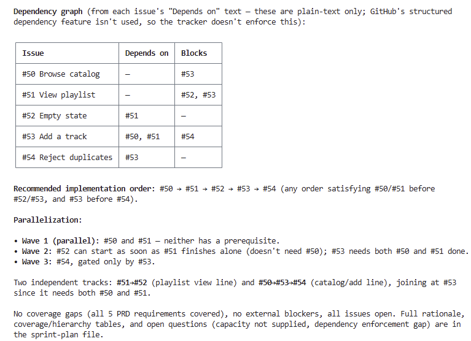

Example captured during a workshop run. Your issue numbers and ordering will differ. The dependencies shown here come from issue text; they are not enforced by GitHub's structured dependency feature.

### Step 9: Hand off to curation

Do not commit yet. The BRD and PRD go through the curation checklist in the next section, and you commit them there together with the Design Thinking record.

Note the parent issue number. You use it in Level 3.

## Curate what you commit

### Topic

HVE-Core agents keep two kinds of output apart:

- **Working state.** Session notes, research, plans, change logs and handoff files. HVE-Core agents write them under `.copilot-tracking\` in your repository. They are drafts for the agent and for you, they can contain raw notes or meeting content, and they are never committed. HVE-Core lists `.copilot-tracking/` in its own `.gitignore`, and the workshop template does the same.
- **Deliverables.** Reviewed documents that other people rely on: the BRD, the PRD, architecture decision records (ADRs), and a short record of the Design Thinking decisions. You commit them next to the code, after a human review.

The rule is simple: never commit the tracking folder. Curate what matters out of it into a reviewed file, then commit that file.

| Agent | Working state (ignored) | Committed deliverable | Source |
| --- | --- | --- | --- |
| **DT Coach** | Coaching state and method notes under `.copilot-tracking\` | A curated decision record. HVE-Core documents no committed location, so the workshop uses `docs\project-planning\playlist-design-decisions.md` | [Design Thinking](https://microsoft.github.io/hve-core/docs/design-thinking/) |
| **Meeting Analyst** | Extracted transcript notes | Nothing. Anonymize what feeds the PRD, then delete the notes after handoff | [Security model](https://microsoft.github.io/hve-core/docs/security/security-model) |
| **BRD Builder** | Session state under `.copilot-tracking\` | `docs\project-planning\<name>-brd.md` | [Product definition](https://microsoft.github.io/hve-core/docs/hve-guide/lifecycle/product-definition) |
| **PRD Builder** | Session state under `.copilot-tracking\` | `docs\project-planning\<name>.md` | [Product definition](https://microsoft.github.io/hve-core/docs/hve-guide/lifecycle/product-definition) |
| **ADR Creator** | Session state under `.copilot-tracking\adr-plans\` | Numbered ADRs in `docs\planning\adrs\` | [Agents catalog](https://microsoft.github.io/hve-core/docs/agents/) |
| **Functional Planner** and **Backlog Manager** | Planning logs and `handoff.md` under `.copilot-tracking\` | GitHub issues, not files | [TPM guide](https://microsoft.github.io/hve-core/docs/hve-guide/roles/tpm) |
| **RPI Agent** (Level 3) | Research, plans, change logs and reviews under `.copilot-tracking\` | The code, the tests and the pull request | [Context engineering](https://microsoft.github.io/hve-core/docs/rpi/context-engineering) |

<div class="important" data-title="Workshop recommendation">

> HVE-Core documents where the BRD, PRD and ADRs go. It does not document a committed location for Design Thinking output. Saving a curated record in `docs\project-planning` next to the BRD and PRD is a workshop recommendation, not an HVE-Core rule.

</div>

### Step 1: Review and commit the deliverables

The delivery brief and `docs/project-planning/dt-later-slice.md` were saved before the optional Product Manager track. Review them together with any BRD and PRD now; do not ask an agent to create another copy. Keep the agreed scope, remove personal or raw notes, and do not link to local tracking files. Agent output remains a draft until you approve it.

Use HVE's commit capability to select only the reviewed files under
`docs/project-planning/`, rather than staging the whole repository. Type
`/git-commit`, select `/hve-core:git-commit.prompt`, press **Tab**, and add the task
below before sending. Do not pre-stage files: the prompt inventories candidates
and asks you to select whole paths, then confirm the exact staged set.

```text
/hve-core:git-commit.prompt
Commit the reviewed Level 2 planning deliverables under docs/project-planning/.
Exclude .copilot-tracking/ and all unrelated changes. Ask me to select the intended
whole paths and confirm their exact staged set before committing.
```

In VS Code's Source Control view, **Staged Changes should contain only the reviewed files under `docs/project-planning/`**. Open each staged file to review the diff that will be committed. No `.copilot-tracking/` file should be included. If unrelated files were already staged or a path is partly staged, stop and resolve that intent before retrying; do not discard existing staging.

The tracking folder stays local and ignored because it contains agent session state, draft reasoning, and potentially sensitive raw notes, not reviewed deliverables. Commit the curated outcomes instead; other readers cannot rely on links to your local working state.

Confirm only the intended staged set. HVE generates the commit message and reports
the resulting commit; it does not push. If there are no changes, inspect the
existing reviewed commits instead of creating an empty one. A real staging or
commit error must be resolved before continuing.

HVE-Core references:

- [Install HVE-Core as an extension](https://microsoft.github.io/hve-core/docs/getting-started/methods/extension) and [Setup in the lifecycle guide](https://microsoft.github.io/hve-core/docs/hve-guide/lifecycle/setup): `.copilot-tracking/` is local working state and belongs in `.gitignore`.
- [Copilot tracking instructions](https://github.com/microsoft/hve-core/blob/main/.github/instructions/hve-core/copilot-tracking.instructions.md): what agents write to the tracking folder, and why committed content must not reference it.
- [Context engineering](https://microsoft.github.io/hve-core/docs/rpi/context-engineering): why RPI keeps research and plans as files outside the conversation.
- [Security model](https://microsoft.github.io/hve-core/docs/security/security-model): sensitive meeting content and the gitignore mitigation.
- [Product definition](https://microsoft.github.io/hve-core/docs/hve-guide/lifecycle/product-definition), [TPM guide](https://microsoft.github.io/hve-core/docs/hve-guide/roles/tpm) and [Business Program Manager guide](https://microsoft.github.io/hve-core/docs/hve-guide/roles/business-program-manager): where the BRD and PRD live and who reviews them.
- [Design Thinking](https://microsoft.github.io/hve-core/docs/design-thinking/) and the [agents catalog](https://microsoft.github.io/hve-core/docs/agents/).
- [HVE-Core custom agents](https://github.com/microsoft/hve-core/blob/main/.github/CUSTOM-AGENTS.md) and the [HVE-Core planning documents](https://github.com/microsoft/hve-core/tree/main/docs/planning), as examples of committed, curated planning content.

---

# Level 3: RPI implementation loop

RPI means **Research, Plan, Implement, Review**. HVE-Core also documents a follow-up stage in the RPI Agent description, but this workshop walks the four core phases.

## Topic

Use RPI Agent to implement the playlist slice from the reviewed Level 2 record at `docs/project-planning/playlist-design-decisions.md`. That file carries the shared scope and acceptance criteria; do not redefine them in each phase prompt. If you completed the Product Manager track, also provide the actual reviewed PRD path and parent issue link. Resolve any disagreement between those sources before approving a plan.

One decision remains yours: **how the user interface handles a duplicate add**. Ask the planner to explain reasonable approaches and their trade-offs, then choose one. The agreed duplicate rejection and accessible feedback remain requirements.

**Why this level:** practise moving from verified evidence to an approved plan, implementation, and acceptance review. The skills carry the procedure; you check the evidence and own the decisions. A small, well-understood change may need only a direct coding request. This workshop deliberately uses the full loop to teach its handoffs, not because every feature requires all four phases.

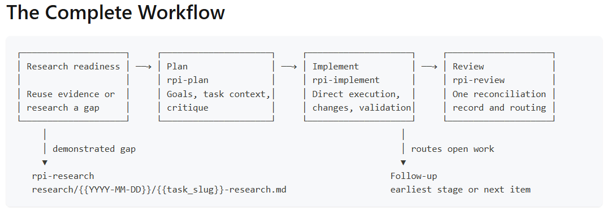

## Work as a developer

**RPI Agent coordinates four skills: Research, Plan, Implement, and Review.** Start from the reviewed Level 2 requirements, work one phase at a time, and read each returned artifact before continuing. Keep its path for the next phase.

If the agent asks how to proceed, choose **Work through each phase with me**. HVE carries the procedure; you own the decisions and approval.

<details>
<summary>How RPI Agent coordinates developer work</summary>

This level follows the HVE-Core [Engineer guide](https://microsoft.github.io/hve-core/docs/hve-guide/roles/engineer) and [Tech Lead guide](https://microsoft.github.io/hve-core/docs/hve-guide/roles/tech-lead).

| Engineer guide stage | HVE-Core command | Where in this level |
| --- | --- | --- |
| Research | `/hve-core:rpi-research` | Research phase |
| Plan | `/hve-core:rpi-plan` | Plan phase |
| Implement | `/hve-core:rpi-implement` | Implement phase |
| Review | `/hve-core:rpi-review` | Review phase |
| Commit and pull request | `/hve-core:git-commit.prompt`, `/hve-core:pull-request` | Tech Lead extension |

Apply these practices from the guides:

- **Start from reviewed requirements.** Open the Level 2 decision record and, when available, the reviewed PRD and parent issue. Those are the inputs; the phase prompts do not replace them.
- **You are the gate between phases.** Read each phase output before you start the next one. Reject anything outside scope.
- **Clear context between phases when it fills up.** The Engineer guide recommends `/clear` between RPI phases: each phase saves its output to files, and the next phase reads those files instead of the chat history. This workshop keeps one session for simplicity. Use `/clear` when the agent drifts or the context is full.
- **Let the Tech Lead tools add judgement.** The Tech Lead guide adds architecture decision records (ADR Creator), multi-perspective review (Code Review) and coding standards that activate by file type. You try them in the optional Tech Lead extension after the Review phase.

### One agent runs the phases

The phase commands are not separate agents, and each one also works on its own without RPI Agent. **RPI Agent** is the HVE-Core agent that coordinates them. It runs `/hve-core:rpi-research`, `/hve-core:rpi-plan` and `/hve-core:rpi-implement`, then `/hve-core:rpi-review`, and saves each phase's output to files so the next phase and later sessions can pick up where it stopped.

You can drive it in two ways:

| Mode | How you start it | When to use it |
| --- | --- | --- |
| Phase by phase (this level) | Run `/agent rpi-agent` in Copilot CLI (select **RPI Agent** in VS Code), then run one `/hve-core:rpi-*` command at a time | Learning RPI, or when you want to check each phase before the next one |
| Full loop | Type `/rpi`, select the HVE-Core prompt with **Tab**, and add the task before sending | A well-scoped task you trust the agent to carry through |

With `/hve-core:rpi.prompt`, RPI Agent asks how much control you want, unless the task text already says (for example, "use automatic mode"). It offers four choices: run end to end, keep going but check with you on unclear decisions, research and plan with you then stop before implementation, or work through each phase with you. In VS Code, the agent's **Full Auto** button starts the end-to-end choice. It still stops for safety confirmations and blockers. To resume a saved task or start a follow-up, select the prompt with **Tab** and identify that task or finding in the same message.

This level drives the phases one at a time so you see each output. Level 5 hands the full loop to RPI Agent on Copilot cloud agent.

### Context engineering: why RPI writes files

An agent only knows what is in its **context window**: the instructions loaded for the session, the files and tool results it read, and the conversation so far. The window is finite. As it fills, older details get summarized or dropped, and the agent starts to drift. RPI is built around that limit.

| Practice | Why it matters |
| --- | --- |
| Each phase writes its output to a file under `.copilot-tracking\` | The research and the plan become durable memory that you can read, correct and hand to the next phase, or to another session, without replaying the chat |
| `/clear` between phases | The next phase starts from the files, not from a long history full of dead ends. Use it when the agent drifts or the context is full |
| Phases with a narrow job | Research and Plan write working artifacts, not application code. Review assesses evidence and routes findings without changing the implementation |
| Instructions in layers | Copilot combines several instruction sources: personal instructions, repository-wide `.github\copilot-instructions.md`, path-specific `*.instructions.md` files that apply by file pattern, and organization instructions. Personal instructions take precedence over repository instructions, which take precedence over organization instructions. HVE-Core adds coding standards that activate by file type in the same way |
| Skills and agents load on demand | A skill's full content enters the context only when the task matches its description, so the window holds what the current phase needs |

See [Context engineering](https://microsoft.github.io/hve-core/docs/rpi/context-engineering) in HVE-Core and [repository custom instructions](https://docs.github.com/en/copilot/how-tos/configure-custom-instructions/add-repository-instructions) on GitHub Docs.

</details>

## Research phase

### Step 1: Ask RPI to research only

Research gathers repository evidence and open questions before anyone plans code changes. Keep application files unchanged during this phase:

Run `/agent rpi-agent` in Copilot CLI, or select **RPI Agent** in the VS Code agent picker. Type `/rpi-research`, select the HVE-Core entry, and press **Tab**. Add the research request before sending:

```text
/hve-core:rpi-research

Research the Music Catalog playlist slice described in docs/project-planning/playlist-design-decisions.md against the current repository.
Identify the evidence, risks, and decisions needed before planning. Do not change application files.
```

Success Criteria:
- A research file exists at the returned path, with repository references supporting its findings and an explicit record of gaps or open questions.
- Application files remain unchanged.

<div class="tip" data-title="Check it yourself">

> Open the research artifact returned for this task, not whichever file is newest. Could a colleague or a fresh session start planning from its evidence and unresolved decisions? Keep the returned artifact paths for the next phase.

</div>

### Step 2: Inspect the research

Open the research file at the path returned by the agent. Check that its key conclusions cite repository files or other evidence, and identify any unanswered questions or decisions needed before planning. Ask the agent to correct unsupported conclusions or missing evidence before continuing. Keep this exact artifact path for the Plan request.

The workshop template includes `.copilot-tracking/` in `.gitignore` by default, so Git ignores the research file and other working artifacts in that folder. There is no need to commit this content; keep it locally for the next RPI phase.

## Plan phase

### Step 1: Ask for an implementation plan

Turn the reviewed evidence into tasks and validation checks before implementation. The planner's default plan critique checks readiness, while the duplicate-feedback choice stays yours:

Type `/rpi-plan`, select the HVE-Core entry, and press **Tab**. Replace `<research-path>` with this task's returned artifact path, then send the command and request together:

```text
/hve-core:rpi-plan

Plan the playlist slice from the reviewed requirements and research at <research-path>.
Keep the scope workshop-sized. Explain the duplicate-feedback options and their trade-offs so I can decide.
```

Success Criteria:
- A saved plan connects the requirements to implementation work and validation.
- If the planner is waiting for your decision, it names the open question and presents options with trade-offs. The plan is not yet implementation-ready; the critique may run only after you answer.
- The plan presents duplicate-feedback alternatives and leaves the choice pending until your decision is recorded.

### Step 2: Review the plan and decide

**Make a choice from the options the planner just presented.** Planning can pause with a message such as "Waiting on your decision D1". This is your turn to decide, not a request to start implementation. Read the options, their pros and cons, and the agent's recommendation. You may follow that recommendation or choose another option based on the trade-off you prefer.

For example, the planner might offer **A: an inline message next to the track**, **B: one page-level status region**, or **C: disable add buttons, with a message if a duplicate request still occurs**. These are illustrative options, not a prescribed list: use the labels and descriptions in your own planner's response. The API must still reject duplicate adds with HTTP 409; your choice concerns how the UI communicates that rejection.

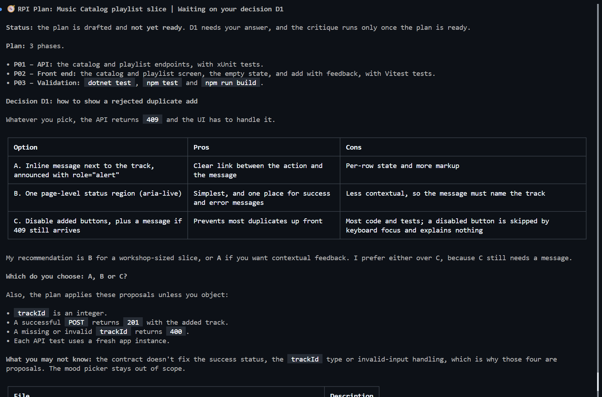

Reply in the same conversation with your choice and a short reason. If your planner offered the example options above and you prefer one shared status region, you could send:

```text
For D1, I choose B: one page-level status region, because I want one place for success and error messages. Include the track name so the duplicate message is clear, and announce it accessibly. Record this choice and rationale in the plan, then finish planning and its critique. Do not implement yet.
```

Do not copy this example unchanged unless it matches your decision. If an option or its consequences are unclear, ask the planner to explain before choosing. Answer any other explicit decision questions it raises; a recommendation alone is not your approval.

**Then review the completed plan.** Open the plan and critique at the returned paths once the planner has recorded your answers and finished its readiness checks. Confirm that the scope matches the reviewed requirements, your selected feedback approach and rationale are recorded, the UI work and tests follow that choice, and no blocking critique findings remain. Ask for corrections if any of these checks fail.

Only when these checks pass, explicitly approve the plan in the conversation. Approval accepts the plan; it does not start implementation. Keep its exact path for the Implement request in the next section. Application files remain unchanged during planning.

Success Criteria:
- The plan records your decision and rationale, rather than merely the agent's recommendation.
- The completed critique reports no unresolved blocking findings, and the plan is implementation-ready.
- You have explicitly approved the reviewed plan without starting implementation.

## Implement phase

### Before Step 1: Create a feature branch

Keep the playlist work separate from the Level 2 default-branch baseline. Ask Copilot to create the feature branch before asking RPI to implement:

```text
Verify that the current branch is the repository's reviewed default branch and
the working tree is clean. Create and switch to feature/playlist-slice from that
baseline. Stop if the branch already exists or the baseline is not ready.
Do not edit files, commit or push.
```

Success Criteria:
- The reported current branch is `feature/playlist-slice`.
- The branch starts from the reviewed default-branch baseline.

### Step 1: Ask RPI to implement

Authorize the approved plan's code and test changes. Implementation returns a changes record with test evidence; a material departure still needs your decision:

Type `/rpi-implement`, select the HVE-Core entry, and press **Tab**. Replace `<plan-path>` with the approved plan's path before sending:

```text
/hve-core:rpi-implement

Implement the approved plan at <plan-path>.
```

Success Criteria:
- The source and test diff matches the approved plan; any material departure has a recorded decision.
- The changes record exists at the returned path and reports completed tasks and API/front-end test results.

Keep that path for Review. Check the reported runs rather than repeating them manually. A skipped or blocked run is not a pass.


### Step 2: Run the app

Start the API and UI in separate terminals so you can test the delivered playlist in a browser. Start each terminal from the repository root.

Launch the API in one terminal:

```bash
cd src/api
dotnet run
```

Launch Vite in another terminal; its proxy sends `/api` requests to the API:

```bash
cd src/front
npm run dev
```

In a Codespace or dev container, open the **Ports** tab beside **Terminal** in VS Code's bottom panel. Open the **Forwarded Address** for the frontend (normally **5173**), not the API (**5080**). Use your session's address, not the example URL in the screenshot. With local tools, use the frontend URL printed by Vite.


Success Criteria:
- The browser shows the track catalog.
- The playlist panel shows the empty-state message.
- Adding a track moves or copies it into the playlist panel.
- A duplicate add is prevented or reported, as you decided at the plan gate.

### Step 3: Commit implementation checkpoint

Use the HVE commit prompt from the repository root; no separate Git commands or
inspection request are needed. It inventories pending paths before asking you
which whole paths to commit. Review the approved implementation in Source Control:
include only approved source, tests and necessary test setup files, never
`.copilot-tracking/`. If RPI already committed the implementation and the working
tree is clean, continue without creating an empty commit.

Type `/git-commit`, select `/hve-core:git-commit.prompt`, press **Tab**, and add
this task before sending:

```text
/hve-core:git-commit.prompt
Commit the approved playlist implementation and its tests from the reviewed RPI plan.
Select only the intended source, tests and necessary test setup paths; exclude
.copilot-tracking/ and unrelated changes. Ask me to select whole paths and confirm
the exact staged set. If the work is already committed, do not create an empty commit.
```

Do not pre-stage everything. Confirm HVE's selected paths and exact staged set only
after reviewing their content. Resolve partly staged or unrelated initially staged
files before retrying. HVE generates the message and creates the local commit;
publication remains the later reviewed PR step.

Success Criteria:
- Pending implementation changes are committed and the working tree is clean.
- If the implementation was already committed, a clean working tree and the existing implementation commits satisfy this checkpoint; "nothing to commit" is not a failure.
- `.copilot-tracking/` is not included in any commit.
- A real staging or commit error must be resolved before continuing.

## Review phase

### Step 1: Ask RPI to review the implementation

Compare delivery with the approved plan before accepting it. Review is read-only: implementation defects go to a later Implement pass, not fixes inside Review.

Type `/rpi-review`, select the HVE-Core entry, and press **Tab**. Replace the placeholders with this task's plan and changes-record paths before sending:

```text
/hve-core:rpi-review

Review the completed implementation against the approved plan at <plan-path> and changes record at <changes-path>.
```

Success Criteria:
- The returned review file links the plan, changes record, and validation evidence, and records an acceptance outcome.
- Each finding identifies its evidence and next action, or the review explicitly records no findings.
- Application files remain unchanged during Review.

A clean review is valid. Carry genuine residual work into Level 5 if any remains; do not invent a finding or defer a required fix to populate the backlog. Read the returned review and resolve accepted blockers before treating the slice as complete. Review notes stay in the ignored tracking folder, so a clean review needs no additional commit.

### Step 2: Debrief the decision

The same acceptance criteria can support different duplicate-feedback designs. Compare your recorded choice with your neighbours or the room, using its tests as evidence:

- Which option did you pick, and why?
- Did the agent recommend the same option? Did its tests follow your choice, or the recommendation?
- Which option is easier to verify with Testing Library queries by role and name?

Success Criteria:
- Your approved plan records the selected duplicate-feedback approach and rationale, and the UI/tests match that choice. Any mismatch is recorded as a finding to resolve.

<div class="tip" data-title="Reference fallback">

> **Scope drift** means the work no longer matches what you approved: for example, adding database persistence when the plan requires in-memory storage, or implementing a different duplicate-feedback design from your recorded choice. Pause acceptance and publication of the affected work, not the whole project.
>
> During **Review**, ask the agent to record the mismatch, affected files and unmet acceptance criteria without changing application files. In a subsequent **Implement** pass, point to that finding and the approved plan, request a correction limited to the affected work, and rerun its validation. Do not discard the implementation or rewrite the plan unless you actually intend to change the requirements.

</div>

## Tech Lead extension and required publication gate

<div class="info" data-title="Extended track">

> The ADR Creator and Code Review activities add 10 to 15 minutes and are optional. Publishing the Level 3 feature through a reviewed pull request below is required before Level 4.

</div>

You may skip the optional ADR and multi-perspective Code Review activities. Do not skip the pull-request preparation and publication gate: Level 4 starts from the reviewed, merged default-branch baseline.

### Step 1: Record the in-memory decision as an ADR

Use your repository-root Copilot session, not the API or frontend server terminal. In Copilot CLI, switch to ADR Creator with:

```text
/agent adr-creation
```

In VS Code, select **ADR Creator** in the agent picker. Keep that agent selected, then type `/adr-author`, select the HVE-Core entry, and press **Tab**. Add this one-line request before sending. Replace `<plan-path>` with the exact reviewed plan path returned in Level 3 and `<repo-visibility>` with your repository's actual visibility (`private` for the workshop template path; `public` in the captured example):

```text
/hve-core:adr-author Create the Music Catalog playlist storage ADR; entry mode: from-planner-handoff; slug: music-catalog-playlist; output template: madr-v4; handoff payload: <plan-path>; decision-makers: TPM; repo visibility: <repo-visibility>; diagram format: mermaid; ASR triggers: performance, maintainability, availability (all three apply); decision: Option A (host-owned lock-protected in-memory store); autonomy tier: partial; target status: accepted; effort: S; backlog target: GitHub work items.
```

`adr-author` is the native authoring skill; it loads the ADR workflow but does not replace the agent selection above. See the [ADR Creator reference](https://microsoft.github.io/hve-core/docs/reference/agents/project-planning/adr-creation/).

These are the captured conversation's choices, not proof that your plan supports them. Confirm or revise them with the agent against your reviewed plan. `accepted` is the target after the native gates, not an approval shortcut; `partial` requires approval before external writes or handoff persistence.

ADR Creator manages its own session under `.copilot-tracking/adr-plans/<project-slug>/state.json`.

<details>
<summary>🪛 setup/troubleshoot: ADR Creator cannot identify the RPI task</summary>

If it cannot identify the right RPI context, give it the actual plan or review path returned in Level 3 rather than asking it to use the newest file.

</details>

**Native startup choices:** read the disclaimer. For a new ADR session, the agent confirms the following three fields from your request, or asks for any that are missing:

**Entry mode**

| Option | Meaning |
| --- | --- |
| `capture` | Start a fresh guided ADR conversation without an upstream handoff payload. |
| `from-planner-handoff` | Start from an actual planner handoff and confirm the prefilled context. |
| `adopt-template` | Adopt your repository's existing ADR template and derive its required questions. |

Use `from-planner-handoff` only when you can share the actual upstream output; selecting the mode does not create that handoff. Otherwise, `capture` can use the RPI artifacts as ordinary context.

**Project slug:** a short kebab-case name for this ADR session, here `music-catalog-playlist`; it selects the tracking folder.

**Output template**

| Option | Meaning |
| --- | --- |
| `madr-v4` | Full MADR v4 record, including evaluation of architecturally significant requirement (ASR) triggers. |
| `y-statement` | Compact six-part decision statement for a low-stakes or reversible choice. |

Answer the native questions and review the Frame and Decide summaries. Let the agent derive the options, rationale, consequences, and validation with you; do not force a question limit or mark a gate passed just to finish quickly.

Success Criteria:
- ADR Creator preserves the chosen session and template, guides the decision, and reports any missing inputs or validation blockers.
- After its gates are satisfied, Govern allocates the ADR number and saves the record under `docs/planning/adrs/`. Keep the reported filename and any generated `.adr-config.yml` changes for the reviewed commit in Step 3.

A sample ADR is in `solutions\afternoon-2\docs\planning\adrs\0001-in-memory-playlist-state.md`. It is a reference, not a filename or document shape your agent must reproduce.

### Step 2: Review the change with the Code Review agent

Run `/agent code-review` in Copilot CLI, or select **Code Review** in VS Code. Copy paste the following prompt:

```text
Review the local commits for the playlist slice since the initial commit of this workshop repository (the template copy or "Workshop starter" commit).

Use the standard profile with the functional, standards, accessibility, and security perspectives at basic depth.
Report findings only. Do not edit files.
```

Code Review asks you to confirm the scope and the perspectives before it runs.

Success Criteria:
- A short walkthrough of the change, then one findings report merged from each perspective.
- Findings that `/hve-core:rpi-review` missed, or a confirmation that there are none.

How it differs from `/hve-core:rpi-review`:

| | `/hve-core:rpi-review` | Code Review agent |
| --- | --- | --- |
| Reviews against | The plan, the requirements and the changes record | The diff, from several perspectives |
| Who steers | The RPI flow | You choose the scope, perspectives and depth |
| Typical use | Close the RPI loop | A Tech Lead check before a pull request |

In Level 6, Copilot code review adds a third reviewer on the pull request itself.

### Step 3: Commit with `/hve-core:git-commit.prompt`

If Steps 1 and 2 left changes to keep, type `/git-commit`, select the HVE-Core prompt, and press **Tab**. Add the commit request before sending:

```text
/hve-core:git-commit.prompt

Commit the reviewed Tech Lead changes only. Exclude .copilot-tracking/ and unrelated
files. Ask me to select whole paths and confirm their exact staged set before committing.
```

Success Criteria:
- You select whole paths and confirm the exact staged set; the agent creates the local commit with a Conventional Commit message.

<div class="tip" data-title="Close the PM backlog from a commit">

> If you created issues in the Level 2 Product Manager track, add a line such as `Closes #12` to a commit message for each sub-issue this slice implements. GitHub closes those issues when the reviewed pull request is merged into the default branch in this level.

</div>

### Step 4: Publish the pull request with `/hve-core:pull-request`

Type `/pull-request`, select the HVE-Core entry, and press **Tab**. Ask it to publish the committed feature branch and open the PR. Review the title, description, target and publication action before confirming:

```text
/hve-core:pull-request

Create a pull request for the committed Level 3 playlist implementation on
feature/playlist-slice, targeting this repository's default branch. Include the
local test and RPI review evidence, without publishing private tracking artifacts.
Check the changed areas and show me the title, description, target and any needed
push before asking for publication approval. After I confirm, push only the
feature branch and open the PR, or report an existing matching PR instead of
creating a duplicate. Do not push to the default branch, merge or bypass branch rules.
```

Success Criteria:
- The agent reads the committed diff of your feature branch, runs quick checks on the changed areas, and shows you a pull request title and description.
- Nothing is published until you confirm the push and PR creation.

Open the returned PR in GitHub and request review from a teammate or facilitator. Keep the change on the feature branch; do not push directly to the default branch or bypass branch rules.

Success Criteria:
- The pull request compares `feature/playlist-slice` with the repository's default branch and contains the Level 3 implementation and its local test and RPI review evidence.
- A human reviewer inspects and approves the change, then merges the pull request through the normal repository workflow. If required checks or review are pending, wait; do not bypass them.

After the pull request is merged, ask Copilot to return to the updated default branch before starting Level 4:

```text
Verify that the Level 3 PR is merged and the working tree is clean. Switch to this
repository's actual default branch and update it by fast-forward only. Stop if
local changes or divergent history prevent this; do not discard work, reset,
rebase or force-push. Confirm that the merged playlist implementation is present.
```

Success Criteria:
- Copilot reports the default branch as current and a clean working tree.
- The default branch includes the merged Level 3 pull request.

---

# Level 4: APM-governed repository agents

## Topic

Your company catalog lists remote plugins; install HVE-Core through it, then APM moves HVE-Core from your personal install into this repository.
The manifest pins the dependency; the lockfile records its resolution.
Copilot reads deployed profiles and skills; policy and audit verify them.
Level 5 requires that audit before cloud-agent PRs merge; this does not run RPI or change the playlist.

**Why this level:** cloud-agent work needs the same verified repository practices that you used locally.

<details>
<summary>Organization agents, plugin marketplaces, and APM: which problem does each solve?</summary>

A **plugin** bundles capabilities such as agents, skills, and MCP configuration. A **Copilot plugin marketplace** lists those packages for discovery. It is a Git-hosted catalog, not GitHub Marketplace for Actions and apps.

| Sharing surface | Useful for | What it does not replace |
| --- | --- | --- |
| Personal plugin, as in Level 1 | Capabilities in your own Copilot environment | The repository setup used by a teammate or cloud agent |
| Organization or enterprise agents | Centrally maintained custom-agent profiles | A project-specific dependency selection and lockfile |
| Copilot plugin marketplace | Discovering and installing packaged capabilities | APM source policy and content audit |
| APM dependency | Declaring, pinning, deploying, and auditing practices with the code | Runtime permissions, tests, or human review of agent behavior |

The manifest pins the direct HVE-Core dependency; the lockfile records APM's
resolved dependency state for installation and audit. Keeping both makes that
resolution inspectable even when the direct reference is already a commit SHA.
Matching package content does not guarantee identical behavior across client or
model versions, tool permissions, or runtime context.

GitHub's documented shared-agent repositories are **`.github` and `.github-private`**, with profiles in their root `agents/` directory. Enterprise-wide governance uses a designated `.github-private` repository configured by an Enterprise Owner. That enterprise route is distinct from repository agents under `.github/agents`; organization-level custom agents are also supported. A repository named `.copilot-private` is not the documented special repository.

Do not assume that storing standalone prompts or skills in the shared-agent repository distributes them to every client. Check the capability's supported sharing path. See [organization agents](https://docs.github.com/en/copilot/how-tos/administer-copilot/manage-for-organization/prepare-for-custom-agents) and [enterprise governance](https://docs.github.com/en/copilot/how-tos/administer-copilot/manage-for-enterprise/manage-agents/create-github-private-repo).

APM can also manage compatible **whole Agent Plugins**. After the curated personal
installation below, this exercise separately deploys HVE-Core's repository agents
and skills. [Plugin support](https://microsoft.github.io/apm/consumer/copilot-agent-plugins/) depends on the APM and Copilot client versions.

For other harnesses, [`apm compile`](https://microsoft.github.io/apm/producer/compile/) compiles **instructions** into target context files such as `AGENTS.md` or `CLAUDE.md`. Agents, skills, and other primitives are deployed by `apm install`. Their tools and formats must still be compatible with the target harness; compilation is not universal translation.

</details>

## Use your company's curated marketplace

### Step 1: Inspect the catalog and register your copy

Open `.github/plugin/marketplace.json` at the repository root. It already ships
with your template copy: do not copy the solution or create another plugin.
Its name is `contoso-plugin-marketplace`; its four entries refer to upstream
repositories rather than files inside your workshop repository.

**Install only HVE-Core in this exercise.** The Java entries illustrate curation:
their advertised skills/canvas payloads are absent at the selected source revision.
WorkIQ requires external Microsoft 365 authentication and can read and write tenant
data. Browsing these entries is not proof that their capabilities run in every
client. No Java runtime or Microsoft 365 account is required.

Register **your template copy**, replacing `OWNER/REPO` with its GitHub owner/name,
then browse the catalog. Run these commands from the repository root in Bash:

```bash
copilot plugin marketplace add OWNER/REPO
copilot plugin marketplace browse contoso-plugin-marketplace
```

**Success Criteria:** the registered catalog points to your repository and lists
HVE-Core, Java Development, Java Modernization Studio and WorkIQ. If registration
is blocked by policy or this name points to another catalog, stop and ask your
tutor; do not overwrite a managed catalog or force removal.

### Step 2: Switch the personal HVE source explicitly

Level 1 already installed HVE. Inspect its identity before changing anything so
the same plugin name does not hide two different sources:

```bash
copilot plugin list --json
```

Look for rows with `name: "hve-core"` and their `marketplace`, `source`, `version`
and `enabled` values. Continue only with no HVE entry, one `hve-core@hve-core`
entry, or one `hve-core@contoso-plugin-marketplace` entry. Duplicate, direct-source,
unknown or managed installations need tutor/admin help before continuing.

If the only entry is the Level 1 `hve-core@hve-core` and you agree to replace that
personal install, exit your current CLI session and remove **only that identity**:

```bash
copilot plugin uninstall hve-core@hve-core
copilot plugin list --json
```

Verify there are now no HVE rows before installing the curated copy. This removes
the known collision rather than assuming a second install overwrites it. If removal
fails or another HVE entry remains, stop. To restore the old source after a failed
curated installation, ask the tutor and use the Level 1 installation procedure.
If the sole entry already comes from this company catalog, skip removal and
installation and check its version/enabled state instead.

Install the reviewed HVE package from your catalog, then inspect its provenance:

```bash
copilot plugin install hve-core@contoso-plugin-marketplace
copilot plugin list --json
```

**Success Criteria:** exactly one HVE row comes from `contoso-plugin-marketplace`,
reports `3.2.2`, and is enabled. Start a fresh CLI session and confirm **DT Coach**
and **RPI Agent** are available. If the install, provenance or agent check fails,
stop before the APM transition.

### Step 3: Register the catalog in VS Code

In VS Code Settings, enable `chat.plugins.enabled`. In your **user** settings JSON,
add your repository to the existing `chat.plugins.marketplaces` array, preserving
other entries. This is an illustrative value; replace the repository placeholder:

```json
{
  "chat.plugins.enabled": true,
  "chat.plugins.marketplaces": ["OWNER/REPO"]
}
```

Open Extensions and search `@agentPlugins`, choose **HVE-Core** from
`contoso-plugin-marketplace`, select **Install**, and review the trust prompt.
If VS Code already discovers the CLI-installed copy, verify it instead of adding
another. It can discover CLI packages only when it can access the same installed
plugin filesystem; a host profile and a remote container/WSL profile may differ.
Manage a separate older VS Code HVE plugin in that UI with tutor help; do not assume
CLI uninstall removes it. Stop on policy restrictions rather than bypassing them.

**Success Criteria:** VS Code shows the company catalog and its HVE installation,
with DT Coach and RPI available. Recommendations in the solution
`.github/copilot/settings.json` are not evidence of installation; do not copy that
file for this exercise, as its enable overlay would interfere with the later CLI
disable. The GitHub Copilot app registration is a **tutor demo**, not a third
participant setup.

### Step 4: Read construction and versioning

Compare the HVE and Java entries in `.github/plugin/marketplace.json`.
`source.repo` names the upstream repository, `source.path` selects a subdirectory
when needed, and `source.sha` pins the fetched revision. HVE uses the full root
package at the reviewed commit, not the differently shaped old release package.

**Decision check:** Record the catalog's `metadata.version`, HVE's entry `version`,
and its source SHA. Which value pins files? The catalog version describes your
catalog; plugin version metadata describes the package; the SHA selects exact
content. Neither label alone pins downloaded files. APM's separate lockfile does
not lock your personal plugins.

<details>
<summary>How a maintainer publishes a reviewed version change</summary>

A maintainer reviews the upstream package, updates the source SHA and matching
version metadata in a PR, validates the catalog, and bumps the catalog version.
Attendees then refresh discovery with
`copilot plugin marketplace update contoso-plugin-marketplace` and explicitly
update the installed package with
`copilot plugin update hve-core@contoso-plugin-marketplace`. VS Code uses
**Extensions: Check for Extension Updates**. No version bump or live update is
required today. A pinned source remains pinned until the reviewed entry changes.
Custom marketplace auto-update is separate user/managed configuration, not enabled
by shipping this catalog. Company curation is not itself enforced enterprise policy.

</details>

## Install HVE-Core through APM

### Step 1: Declare the repository dependency

Use the same repository as Levels 1–3. Copy the manifest that tells APM which package and version this project uses. Run this Bash file-copy command from the repository root:

```bash
cp solutions/afternoon-2/apm.yml ./apm.yml
```

**Decision check:** Which exact HVE-Core commit SHA and deployment target are selected in `apm.yml`? Record both values before you install.

Open `apm.yml`. Its dependency is `microsoft/hve-core#1dbd6a7ea90b74accaf8c809262e38952bd4c359`: a commit SHA, not “whatever is newest.” The `copilot` target selects the deployment layout for this workshop, not an AI model.

### Step 2: Install and inspect the repository agents

Install that dependency for Copilot:

```bash
apm install --target copilot
```

Open `apm.lock.yaml` and locate `resolved_commit`. Then open `.github/agents/rpi-agent.agent.md` and `.github/agents/backlog-manager.agent.md`: these are the profiles the later exercises will use. Inspect the supporting skills under `.agents/skills`.

**What to expect:** the lockfile records the pinned commit, and the repository contains readable agent profiles and skills. If any are missing, resolve the installation error before continuing.

### Step 3: Switch from personal to repository agents

The curated personal HVE-Core plugin and the new repository profiles can both
appear in the agent picker. After verifying the repository files, exit the current
CLI session and disable the exact curated personal copy from your terminal:

```bash
copilot plugin disable hve-core@contoso-plugin-marketplace
copilot plugin list --json
```

Verify the curated row is disabled, then start `copilot` again from the repository
root and check the agent picker. **RPI Agent** and **Backlog Manager** should remain
available from the repository. Disable preserves the personal install;
`copilot plugin enable hve-core@contoso-plugin-marketplace` restores it later.

<div class="warning" data-title="Managed plugins and VS Code">

> Managed settings may prevent local disabling. If so, stop and ask the tutor/admin
> to resolve the intended handoff; do not claim the personal plugin is disabled.
> This CLI command does not disable a separate VS Code extension or plugin.
> In VS Code, disable the personal HVE plugin through its plugin UI, then verify
> repository RPI Agent and Backlog Manager remain available. Distinguish any managed
> duplicate entries explicitly; they do not mean the APM installation failed.

</div>

## Apply repository policy

### Step 1: Set the allowed sources

The manifest selects a package; the policy decides whether that selection is permitted. This policy allows **`microsoft/**`** sources, requires pins, limits dependency depth, and denies inline self-defined MCP servers.

`executables.deny` is a separate guard on components that can run code: hooks, `bin` executables, self-defined MCP servers, LSP servers, and canvas extensions. The `untrusted-org/*` rule blocks matching executable components even if local consent is given. Source selection and executable trust are different checks.

Copy the policy with Bash, then open it to inspect those two rule groups:

```bash
cp solutions/afternoon-2/apm-policy.yml ./apm-policy.yml
```

**Decision check:** Which dependency source pattern is allowed, and which executable namespace is denied? Point to the two rule groups in `apm-policy.yml`.

Success Criteria:
- `apm-policy.yml` exists at the repository root with `enforcement: block`.
- `dependencies.allow` contains `microsoft/**`, and `executables.deny` contains `untrusted-org/*`.

### Step 2: Check policy and installed content

Parse the policy first so configuration errors are visible, then check whether the installed dependency and deployed files comply. The audit checks provenance, consistency, and policy—not whether the agent will always behave correctly:

```bash
apm policy status --policy-source apm-policy.yml
apm audit --ci --policy apm-policy.yml
```

Success Criteria:
- Policy status reports `Outcome: found`, `Enforcement: block`, and `Warnings: none`.
- The audit exits successfully for the pinned HVE-Core dependency and its deployed content.

If either check fails, inspect the named error before continuing; a parsed policy alone is not a passing audit.

<div class="warning" data-title="Audit coverage">

> Drift detection can replay installation and fetch dependencies. On a restricted network, ask for help or inspect the recorded output; a blocked audit is not a pass. `--no-drift` reduces coverage and is not a substitute for the CI gate. Upstream labels policy auditing experimental; no `apm experimental enable` command is needed.

</div>

<details>
<summary>How an organization makes the policy a gate across repositories</summary>

An organization can publish shared `apm-policy.yml` rules; repositories can extend that policy, and an organization policy can extend an enterprise baseline. Inheritance is **tighten-only**: a repository cannot broaden the parent's allowed sources or weaken its block rule.

For example, a company could curate packages in reviewed GitHub repositories, list those repositories as trusted APM sources, and expose plugins through a company marketplace. **Marketplace discovery and APM source trust remain separate**: allowing the marketplace's name is not an APM dependency rule.

A shared GitHub Actions audit checks the committed lockfile and deployed files against that policy. An organization ruleset can require a centrally controlled workflow across selected repositories where the GitHub plan supports it. This prevents a repository from simply removing its local audit to avoid the gate. Policy distribution, workflow execution, and mandatory enforcement are three distinct pieces.

For **enterprise-owned organizations**, Enterprise Owners can designate an organization's `.github-private` repository as the enterprise's client-governance source and publish `copilot/managed-settings.json` there. Server-managed settings apply to users receiving a Copilot license from the enterprise or any of its organizations, even without access to that repository; this is not a settings file to add to your workshop repository.

Supported keys include `extraKnownMarketplaces` to distribute approved catalogs, `strictKnownMarketplaces` to restrict plugin installation to listed marketplaces, and `enabledPlugins` to enable or disable specific plugins. Administrators can also control permissions and specialize eligible settings for enterprise teams. Managed settings take precedence over user configuration, but **client support varies by key**: check the [supported-keys matrix](https://docs.github.com/en/copilot/reference/enterprise-administrators/enterprise-managed-settings#supported-keys) before a rollout.

This enterprise-admin control is **not** APM policy or a repository CI gate, and does not imply every governed user needs a Copilot Enterprise seat. Configuring enterprise governance is outside this participant lab; see [Getting started with enterprise-managed settings](https://docs.github.com/en/copilot/how-tos/administer-copilot/manage-for-enterprise/use-managed-settings/get-started).

See [APM policy inheritance](https://microsoft.github.io/apm/enterprise/apm-policy/), [organization workflow gates](https://microsoft.github.io/apm/enterprise/github-rulesets/), and [Copilot enterprise-managed plugin standards](https://docs.github.com/en/copilot/concepts/enterprise/plugin-standards).

</details>

### Step 3: Edit a rule to block a dependency, then restore the policy

**Learner edit:** Keep the allowlist unchanged and add a temporary `dependencies.deny` entry for `microsoft/hve-core` to the existing `dependencies` block:

```yaml
dependencies:
  allow:
    - "microsoft/**"
  deny:
    - "microsoft/hve-core"
  require_pinned_constraint: true
  max_depth: 3
```

Run `apm audit --ci --policy apm-policy.yml` again. It should exit with code `1`: the deny rule wins even though the source matches the allowlist. Remove only the temporary `deny` entry and rerun the audit. **Restore a passing audit before committing.**

## Publish the method and its audit

### Step 1: Add the PR audit workflow

Copy the workflow with Bash so GitHub checks the committed setup on pushes and pull requests:

```bash
mkdir -p .github/workflows
cp solutions/afternoon-2/.github/workflows/apm-audit.yml .github/workflows/apm-audit.yml
```

**Decision check:** Does this workflow reinstall packages or audit the committed context as-is? Verify `setup-only` and the audit command in the copied file.

Open `.github/workflows/apm-audit.yml`. It sets up APM **without reinstalling your packages**, then runs `apm audit --ci --no-cache --policy apm-policy.yml`. Reinstalling first could overwrite the drift you wanted to detect. The workflow pins APM `0.33.0`; use the same release locally when regenerating committed APM outputs.

**A workflow alone does not block merging.** Level 5 makes `apm-audit` required after the remaining setup is published.

### Step 2: Commit and push the verified setup

Review the pending paths and their diffs. Include the deployed agents and shared skills, not just the manifest: a fresh cloud environment cannot read your personal plugin or private tracking notes.

Check pending paths first; verify `/git-commit` still offers the HVE commit prompt
from the repository deployment after personal HVE is disabled. If it is missing,
stop and ask the tutor to resolve the deployment rather than using a raw commit.

```text
Inspect the pending repository setup paths and their diffs. Identify deployed
agents and shared skills as well as the APM manifest, lock and policy. Report
unrelated or partly staged files; do not stage, commit, discard or push anything.
```

Select `/hve-core:git-commit.prompt` with **Tab**, then give it the governed scope.
Review the requested whole paths and exact staged set before confirming:

```text
/hve-core:git-commit.prompt
Commit the governed repository setup: apm.yml, apm.lock.yaml, apm-policy.yml, and
the reviewed deployed files under .github/ and .agents/. Exclude .copilot-tracking/
and unrelated files. Ask me to select whole paths and confirm the exact staged set.
```

Once the local commit succeeds, publish it separately. A failed or missing commit
is not permission to continue:

```text
Publish the committed Level 4 repository setup to the current branch's upstream
after showing me the remote, branch and commits and obtaining my confirmation.
Stop if branch rules reject the push; use a reviewed setup PR instead, without
bypassing protection or force-pushing. Do not create another commit.
```

### Step 3: Confirm readiness on GitHub

On the default branch, open `.github/agents` and `.agents/skills`, then inspect the **APM Audit** run in **Actions**. If your setup was published on a branch, get it reviewed and merged before continuing.

**Success Criteria:** the pinned setup is on the default branch, the audit passed for that commit, and RPI Agent and Backlog Manager are available in the repository. You will use them next—not the disabled personal plugin.

**Marketplace checkpoint:** your own repository catalog is registered in CLI and
VS Code; the curated HVE source/version was checked before the personal-to-APM
handoff. No private company repository access or optional-plugin installation was
needed. Catalog discovery and APM source trust remain separate.

---

# Level 5: Agentic workflows and delegation

## Stage 5a: Verification as contract

## Topic

Verify application tests, cloud setup, and APM audit as separate parts of the baseline.
Run them before delegation so the agent starts with working code and tools.
GitHub rulesets make selected checks merge requirements; green checks do not prove acceptance criteria.
Handoff: a tested `main`, working cloud setup, and strict `apm-audit` gate before Stage 5b.

**Why this level:** delegated work needs a verified baseline and a working environment before the agent starts.

<div class="warning" data-title="Permissions and availability">

> Rulesets need repository administration permission and a supported GitHub plan. Cloud-agent and Copilot code-review availability depend on licensing and organization policy. If unavailable, use the facilitator's prepared PR; do not treat an absent check or review as passed.

</div>

If you lack the permission or license needed to activate a required check, stop at the handoff and use the facilitator's prepared PR. Do not claim the gate is active.

### Step 1: Copy and inspect the test workflow

Copy the supplied workflow so pull requests and pushes to `main` run the API and front-end tests. Keep the solution file unchanged and inspect its triggers and job before publishing:

```bash
mkdir -p .github/workflows
cp solutions/afternoon-2/.github/workflows/ci.yml .github/workflows/ci.yml
```

**Decision check:** Which events trigger the `test` job, and which API and front-end test commands does it run? Find them in `.github/workflows/ci.yml`.

Use the HVE commit prompt to select the reviewed workflow only. Confirm its exact
staged set; do not stage unrelated files or tracking state:

```text
/hve-core:git-commit.prompt
Commit the reviewed CI workflow at .github/workflows/ci.yml only.
Ask me to select the whole path and confirm its exact staged set; exclude tracking state.
```

After successful local commit, publish to the default branch before requiring the check:

```text
Show me the remote, branch and committed CI workflow change, then ask for
confirmation to publish it. Stop if branch rules require a reviewed PR; do not
bypass them or force-push. Do not stage files or create another commit.
```

Wait for **CI** on `main` to pass. Then make its `test` job a required check using the supplied ruleset:

```bash
gh api --method POST "repos/{owner}/{repo}/rulesets" --input solutions/afternoon-2/rulesets/main-tests-required.json
```

In **Settings > Rules > Rulesets**, confirm **Tests must pass on main** is active. The supplied test rule allows repository administrators to complete setup pushes; ordinary pull requests must pass `test`. That exception does not apply to the separate APM audit rule. Level 3 used local tests before repository CI or required checks existed.

### Step 2: Prepare a working cloud environment

`.github/workflows/copilot-setup-steps.yml` installs .NET and Node dependencies before the cloud agent starts. Keep the job name `copilot-setup-steps`. Add a build after **Install front-end dependencies** so a broken baseline fails before the agent begins:

```yaml
      - name: Build the API
        run: dotnet build MusicCatalog.slnx --no-restore
```

Use the same HVE capability to commit the reviewed setup change before enabling
the strict audit rule:

```text
/hve-core:git-commit.prompt
Commit the reviewed Copilot setup at .github/workflows/copilot-setup-steps.yml only.
Ask me to select the whole path and confirm its exact staged set; exclude tracking state.
```

Publish only after the local commit succeeds:

```text
Show me the remote, branch and committed Copilot setup change, then ask for
confirmation to publish it. Stop if branch rules require a reviewed PR; do not
bypass them or force-push. Do not stage files or create another commit.
```

Check that **Copilot Setup Steps** passed in Actions. Dependencies missing from setup may require downloads during the session, where the agent firewall can block them.

See [Customize the agent environment](https://docs.github.com/en/copilot/how-tos/copilot-on-github/customize-copilot/customize-cloud-agent).

### Step 3: Require the APM audit

After the initial CI and cloud-setup changes are on `main`, wait for **APM Audit** on its latest commit to pass. Then make its `apm-audit` check required:

```bash
gh api --method POST "repos/{owner}/{repo}/rulesets" --input solutions/afternoon-2/rulesets/main-apm-audit-required.json
```

Confirm **APM audit must pass on main** is active. Its ruleset has **no bypass list**, including for administrators. A failed or missing `apm-audit` blocks merging. Once active, later Stage 5b workflow and planning changes must use a reviewed pull request; do not push them directly to `main`.

### Handoff artifact: Stage 5a verification record

Record the current default-branch commit and link the passing run or setting for each guarantee. Recheck all evidence against the latest `main` commit before moving on.

| Guarantee | Evidence to record |
| --- | --- |
| Application tests | `test` passed and is required by the active test ruleset |
| Cloud environment | `Copilot Setup Steps` passed with the API build |
| Repository agents | `APM Audit` passed; `apm-audit` is required with no bypass actors |

## Stage 5b: Backlog and delegation

## Topic

Reconcile committed planning, issue criteria, and revision-bound PR/check evidence before delegation.
This prevents stale recommendations and unverified closure; the daily job can propose but not choose work.
Handoff: a human-selected, criteria-backed issue linked to committed plans and any existing PR.
Boundary: safe outputs cap issue writes; people assign Copilot and own Project status.

**Why this level:** a team needs more than agents that write code. It needs issues that reflect current evidence, visible progress, and a clear decision about what to delegate.

<details>
<summary>Two jobs, one delivery loop: backlog reconciliation and cloud-agent RPI</summary>

**GitHub Agentic Workflows (`gh-aw`)** compiles Markdown workflow definitions into GitHub Actions. The daily job reads committed planning, issues, PRs, and checks; a separate safe-output job applies its bounded issue updates. It does not assign work or change application code.

**Copilot cloud agent** takes the issue you choose and works in a fresh GitHub environment. RPI gives it a structured loop: Research the current implementation, Plan a bounded change, Implement with tests, and Review against the issue. A clear problem, acceptance criteria, and exclusions are more useful than an unbounded “improve this app.”

| Evidence | Backlog response |
| --- | --- |
| Committed planning changes | Link the revision and flag changed scope or dependencies; do not silently rewrite agreed requirements |
| Linked draft or open PR | Record progress and remaining criteria, not completion |
| Fixing PR merged to `main`, with criterion evidence | Link the fixing PR and commit; close a fully satisfied issue |
| Partial delivery or missing checks | Keep the issue open and explain what remains |

Level 4 made the method repository-readable. This level makes the work traceable. Level 6 adds an independent Copilot code review and the human merge decision.

</details>

### Start the Stage 5b setup branch

The strict APM audit rule is active before any backlog workflow or planning changes begin. Create a feature branch for those changes; the setup PR must pass both required checks and receive human review before you continue:

```text
Verify the working tree is clean and the current default-branch baseline includes
the verified Stage 5a setup. Create and switch to feature/level-5b-backlog.
Stop if that branch already exists or the baseline is not ready. Do not commit or push.
```

## Install and initialize gh-aw

### Step 1: Make the workflow commands available

Install the GitHub CLI extension, unless it is already present:

```bash
gh extension install github/gh-aw
```

### Step 2: Initialize the repository

Initialize the support files for agentic workflows in this repository:

```bash
gh aw init
```

Review the files created by the command. The Copilot-engine integration files depend on the installed gh-aw version.

## Build the daily backlog job

### Step 1: Copy the reconciliation workflow

The solution imports the repository's Backlog Manager profile and declares which GitHub writes are allowed. Copy only the backlog workflow; accessibility is a separate demonstration later.

```bash
cp solutions/afternoon-2/.github/workflows/daily-backlog.md .github/workflows/daily-backlog.md
```

**Decision check:** Which committed planning paths does the job read, which profile does it import, and which label and caps gate issue writes? Find `Gather revision-bound evidence`, `imports`, and `safe-outputs` in the copied file.

### Step 2: Inspect the write boundary

Open `.github/workflows/daily-backlog.md`. Locate the schedule, `imports`, and `safe-outputs`.

- `imports` reuses `.github/agents/backlog-manager.agent.md`; this is the workshop's integration pattern, not a grant of its local tools.
- The agent reads repository content, issues, PRs, and Actions evidence. `copilot-requests: write` authorizes inference, not repository edits.
- A separate safe-output job applies only declared writes. Comments, labels, and closures require the **`backlog-managed`** opt-in; the workflow caps one summary issue, five comments, three closures, and ten label additions or removals per operation.
- No assignment, application-code write, or Project write is enabled.

<div class="warning" data-title="Choose the automation boundary">

> This job can close opted-in issues when delivery evidence satisfies their criteria. Add `backlog-managed` only to issues you authorize it to reconcile. Issue and PR text is untrusted input; reading it does not grant write authority or authorize broader writes or assignment. You still choose what Copilot implements.

</div>

<details>
<summary>Why safe outputs matter for an unattended job</summary>

The agent can read an issue containing malicious instructions. Read-only agent permissions prevent direct GitHub edits; safe outputs perform only the separately declared operations, with target filters and operation limits. Those limits bound damage; they do not prove every proposed update is correct. Review the run's evidence when an issue changes unexpectedly.

The job links a planning revision, PR, or fixing commit in each progress update. It skips an identical evidence update on later runs and leaves ambiguous work open. A merged PR or a checked checkbox alone is not proof of complete delivery.

See [safe outputs](https://github.github.com/gh-aw/reference/safe-outputs/).

</details>

### Step 3: Compile and review the job

Compilation validates the source and creates the Actions workflow. The generated gh-aw `.lock.yml` is not APM's `apm.lock.yaml`: they lock different systems. Do not hand-edit the generated workflow; review the source, generated files, and initializer output before staging:

```bash
gh aw compile
```

Ask Copilot to inspect the compilation changes without staging them:

```text
Inspect the pending paths and diffs from gh aw init and gh aw compile, including
.github/workflows/daily-backlog.md and its generated lock. Report unexpected
changes. Do not stage, commit, modify generated files or publish anything.
```

Confirm that the changed files belong to `gh aw init`, the backlog source, or generated workflows. The generated `.github/workflows/daily-backlog.lock.yml` is local until the reviewed setup PR is merged.

<details>
<summary>🪛 setup/troubleshoot: push rejected for workflow files</summary>

> With a classic OAuth credential, workflow edits need the `workflow` scope. Use `gh auth refresh --scopes workflow` and `gh auth setup-git` if that is the reported problem. In a Codespace, run `unset GITHUB_TOKEN` first so `gh` uses your login; if `GH_TOKEN` is also set, it takes precedence over that login. Fine-grained credentials need the appropriate Workflows permission instead.

</details>

## Give the backlog real work and evidence

### Step 1: Prepare the next small planning decision

Open your committed `docs/project-planning/dt-later-slice.md` from Level 2 alongside `docs/project-planning/playlist-design-decisions.md`. Confirm that the chosen DT idea is still a small, separate follow-up and that its dependencies are satisfied by the merged Level 3 implementation. Refine unclear acceptance criteria before creating an issue; do not use BRD/PRD Builder or start implementation here.

**Reference fallback only:** if you did not save a usable DT decision, pause and recover your choice with the tutor. If you explicitly choose **Remove a track from the playlist** instead, the supplied brief is a worked example:

```bash
cp solutions/afternoon-2/docs/project-planning/remove-playlist-track.md docs/project-planning/remove-playlist-track.md
```

**Decision check:** Does this brief revise the original agreement or record a follow-up, and which behaviors remain excluded? Find `Status`, `Constraints`, and `Traceability`, then compare them with the committed Level 2 planning brief.

Keep the original slice's exclusions: the selected document records a follow-up, not a rewrite of the earlier agreement. For your DT brief, check its scope, exclusions and rationale rather than requiring the example's headings. If your Level 2 brief is missing, resolve that gap before treating it as planning evidence.

### Step 2: Publish the 5b setup in a reviewed PR

The strict `apm-audit` rule is already active. Review the `gh aw init` output and ask Copilot to inspect the setup before invoking the commit prompt:

```text
Inspect pending paths and diffs under .github/workflows and the selected later-slice
planning brief. Identify required initializer files and unrelated changes.
Do not stage, commit or publish anything.
```

For your own DT idea, use `docs/project-planning/dt-later-slice.md` as the selected brief and replace the fallback path in the commit request below. That brief may already be committed from Level 2; do not create an empty commit for it. Commit any reviewed refinements together with the new setup files. If required initializer files remain pending, add their reviewed exact paths to the commit request before sending.

Select the HVE commit prompt with **Tab** and provide this bounded task. Review
the source workflow, its compiled lock and the planning brief before confirming
the selected paths and exact staged set:

```text
/hve-core:git-commit.prompt
Commit the reviewed Stage 5b setup: .github/workflows/daily-backlog.md,
.github/workflows/daily-backlog.lock.yml and
docs/project-planning/remove-playlist-track.md only. Ask me to select whole paths
and confirm the exact staged set. Exclude .copilot-tracking/ and unrelated changes.
```

After successful local commit, use the pull-request capability to publish this branch and create the setup PR:

```text
/hve-core:pull-request
Create a PR titled "Add the Stage 5b backlog setup" from feature/level-5b-backlog
to this repository's default branch for the committed bounded backlog workflow
and reviewed planning brief. Show me the description, target and needed push,
then ask for publication approval. After confirmation, publish only this feature
branch and open the PR, reusing an existing matching PR if present.
Do not merge, push to the default branch or bypass test or apm-audit checks.
```

Wait for both required checks, `test` and `apm-audit`, on the PR revision. A human reviews and merges the PR through the normal workflow; do not bypass either check or treat an open PR as completion. After merge, sync the default branch before creating the feature issue:

```text
Verify the Stage 5b setup PR is merged and the working tree is clean. Switch to
the actual default branch and update it by fast-forward only. Stop on local
changes or divergent history without discarding, resetting or rebasing anything.
Confirm the reviewed planning brief and compiled backlog workflow are present.
```

**What to expect:** the default branch contains the reviewed planning brief and compiled workflow, and the PR records passing required checks plus human approval.

### Step 3: Create a scoped feature issue

On GitHub, open **Issues > New issue > Feature request**. If this follow-up already exists, inspect it rather than create a duplicate. Populate the title, problem, outcome, acceptance criteria, area and exclusions from your reviewed DT later-slice brief. The following **Remove a track** form is a worked example, not a replacement for your chosen idea:

Title:

```text
[Feature]: Remove a track from the playlist
```

Problem statement:

```text
Users can add tracks to the in-memory playlist, but they cannot remove a track if they added the wrong one.
```

Expected outcome:

```text
A user can remove an existing track from the in-memory playlist without refreshing the page.
```

Acceptance criteria:

```text
- [ ] API exposes a remove operation for an existing playlist track.
- [ ] Removing an unknown or absent track returns a clear error status and JSON body.
- [ ] Front end shows an accessible Remove button for each playlist item.
- [ ] Removing a track updates the playlist panel and restores the empty state when the last item is removed.
- [ ] xUnit and Vitest tests cover the behavior.
```

Area:

```text
both
```

Out of scope:

```text
Persistence, multiple playlists, users, reorder, search, and styling library changes.
```

Success Criteria:
- The issue has checkable acceptance criteria and explicit exclusions matching the selected later-slice brief.

Add a comment linking to the two planning documents on your repository's default branch. Copy their URLs from GitHub's file view, not from a local editor. The job can now relate the issue to the committed planning revision.

### Step 4: Opt the issue into reconciliation

Create the opt-in label once, then replace `ISSUE-NUMBER` with your feature issue number:

```bash
gh label create backlog-managed --description "Allow bounded backlog evidence updates and verified closure"
gh issue edit ISSUE-NUMBER --add-label backlog-managed
```

If the label already exists, use it. Apply it to any existing playlist issues you want the job to reconcile, including PM-track issues. Unlabelled issues can inform the summary but will not receive task updates or be closed.

### Step 5: Turn a deferred review finding into an issue

Open the review artifact returned for your Level 3 task. If it contains genuine residual work that you agreed to defer, create an issue for that finding, replacing the title and body below. If the review was clean, skip this step; do not invent a finding.

```bash
gh issue create --title "Review finding: SHORT-TITLE" --body "Deferred from the Level 3 RPI review. Finding: WHAT-AND-WHERE. Smallest fix: SMALLEST-FIX."
```

Include acceptance criteria and a source link. Add `backlog-managed` only if you want automated reconciliation for it.

### Step 6: Run daily backlog

Trigger the same job that will run on weekdays. This consumes Copilot inference and Actions usage:

```bash
gh aw run daily-backlog
```

Open the run in **Actions** and wait for it to finish. Then open the latest `[Daily backlog]` summary and your opted-in feature issue.


### Step 7: Read the summary issue

Compare the summary's **Evidence and progress**, **Recommended implementation order**, and **Needs a human decision** sections with your issue. Its update should link the committed planning and identify remaining criteria. It should **stay open**: no remove feature has been delivered yet.

**What to expect:** a summary and evidence comment, or an explicit no-change/missing-evidence result. A successful run without an issue update is not proof of reconciliation; check the safe-output log. Review any proposed closure against the linked fix and criterion evidence.

Use **Can be developed in parallel** to identify independent work. Parallel recommendations do not override missing dependencies or human assignment.

### Handoff artifact: Human-selected backlog task

Before delegation, record the task you chose and verify each item:

| Handoff evidence | Ready when |
| --- | --- |
| Planning | The original Level 2 agreement and follow-up brief are committed on the default branch through the reviewed setup PR. |
| Selection | A person selected or confirmed one feature issue after checking the summary's recommendation and blockers. |
| Issue contract | The issue links both planning documents, retains all acceptance criteria and exclusions from the selected later-slice brief, and is open; missing evidence stays visible. |
| Authority | `backlog-managed` is an explicit per-issue opt-in. A person assigns Copilot and sets intermediate Project status; the workflow does neither. |

## Delegate after the verification handoff

Choose the issue backed by your reviewed **DT later-slice decision**, unless the summary identifies a real blocker. Use **Remove a track from the playlist** only if you selected that fallback. Prepare the same test contract and environment for the cloud agent that you used locally.

### Step 1: Confirm the agent's inputs

On GitHub's default branch, verify the RPI Agent in `.github/agents`, supporting `.agents/skills`, committed planning, and the setup workflow. The cloud agent cannot read ignored `.copilot-tracking` files from your machine.

### Step 2: Assign the issue

On the feature issue, use **Assignees** or the Copilot task control to choose Copilot and **RPI Agent** where supported. In Level 3 you drove the phases; now you authorize the bounded end-to-end loop. In a local session, `/rpi` is the entry point; in the cloud assignment, the task instructions carry the same intent.


Send these additional instructions with the issue. The default path is your
reviewed DT decision; **only if you selected the Remove a track fallback**, replace
`docs/project-planning/dt-later-slice.md` with
`docs/project-planning/remove-playlist-track.md`. Verify the selected brief exists
on your repository's default branch before assignment:

```text
Use the RPI workflow. Work end to end in automatic mode on this issue, using docs/project-planning/dt-later-slice.md and the repository instructions as context. Keep the implementation within the issue acceptance criteria and exclusions. Preserve in-memory state and add API and UI tests. Run dotnet test from the repository root and npm test from src/front. Review the change against the issue before returning the PR. Link this issue and the fixing commit; use a closing keyword only if the PR fully resolves it. Do not merge or modify the backlog workflow.
```

**What to expect:** a linked task session and draft PR on the issue. If RPI Agent is unavailable, record that limitation; the default agent can follow the task, but it is not evidence that HVE orchestration ran.

## Follow one task on the shared dashboard

Use the issue timeline to see assignment, progress, and the linked PR. If the team has a shared **GitHub Project**, add this issue through its **Projects** field. Use the Project's actual Status choices: a planned state before assignment, an in-progress state during implementation, then a review state when the PR is ready.

With Project write access, check **Project menu > Workflows > Item closed** and enable its transition to **Done**. Keep status-to-issue closure automation off: moving a card to Done is not delivery evidence. If there is no shared Project or you lack permission, follow the same issue timeline; do not create a token just for the lab.

The daily job updates issue evidence, not Project fields. Built-in Project workflows handle configured closure transitions; people set the intermediate review state. Agent-driven field updates would need separate Project access and a field contract, not just repository `GITHUB_TOKEN`.

When an open PR has meaningful progress, rerun `gh aw run daily-backlog`. Check for the PR link and remaining criteria on the managed issue. With unchanged evidence, another run should not add the same progress comment. An open PR must not cause closure.

## Accessibility review: separate demonstration

While the coding task runs, watch the facilitator's browser-supported accessibility example. **No participant configuration or audit run is required.** The private CoffeeSoft references are shown through prepared visuals:

- [Scheduled accessibility audit](https://github.com/CoffeesoftDotDev/accessibility-copilot/blob/main/.github/workflows/a11y-scheduled-audit.md)
- [Accessibility remediation conventions](https://github.com/CoffeesoftDotDev/accessibility-copilot/blob/main/.github/copilot-instructions.md)
- [Awesome Copilot customization catalog](https://github.com/github/awesome-copilot)

The example connects browser evidence to an actionable issue. Its scheduled workflow declares its own Playwright tool; repository MCP settings apply to cloud agent/code review, not automatically to gh-aw, your CLI, or your IDE. Missing runtime checks are reported as **not tested**, not a clean audit.

When the implementation PR is ready, continue to Level 6 and explicitly request **Copilot code review** on that PR. The coding agent's RPI self-review is not that independent review.

## Extended track: delegate a security review to Copilot cloud agent

<div class="info" data-title="Extended track">

> This optional track needs the Level 4 agents on your default branch and Copilot cloud agent enabled. Follow it only if your facilitator includes it. It is report-only: a qualified person must validate findings before fixes, and a human decides whether to merge. The label-triggered variant also needs a repository-scoped credential.

</div>

<details>
<summary>Optional security delegation: report-only task, review, and label-triggered extension</summary>

This track follows the HVE-Core [Security Architect guide](https://microsoft.github.io/hve-core/docs/hve-guide/roles/security-architect). In that guide, a security architect:

1. Plans controls with **Security Planner**.
2. Adds supply-chain review with **SSSC Planner**.
3. Adds **RAI Planner** only when the system has AI components.
4. Tracks risks with `/hve-core:risk-register`.
5. Checks the implementation with `/hve-core:rpi-review` and **Security Reviewer**.
6. Uses `/hve-core:incident-response` in operations.

Here, you hand the Security Reviewer run to Copilot cloud agent. The review runs on GitHub instead of on your machine, and comes back as a pull request that a human reviews.

<div class="warning" data-title="Assistive tools only">

> The HVE-Core security agents are assistive tools. They do not replace SAST, DAST, SCA, penetration testing, or review by a qualified person. A qualified person must validate every finding before anyone acts on it.

</div>

| Mechanism | Classification |
| --- | --- |
| Security Planner, SSSC Planner, RAI Planner, Security Reviewer | HVE-Core agents, documented by HVE-Core |
| Custom agents for Copilot cloud agent, read from `.github/agents` on the default branch | Documented capability |
| Assigning an issue to Copilot with a custom agent through the REST API (`agent_assignment.custom_agent`) | Documented capability, public preview |
| The gh-aw `assign-to-agent` safe output | Documented gh-aw capability, needs a fine-grained PAT |
| Security Reviewer and its subagents running inside Copilot cloud agent | Workshop pattern: check what the report says it ran |
| A report-only security pull request | Workshop pattern |

### Step 1: Check that Security Reviewer is on the default branch

List the published agent profiles so the delegated task can select Security Reviewer:

```bash
gh api "repos/{owner}/{repo}/contents/.github/agents" --jq ".[].name"
```

Success Criteria:
- `security-reviewer.agent.md` is listed.

If it is missing, check that the Level 4 commit included `.github` and reached the default branch. Assigning without the custom agent is a fallback, not a successful check of HVE-Core orchestration.

### Step 2: Create the security review issue

Create a report-only issue with explicit source scope and a document deliverable:

```bash
url=$(gh issue create --title "[Security]: Review the playlist slice" --body-file - <<'EOF'
## Goal

Run a security review of the Music Catalog playlist slice with the HVE-Core Security Reviewer in audit mode.

## Scope

- src/api
- src/front/src

## Deliverable

- One pull request that adds docs/security/playlist-security-review.md.
- For each finding: severity, file and line, description, recommendation, and whether the finding was verified.
- Do not change application code. Fixes become separate issues after human review.

## Note

These findings are AI-assisted. A qualified person must validate them before anyone acts on them.
EOF
) || exit 1
issue=${url##*/}
printf '%s\n' "$url"
```

Success Criteria:
- A new issue exists, and the Bash variable `issue` holds its number.

### Step 3: Assign the issue to Copilot with Security Reviewer

Choose one option.

**Option A: GitHub UI.** Open the issue. Under **Assignees**, choose **Copilot**. When the dialog lets you choose a custom agent, choose **Security Reviewer**. Then copy paste the following additional instructions:

```text
Report only. Follow the issue: review src/api and src/front/src in audit mode, then open one pull request that adds docs/security/playlist-security-review.md. Do not change application code. List which security skills you applied and mark every finding as verified or unverified.
```

**Option B: command line.** This uses the documented REST API for assigning issues to Copilot, which is in public preview. Run from the same Bash session so `issue` still holds the number created above. Node.js, already installed for the workshop, serializes the JSON payload safely:

```bash
set -o pipefail
repo=$(gh repo view --json nameWithOwner --jq .nameWithOwner) || exit 1
base=$(gh repo view --json defaultBranchRef --jq .defaultBranchRef.name) || exit 1
: "${issue:?Create the security review issue first in this Bash session}"
node -e 'console.log(JSON.stringify({
  assignees: ["copilot-swe-agent[bot]"],
  agent_assignment: {
    target_repo: process.argv[1],
    base_branch: process.argv[2],
    custom_agent: "security-reviewer",
    custom_instructions: "Report only. Add docs/security/playlist-security-review.md and do not change application code. List which security skills you applied and mark every finding as verified or unverified.",
    model: ""
  }
}))' "$repo" "$base" |
  gh api --method POST "repos/$repo/issues/$issue/assignees" --input -
```

Success Criteria:
- Copilot is an assignee and opens a draft pull request.
- The session log identifies the reviewed code scope and the security skills it applied.

<div class="info" data-title="Workshop note">

> This workshop passes the agent file name without `.agent.md` as `custom_agent`. That is the format the gh-aw examples use. If the assignment ignores the custom agent, use Option A and pick the agent in the UI.

</div>

### Step 4: Review the security pull request

When the pull request is ready, check:

- Only `docs/security/playlist-security-review.md` changed.
- Each finding points to a file and a line that you can open.
- The report lists the skills it applied.
- You verify at least one finding yourself and mark false positives.

A sample report with illustrative findings is in `solutions/afternoon-2/docs/security/playlist-security-review.md`. Use it to compare the shape, not the findings.

Success Criteria:
- Nothing merges without a human decision.
- Each finding you accept becomes an issue. You can create these issues with Backlog Manager, as in the Level 2 Product Manager track.

### Step 5 (facilitator demo): Delegate with a label and gh-aw

The solution workflow `solutions/afternoon-2/.github/workflows/security-review-delegation.md` automates Step 3, while a human still decides:

- **Trigger:** a person adds the `security-review` label to an issue.
- **Agent job:** it only reads the issue and checks that it is a scoped security review request. It cannot write to GitHub.
- **Safe output:** `assign-to-agent` performs the assignment with `custom-agent: security-reviewer`, `target: triggering`, and `max: 1`. The `names: [security-review]` trigger filter is the label gate.
- **Authentication:** assigning Copilot needs a fine-grained PAT stored as the `GH_AW_AGENT_TOKEN` secret. The PAT needs read access to metadata and write access to actions, contents, issues, and pull requests. The default `GITHUB_TOKEN` and GitHub App tokens are not accepted.

Ask Copilot to prepare a new branch; the APM rule now protects the default branch:

```text
Verify the default-branch baseline and clean working tree, then create and switch
to security-review-delegation. Stop if that branch already exists or the baseline
is not ready. Do not commit or publish anything.
```

Then copy and compile the workflow from the repository root. Enter the secret only in the CLI's interactive prompt, never in Copilot Chat:

```bash
cp solutions/afternoon-2/.github/workflows/security-review-delegation.md .github/workflows/security-review-delegation.md
gh aw compile
gh label create security-review --description "Delegate a security review to Copilot cloud agent"
gh secret set GH_AW_AGENT_TOKEN
```

Use the HVE commit prompt to review and commit the workflow source and compiled
lock only. Never include the PAT or tracking state in the selected paths:

```text
/hve-core:git-commit.prompt
Commit the reviewed label-gated security workflow at
.github/workflows/security-review-delegation.md and its compiled .lock.yml only.
Ask me to select whole paths and confirm the exact staged set; exclude credentials,
.copilot-tracking/ and unrelated changes.
```

After the local commit succeeds, publish through a reviewed setup PR:

```text
/hve-core:pull-request
Create a PR for the committed security-review-delegation branch to the actual
default branch. Show me the target, description and needed push, and ask for
publication approval. After confirmation, publish only this feature branch
and open the PR, reusing an existing matching PR if present. Do not merge,
bypass required checks, or include credentials or private tracking artifacts.
```

Open the returned pull request, wait for the required checks, and have a human review and merge the workflow setup before using the label trigger. `gh secret set` prompts for the value, so the PAT does not end up in your shell history. Then create a new security review issue, as in Step 2, and add the `security-review` label to it.

Success Criteria:
- The workflow runs, and Copilot is assigned with Security Reviewer.
- Without the label, or without the secret, nothing is assigned.

<div class="warning" data-title="Long-lived credential">

> A PAT is a long-lived credential. Limit it to this repository, set a short expiry, and delete it after the workshop.

</div>

</details>

---

# Level 6: Review the delegated work

## Topic

Compare issue criteria with evidence for the exact PR revision, not an earlier commit.
The posted Copilot review and current `test`/`apm-audit` checks add distinct evidence; neither proves every behavior.
Handoff: resolved findings, verified criteria, and review/check results tied to the same PR head.
Boundary: a human approves or requests changes and decides whether to merge; an open PR stays open.

**Why this level:** the agent's self-review, an independent PR review, and passing checks provide different evidence. None replaces your acceptance decision.

<details>
<summary>RPI self-review, Copilot code review, and human acceptance</summary>

| Review | Evidence it adds | Boundary |
| --- | --- | --- |
| RPI Review in the coding task | Compares the work with the plan and issue criteria | Performed within the agent's own delivery loop |
| Copilot code review on GitHub | Examines the PR diff and repository instructions; posts comments and suggestions | A separate request; a comment review, not human approval |
| Required `test` and `apm-audit` checks | Exercise behavior and verify the repository's APM setup | Green checks alone do not prove every acceptance criterion |
| Human review | Accepts scope, evidence, trade-offs, and remaining risk | The decision about merging |

Copilot does not automatically repeat its review after each new push. Request another review after substantive fixes. The final check and review evidence must relate to the revision you intend to merge.

</details>


## Review the pull request

### Step 1: Follow the agent session

Open the Level 5 issue and its linked PR, then the agent session from the PR timeline. Check the setup and RPI work before reading the diff.

Look for the setup build, tests, the agent's review, and any blockers. The PR should reference your issue and describe the delivered change. If the task is still working, inspect its progress and use the facilitator's prepared PR for the review exercise; do not declare an unfinished task complete.

### Step 2: Request the independent Copilot code review

Once implementation is ready, mark the PR **Ready for review** if it is still a draft. Under **Reviewers**, request **Copilot**. This reviews the result of the delegated RPI execution, not the backlog summary.

<details>
<summary>🪛 setup/troubleshoot: request Copilot review from the CLI</summary>

Alternatively, replace `PR-NUMBER` and request it from the repository terminal:

```powershell
gh pr edit PR-NUMBER --add-reviewer '@copilot'
```

</details>

Wait for a posted Copilot review in the PR timeline, even if it reports no findings. A request without a completed review is not review evidence. If an automatic review already ran, check which commit it reviewed.

<div class="warning" data-title="Review availability and usage">

> If Copilot is unavailable as a reviewer, use the facilitator's completed review and record the limitation. Reviews consume Copilot usage and may use Actions minutes on private repositories; see [billing](https://docs.github.com/en/copilot/concepts/billing-and-usage). Automatic review is a separately configured [repository rule](https://docs.github.com/en/copilot/how-tos/copilot-on-github/set-up-copilot/configure-code-review), not a side effect of assigning an issue to the coding agent.

</div>

### Step 3: Read the diff, then approve workflows

GitHub Actions on a cloud-agent PR may wait for approval from a user with write access. They execute PR code: inspect the diff first, then choose **Approve and run workflows** where prompted.

Record the current PR head SHA. Check **both** `test` and `apm-audit` on that revision, and confirm the posted review also covers it. Where you enabled the rulesets, a missing or failed check blocks merging. A test run in the agent session is useful context, not a replacement for those hosted checks. Any later push makes earlier review/check evidence stale; wait for both checks and request another review after substantive changes.

### Step 4: Match the change to the issue

Compare the five issue criteria with code, tests, and any observed UI behavior. In particular: a successful removal, a clear error for an unknown or absent track, accessible Remove controls, and the empty state after removing the last item.

Check that state remains in memory and the PR adds no excluded feature. Read any reported firewall or test limitation as missing evidence, not as a waiver.

### Step 5: Resolve valid review findings

Read Copilot's comments critically. For a real gap, mention `@copilot` in a PR comment with a specific requested correction. Explain why if you dismiss a suggestion. After substantive changes, rerun the checks and request another Copilot review.

### Step 6: Decide

Merge only when the issue criteria are satisfied, required checks pass for the latest revision, and review findings are resolved or explicitly accepted. Otherwise leave the PR open with a clear request. A closing keyword should name this issue only if the PR fully resolves it.

After merge to `main`, inspect the issue timeline for the closing PR and fixing commit. If it remains open, rerun `gh aw run daily-backlog`: the opted-in reconciliation job must check delivery evidence before closing it. Partial delivery stays open with remaining criteria.

On the shared Project, verify **Done** if you configured the closed-item workflow. Without that automation, update the card yourself after acceptance; issue comments do not automatically change Project fields. Finally, ask Copilot to synchronize the local default branch:

```text
Verify the delegated PR is merged and the working tree is clean. Switch to the
actual default branch and update it by fast-forward only. Stop on local changes
or divergent history; do not discard, reset, rebase or force-push.
```

**Success Criteria:** the delegated PR has a completed Copilot code review and current check evidence; the human merge/change-request decision is recorded; the issue and dashboard match delivered work.

<details>
<summary>Cloud-agent guardrails behind the review gates</summary>

| Risk | Mitigation documented by GitHub |
| --- | --- |
| Someone outside the team steers the agent | Only users with write access can assign the agent. Comments from users without write access are never passed to it |
| Hidden instructions in an issue or comment | Hidden characters are filtered, for example text in an HTML comment is not passed to the agent |
| The agent pushes where it should not | It pushes only to its own `copilot/` branch, cannot approve or merge, and is subject to branch protections and required checks |
| The agent's code runs in your CI unreviewed | Workflows wait for **Approve and run workflows** from a user with write access |
| The agent leaks code or secrets to the internet | The agent firewall limits internet access by default |
| Nobody can tell who did what | Commits are authored by Copilot, co-authored by the person who assigned the work, and link to the session log |

See [Risks and mitigations for Copilot cloud agent](https://docs.github.com/en/copilot/concepts/agents/cloud-agent/risks-and-mitigations).

</details>

## Commit checkpoint

No local commit is required for this level unless you changed local files. Check
the working tree first; delegated PR commits are not a reason to create an empty
local commit:

```text
Inspect the local working tree after Level 6. Report whether any local changes
remain; distinguish them from the delegated PR's commits. Do not stage, commit,
discard changes or push.
```

For reviewed local changes only, select the HVE commit prompt and provide the task:

```text
/hve-core:git-commit.prompt
Commit the reviewed local Level 6 changes only, if any remain.
Exclude .copilot-tracking/ and unrelated files. Ask me to select whole paths and
confirm their exact staged set; do not create an empty commit for delegated PR work.
```

Success Criteria:
- Local work remains clean.
- The delegated work is merged or tracked in its pull request, and the rest of the backlog is tracked in GitHub.

---

# Recap: Governed agentic SDLC

## Topic

You will connect the AI SDLC workshop into one operating model, then look at it as an architect would: how to roll it out, measure it, apply it to existing code, and choose a method and a model.

### Facilitator demo: Secret scanning and push protection

This is facilitator-only; attendees do not configure push protection in their repositories. Private organization repositories need **GitHub Secret Protection** for secret scanning and push protection. Demonstrate only in a licensed proctor repository and use the generated fake key below—**never** use a real credential, even a revoked one.

<details>
<summary>Optional facilitator demonstration: fake key, blocked push, and cleanup</summary>

Copilot cloud agent already runs secret scanning on the code it generates. Push protection applies the same check to every push, whether it comes from a person, a Codespace, or an agent.

### Step 1: Enable push protection

In the proctor repository, open **Settings → Advanced Security**. Under **Secret Protection**, click **Enable**, then click **Enable** next to **Push protection**.

### Step 2: Add a workshop custom pattern

Generate a fake key from the repository root. It is not a real credential:

```bash
node -e "console.log('MCWS_' + require('crypto').randomBytes(16).toString('hex').toUpperCase())"
```

Under **Secret Protection**, to the right of **Custom patterns**, click **New pattern**, then enter:
- Pattern name: `Music Catalog workshop key`
- Secret format: `MCWS_[A-Z0-9]{32}`
- Test string: the key you generated

Click **Save and dry run**, then **Publish pattern**, then **Enable** push protection for the pattern.

### Step 3: Try to push the fake key

Ask Copilot to create the isolated demo branch in the proctor repository:

```text
Verify the working tree is clean, then create and switch to demo/push-protection.
Stop if the branch already exists. Do not commit or publish anything.
```

From the proctor repository root, paste your generated fake key in place of `PASTE-KEY-HERE`:

```bash
printf '%s\n' 'MUSIC_CATALOG_KEY=PASTE-KEY-HERE' > demo.env
```

In the prepared HVE-enabled proctor profile, invoke the commit capability for
this synthetic fixture only. Keep the selected-path and staged-set confirmations:

```text
/hve-core:git-commit.prompt
Commit only demo.env containing the generated fake workshop custom-pattern key.
It is a synthetic fixture, never a real credential. Ask me to select the whole
path and confirm its exact staged set; exclude tracking state and unrelated files.
```

After successful local commit, attempt the protected push. Do not bypass a rejection:

```text
Show me the proctor remote, demo/push-protection branch and synthetic-fixture
commit, then ask for confirmation to attempt that branch's push. Report the
push-protection rejection. Do not use a bypass link, retry with a bypass,
force-push or publish to the default branch.
```

Success Criteria:
- The push is **rejected**. The output names the **Music Catalog workshop key** pattern, the file and the commit.
- No alert is created, because nothing reached the repository.

<div class="important" data-title="Do not bypass">

> The rejection message offers a link to bypass the block. Do not use it. A bypass creates a secret scanning alert, and an administrator must review it.

</div>

### Step 4: Clean up

Return to `main` and remove only the rejected demo branch and its temporary file. Do not bypass push protection to publish the fake key.

```text
Verify the demo push was rejected and the current branch is demo/push-protection.
Show me the exact temporary branch and demo.env cleanup targets and ask for
confirmation before deleting anything. After confirmation, return to the actual
default branch and delete only the local demo branch and any remaining demo.env
fixture. Stop on unrelated changes or unexpected state; do not reset other work
or bypass push protection.
```

Success Criteria:
- Copilot reports a clean working tree on the default branch.
- The fake key never reached GitHub.

</details>

## What you practiced

**Act 1, build the feature.** You started with a clean starter app. You used DT Coach to constrain the problem. You used RPI Agent to research, plan, implement, and review a full-stack slice, kept its context small with phase artifacts, and made one real design decision at the gate.

**Act 2, scale the method.** You installed pinned repository agents with APM, applied a source policy, and published an audit. You compared that with marketplace discovery, then compiled a daily backlog job that reconciles opted-in issues with committed planning and delivery evidence.

**Act 3, close the loop.** You required tests and the APM audit, prepared the cloud environment, and delegated a scoped issue to RPI Agent. You requested Copilot code review on the resulting PR and made a human acceptance decision, then checked issue and shared dashboard progress.

If you ran the extended tracks, you also worked in three roles: as a Product Manager, you went from BRD to PRD to tracked GitHub issues; as a Tech Lead, you added an ADR and a multi-perspective code review; as a Security Architect, you delegated a report-only security review to Copilot cloud agent.

## Operating model

| Layer | What it did today | Governance point |
| ----- | ----------------- | ---------------- |
| DT Coach | Framed the capability and boundaries. | Humans accepted fixed decisions. |
| PM agents (extended) | BRD Builder, PRD Builder, Functional Planner and Backlog Manager turned decisions into issues. | Planning is read-only; only a confirmed `/hve-core:backlog-execute` writes to GitHub. |
| RPI Agent | Sequenced research, plan, implement, review. | Humans gate each phase; tests and commits verified progress. |
| APM | Installed HVE-Core into the repo with a SHA pin. | `apm.lock.yaml` and policy audit made it reproducible. |
| Plugin marketplace | Registered your curated catalog in CLI/VS Code and installed HVE before the APM transition. | Catalog/plugin versions and source SHA differ; discovery is distinct from APM trust. App setup stayed a tutor demo. |
| gh-aw | Reconciled opted-in issues with committed plans and linked delivery evidence. | Read-only agent job; capped safe outputs; human delegation. |
| CI and ruleset | Made `dotnet test` and `npm test` a required check on the default branch. | The same contract for humans and agents; bypasses are audited. |
| Security Reviewer (extended) | Ran a report-only security review in Copilot cloud agent. | A human labels or assigns, and a qualified person validates every finding. |
| Copilot cloud agent | Implemented one scoped issue through the RPI loop. | Human assignment, setup steps, firewall, workflow approval, required checks, PR review. |
| Accessibility review (demo) | Connected source and browser evidence to a tracked finding. | Audit-only; missing runtime coverage remains explicit; no conformance claim. |
| Shared GitHub Project | Displayed the delegated task and delivered status. | Intermediate status set by people; configured closed-item automation reflects accepted issue closure. |
| Copilot code review | Reviewed the agent's PR against repository instructions. | Comments only; a human approves and merges. |
| Secret scanning | Facilitator demonstrated a fake key blocked before push; attendees did not configure it. | Push protection and audited bypasses (Secret Protection licence). |

<div class="important" data-title="Human judgment stays in the loop">

> The SDLC is agentic, not unattended. Humans choose scope, approve policies, review outputs, validate tests, and decide what lands on the default branch.

</div>

## Final validation

Verify the final API behavior with its integration tests before closing the workshop. Run from the repository root:

```powershell
dotnet test
```

Run the front-end suite from its project directory to verify the rendered interaction contract:

```bash
cd src/front
npm test
```

Success Criteria:
- API tests pass.
- Front-end tests pass.
- Your repository has clean, reviewed commits for the playlist slice and governance setup.

## Architect capstone

Use this section as a short facilitated discussion, or read it on your own. Each part starts from what you did today and asks what changes at the scale of an organization.

### Roll out across the organization

| Today, in your repository | At organization or enterprise scale |
| --- | --- |
| You inherited the Copilot features, models and MCP access that your organization allows | Enterprise and organization **Copilot policies** decide which features, models, preview features and MCP servers are available. MCP access can be limited to servers from an [MCP registry](https://docs.github.com/en/copilot/how-tos/administer-copilot/manage-mcp-usage/configure-mcp-server-access) |
| `.github\copilot-instructions.md` and `.github\agents` in one repository | Organization custom instructions, and [organization or enterprise custom agents](https://docs.github.com/en/copilot/concepts/agents/cloud-agent/about-custom-agents) in a `.github` or `.github-private` repository |
| `apm.yml` and `apm-policy.yml` in one repository | An organization or enterprise APM policy that repositories extend. APM policy inheritance is designed to tighten only: a repository can add restrictions but not relax its parent. Check the current [APM documentation](https://microsoft.github.io/apm/), because the policy schema is evolving |
| Your template copy's curated marketplace, registered in CLI and VS Code | An organization-curated marketplace repository for discovery; marketplace listing remains distinct from APM source trust |
| One repository ruleset | Organization rulesets that apply the same required checks and reviews to many repositories |

### Measure the impact

- Use [Copilot usage metrics](https://docs.github.com/en/copilot/concepts/copilot-usage-metrics/copilot-metrics) for adoption and engagement: who uses which features, and how often.
- Adoption is not impact. Measure delivery outcomes that you already track, before and after: cycle time from issue to merge, review time, rework on pull requests, and change failure rate.
- Compare agent pull requests with human ones: merge rate, number of review rounds, and how often the required checks fail. A rising rework rate is a sign that issues are not scoped well enough for delegation.
- Keep usage units separate from outcome metrics. See **Choose a model and track usage** below.

### Adopt it on existing code

Today's starter was small and clean. Most of your repositories are not. A pattern that works on existing code:

1. **Research first.** Run research-only RPI on the area you want to change. Do not plan or implement yet.
2. **Write down what research found.** Turn the conventions it found into repository instructions, and into path-specific instructions for the riskiest folders.
3. **Make verification the contract** before any delegation: CI, required checks, and the setup steps the agent needs.
4. **Delegate low-risk work first:** tests, documentation, and small, well-scoped issues with clear acceptance criteria. Widen the scope as the review data in **Measure the impact** improves.

### Choose a method

RPI is one structured method among several. Choose by the kind of uncertainty you face:

| Method | The source of truth | Use it when |
| --- | --- | --- |
| Agent mode or a single prompt | The conversation | The change is small, local and easy to verify |
| RPI (today) | Research, plan and review artifacts for each task | The code is unfamiliar, or you need a human gate between understanding, deciding and changing |
| Spec-driven development, for example [GitHub Spec Kit](https://github.com/github/spec-kit) | A specification that lives with the code, from which plans and tasks are derived | The requirements are the hard part, and several people or agents implement against the same spec |

The methods combine: a spec can describe what to build, and RPI can carry out each task from it.

### Choose a model and track usage

| Task | A reasonable starting point |
| --- | --- |
| Routine edits, explanations, small fixes | **Auto**, or an efficiency-oriented model |
| Research and planning on unfamiliar code, reviews | A stronger reasoning model |
| Unattended workflows and delegated tasks | A model you choose explicitly, recorded for reproducibility |

Auto model selection is documented in VS Code, Copilot CLI, the Copilot App, and GitHub.com surfaces. Its documented tiers are **Efficiency** (prioritizes cost, for fast, straightforward tasks), **Balance** (cost, quality and latency, for everyday work) and **Intelligence** (prioritizes quality, for complex tasks). Auto excludes models that are not in your plan, models blocked by administrator policy, and models blocked by data residency or FedRAMP constraints. Do not assume that Auto, or any model, is always the cheapest, fastest or best: measure it on your own tasks with the **Controlled measurement experiment** in the Extra Credits, and record the model actually selected when you need reproducibility.

Different experiences consume different units. Keep them distinct when you report usage:

| Experience | Usage unit to track | Notes |
| ---------- | ------------------- | ----- |
| VS Code Chat and Agent | AI credits under the current Copilot billing model | Code completions are not billed on paid plans. |
| Copilot CLI | AI credits | Use `/usage` if your CLI version supports it. |
| Copilot cloud agent | AI credits plus separate GitHub Actions runner consumption where applicable | Keep AI credits and runner minutes separate. |
| Copilot code review | AI credits, plus GitHub Actions minutes on private repositories | See Level 6. |
| gh-aw with the Copilot engine | AI credits for Copilot requests; GitHub Actions workflow execution for compute | `permissions: copilot-requests: write` enables Copilot requests from the workflow pattern used here. |
| External APIs, MCP tools, or package registries | Provider-specific units | Do not blend third-party API fees with Copilot AI credits. |

Check current rates in [Copilot billing and usage](https://docs.github.com/en/copilot/concepts/billing-and-usage) rather than in workshop material.

---

# Extra Credits 🪙

Use this section only if you finish early or as a facilitator-led discussion. Do not add unverified prices or unpublished claims. The model-choice guide and the usage-unit matrix are in the **Architect capstone** of the recap.

## HydraFusion research preview

Project HydraFusion is described by GitHub as a **research preview**. The verified execution patterns are:

- **Single**: one selected model solves the task directly.
- **Cascade**: an efficient model drafts a solution and a quality gate decides whether to accept or escalate.
- **Critique**: one model drafts, an independent critic reviews, and the drafting model revises once.

Cost and usage aggregate across every workflow leg. Treat HydraFusion as an optional research preview, not a production default and not guaranteed cheaper.

<div class="warning" data-title="Experimental feature">

> The workshop research verified the HydraFusion concept and patterns from GitHub's announcement. It did not verify a stable CLI toggle command. If HydraFusion appears in `/model`, use the current UI and documentation rather than memorized commands.

</div>

## Controlled measurement experiment

Run the same bounded task through multiple modes and compare results. Keep context fixed.

Task prompt to reuse:

```text
Review the Music Catalog playlist implementation for one missed edge case. Do not edit files. Return one finding at most, with file, behavior, test idea, and confidence.
```

Measurement template:

| Run | Model or mode | Context size | Usage units | Latency | Tests passing | Review findings |
| --- | ------------- | ------------ | ----------- | ------- | ------------- | --------------- |
| 1 | Efficient model |  |  |  |  |  |
| 2 | Stronger reasoning model |  |  |  |  |  |
| 3 | Auto |  |  |  |  |  |
| 4 | HydraFusion, if available |  |  |  |  |  |

Separate context sources when interpreting the result:

- Files in the repository.
- Repository instructions and plugins.
- The user prompt.
- Conversation history.
- Tool results.
- Sub-agents or `/fleet` workers.
- Generated output.
- Context compaction or summarization.
- Billable usage.

## CLI commands to verify locally

Inspect available models and usage first; use only commands listed by your installed CLI version:

```text
/model
```

Read the usage view to record the units and values reported by this CLI experience:

```text
/usage
```

`/fleet` starts parallel delegated work; it is not a usage report. The entry below is a reference, not a task to execute here. Use `/help` to check whether your version lists it, without submitting delegated work:

```text
/fleet
```

Success Criteria:
- `/model` shows available model selection options.
- `/usage` shows usage information if supported for your account and CLI version.
- `/help` lists `/fleet` if the installed version supports it; otherwise the missing command is recorded as unavailable. No delegated task is started in this verification step.

## Help us improve this Workshop

If you faced any challenge or bug running this workshop, please let us know. Your help will be invaluable in making this workshop better, especially as we try to keep it up to date with fast-moving Copilot capabilities. [Report any problem here.](https://github.com/Justrebl/AI-SDLC-Workshop/issues) To propose a fix, see [CONTRIBUTING.md](https://github.com/Justrebl/AI-SDLC-Workshop/blob/main/CONTRIBUTING.md).
