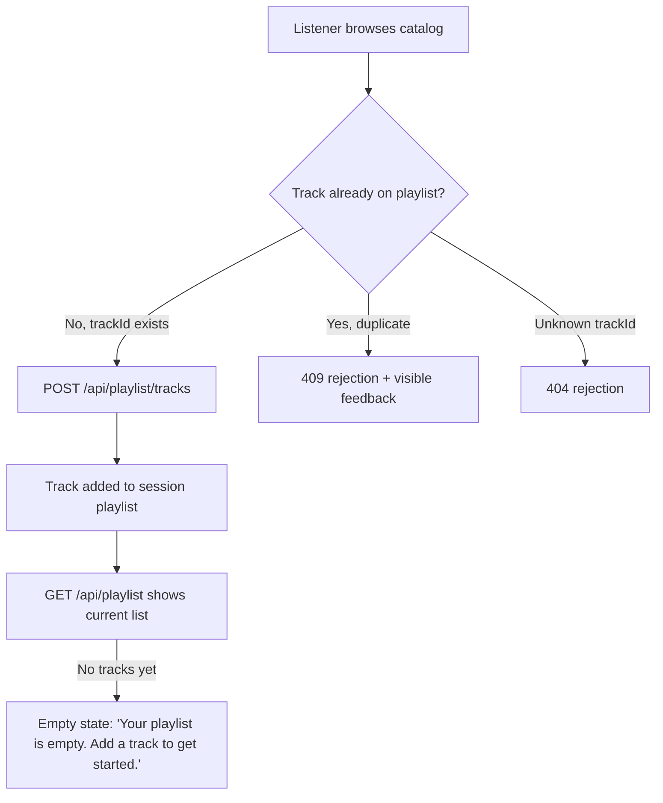

# Music Catalog Playlist Slice

> **BRD-2026-music-catalog-playlist-slice-001** | Status: draft | Version: 0.1.0 | Last Updated: 2026-10-07

## Executive Summary

This BRD covers a single, fixed-scope slice of the Music Catalog application: letting a listener browse the track catalog and collect tracks into one in-memory playlist during a browsing session. The underlying user problem — that a listener choosing music for a listening moment needs a way to collect tracks into a short listening list — is a **proposed hypothesis**, not a finding from customer research. The expected value, keeping a listener's selected tracks together during a session so they do not have to repeatedly rescan the catalog, **has not yet been measured**.

The scope itself is not hypothesis-driven: it is a fixed delivery contract recorded in the reviewed decision record at `docs/project-planning/playlist-design-decisions.md`, supplied independently of any Design Thinking exploration on this initiative. That source document explicitly notes its own DT exploration was a single simulated conversation, not validated research, and that the explored concept does not need to be a playlist. This BRD treats only the fixed delivery contract as authoritative scope; it does not import exploratory DT findings, assumptions, or the candidate "dismiss" idea as requirements.

Primary success signal: acceptance targets below are **demonstrated**, not yet proven — namely that a listener can browse and add tracks to one playlist, duplicate adds are rejected with visible feedback, the empty-playlist state is visible, and controls are accessible by role and label, with implementation passing the repository's API and front-end tests.

Decision ownership and reviewer identity are **not yet confirmed** (see Open Questions). The sign-off section of this BRD is intentionally left unpopulated pending an actual person-to-person review; no reviewer feedback is simulated or recorded on anyone's behalf.

---

## Business Context

Music Catalog is a small reference application used in a workshop setting. The current catalog lets a listener browse tracks but offers no way to retain a subset of tracks across a browsing session. The proposer's hypothesis is that a listener selecting music for a particular listening moment would benefit from collecting tracks into a short list rather than repeatedly scanning the full catalog.

No market, competitive, or regulatory context applies; this is an internal, in-memory feature slice with no external constraints beyond the fixed delivery contract described below.

---

## Stakeholders

| Stakeholder | Role | Power | Interest | Engagement Strategy |
|---|---|---|---|---|
| Proposer (feature originator) | Proposes the feature and scope | Unconfirmed | High | Confirm formal role and decision authority (see Open Questions). |
| Listener-perspective reviewer | Reviews the proposed need and scope from a listener's point of view | Unconfirmed | High | Hold a short, live, person-to-person review (see review prep below); do not record feedback until actually given. |

*Guidance per the `requirements-author` skill's stakeholder-analysis reference (Mendelow Power/Interest grid): formal quadrant placement and RACI assignment are deferred until decision ownership and reviewer identity are confirmed.* No sponsor, approver, or additional stakeholder is named; none is invented.

---

## Design Decisions

| Decision ID | Decision | Rationale | Decision Maker | Date | Related IDs |
|---|---|---|---|---|---|
| DD-001 | Treat the fixed delivery contract in `docs/project-planning/playlist-design-decisions.md` as the sole authoritative source of scope for this BRD; exploratory DT findings, untested assumptions, and the candidate "dismiss" idea from that same document are excluded from requirements. | The decisions document itself states the DT exploration was a single simulated conversation and did not validate the explored concept, and that the explored concept does not need to be a playlist. | Proposer | 2026-10-07 | BG-001, CON-001 through CON-004 |

---

## Business Goals

```text
BG-001: A listener can browse the catalog and collect tracks in a single playlist during a session.
Priority: MUST
KPI: Not yet defined — how to assess the expected value (keeping selected tracks together during a session) is an open question.
Baseline: Not measured.
Target: Not measured.
Timeframe: Not set.
Measurement source: Not yet agreed.
Owner: Not yet confirmed (proposer and reviewer both have a stake; see Open Questions).
```

**SMART Evaluation** (assessed at Define→Govern gate):

- [ ] **S**pecific: Objective statement is specific; the measurable benefit behind it is not yet defined.
- [ ] **M**easurable: No KPI, baseline, or target has been agreed.
- [ ] **A**chievable: Not assessed.
- [ ] **R**elevant: Not assessed against organizational strategy (none supplied).
- [ ] **T**ime-bound: No timeframe set.

**Status**: deferred

### Outcome Hypothesis Handoff Provenance

No `OUTCOME_HYPOTHESIS_TO_BRD_HANDOFF_V1` payload was supplied for this BRD. This section is intentionally empty; BG-001 was authored directly from the task's stated business objective rather than an imported hypothesis handoff.

---

## Business Rules

(none identified) — no standing policy, regulatory, or operating rule was supplied for this slice.

---

## Functional Requirements

**FR-001**: A listener can browse the track catalog.
- Actor: Listener.
- Trigger: Listener opens or navigates the catalog view.
- Expected Outcome: The full track catalog is displayed.
- Acceptance Criteria: AC-001.
- Business Goals: BG-001.

**FR-002**: A listener can add a browsed track to the single session playlist.
- Actor: Listener.
- Trigger: Listener selects an add action on a track.
- Expected Outcome: The track is appended to the one in-memory playlist via `POST /api/playlist/tracks` with a JSON body containing `trackId`.
- Acceptance Criteria: AC-002.
- Business Goals: BG-001.

**FR-003**: The system rejects an add for a track already on the playlist, with visible, accessible feedback to the listener.
- Actor: System (responding to listener action).
- Trigger: Listener attempts to add a `trackId` already present in the playlist.
- Expected Outcome: The request is rejected with HTTP 409, and the listener sees accessible, perceivable feedback that the add was rejected. (The specific UI treatment for this feedback is left open per the source decision record.)
- Acceptance Criteria: AC-003.
- Business Goals: BG-001.

**FR-004**: The system rejects an add for an unknown track id.
- Actor: System (responding to listener action).
- Trigger: Listener attempts to add a `trackId` not present in the catalog.
- Expected Outcome: The request is rejected with HTTP 404.
- Acceptance Criteria: AC-003.
- Business Goals: BG-001.

**FR-005**: A listener can see the current state of their playlist, including when it is empty.
- Actor: Listener.
- Trigger: Listener views the playlist area while it has no tracks.
- Expected Outcome: The front end displays the empty-state text "Your playlist is empty. Add a track to get started." via `GET /api/playlist`.
- Acceptance Criteria: AC-004.
- Business Goals: BG-001.

---

## Non-Functional Requirements

*Organized by ISO/IEC 25010 Quality Characteristics*

### Functional Suitability

(none beyond FR-001 through FR-005.)

---

### Performance Efficiency

(none specified; not a stated acceptance target.)

---

### Compatibility

(none specified.)

---

### Usability

**NFR-001**: All catalog and playlist controls (browse, add, duplicate-feedback, empty-state) are accessible by role and label, with perceivable status feedback for duplicate/unknown-track rejection.

---

### Reliability

(none specified beyond in-memory operation during a session; see CON-002.)

---

### Security

(none specified; no authentication or user accounts are in scope — see CON-003.)

---

### Maintainability

**NFR-002**: The implementation passes the repository's existing API test suite (`tests/api`, xUnit) and front-end test suite (Vitest + Testing Library) for this slice's behavior.

---

### Portability

(none specified.)

---

## Constraints

**CON-001**: Exactly one playlist exists; no support for multiple playlists or playlist creation.
- Imposing source: Fixed delivery contract (`docs/project-planning/playlist-design-decisions.md`).
- Affected boundary: Scope.
- Non-negotiability: Supplied as a fixed contract for this exercise, independent of the DT exploration.
- Category: Organizational.
- Impact: Requirement and design.

**CON-002**: Playlist and catalog state is held in memory only; no persistence across restarts.
- Imposing source: Fixed delivery contract; repository-wide convention (state is in-memory only, no database or file writes).
- Affected boundary: Technology.
- Non-negotiability: Fixed contract and existing repository architecture.
- Category: Technical.
- Impact: Design and delivery.

**CON-003**: No user accounts, authentication, or per-user state.
- Imposing source: Fixed delivery contract.
- Affected boundary: Scope.
- Non-negotiability: Fixed contract for this exercise.
- Category: Organizational.
- Impact: Requirement and design.

**CON-004**: No reorder, remove, search, or playlist-creation capability in this slice.
- Imposing source: Fixed delivery contract.
- Affected boundary: Scope.
- Non-negotiability: Fixed contract for this exercise.
- Category: Organizational.
- Impact: Requirement and acceptance.

---

## Process Models



---

## Acceptance Criteria

**AC-001**: Given the catalog view, When a listener opens it, Then all tracks in the catalog are visible with accessible, labelled controls.
- Covers: FR-001.
- Status: Not Started.

**AC-002**: Given a browsed track not yet on the playlist, When the listener adds it, Then the track appears on the single session playlist.
- Covers: FR-002.
- Status: Not Started.

**AC-003**: Given a track already on the playlist (or an unknown trackId), When the listener attempts to add it, Then the system returns HTTP 409 (duplicate) or HTTP 404 (unknown) respectively, with visible, accessible feedback for the duplicate case.
- Covers: FR-003, FR-004.
- Status: Not Started.

**AC-004**: Given no tracks have been added yet, When the listener views the playlist, Then the empty-state text "Your playlist is empty. Add a track to get started." is visible.
- Covers: FR-005.
- Status: Not Started.

All AC-### items above are demonstrated only once the repository's API (xUnit) and front-end (Vitest + Testing Library) tests pass for this slice.

---

## Traceability Matrix

### FR-to-AC Coverage

| FR | Linked AC | Covered? |
|---|---|---|
| FR-001 | AC-001 | Yes |
| FR-002 | AC-002 | Yes |
| FR-003 | AC-003 | Yes |
| FR-004 | AC-003 | Yes |
| FR-005 | AC-004 | Yes |

Coverage: 5 of 5 FR rows have at least one AC link = **100.0%** (meets the 80.0% threshold).

### FR-to-BG Alignment

| FR | Linked BG | Covered? |
|---|---|---|
| FR-001 | BG-001 | Yes |
| FR-002 | BG-001 | Yes |
| FR-003 | BG-001 | Yes |
| FR-004 | BG-001 | Yes |
| FR-005 | BG-001 | Yes |

Coverage: **100.0%** (meets the 100.0% target; no waiver needed).

### BR-to-FR Enforcement

(none) — no business rules (BR-###) were identified for this slice.

---

## Risks and Assumptions

### Key Assumptions

| ID | Assumption | Evidence status | Impact if false | Mitigation | Source |
|---|---|---|---|---|---|
| ASM-001 | A listener choosing music for a listening moment needs a way to collect tracks into a short listening list. | Untested (explicitly flagged as a hypothesis, not a research finding) | The feature may not address a real listener need. | Confirm via the planned person-to-person review and any later real listener validation. | Task statement |
| ASM-002 | Keeping selected tracks together during a session reduces repeated catalog scanning and is valuable to the listener. | Untested (explicitly flagged as not yet measured) | Delivered feature may show no measurable benefit. | Agree a measurement approach (see Open Questions) before treating this as validated. | Task statement |

### Research Finding Dispositions

(not applicable) — no bounded `rpi-research` evidence was requested or considered for this BRD; the DT exploration in `.copilot-tracking/dt/music-catalog-listening/` is local, uncommitted coaching context and is explicitly superseded by `docs/project-planning/playlist-design-decisions.md` for scope purposes. It is not treated as BRD evidence here.

### Risk Register

| Risk | Probability | Impact | Mitigation |
|---|---|---|---|
| The underlying user-need hypothesis is wrong, and the feature does not address a real listener need. | Medium | Medium | Validate through the planned person-to-person review before further investment. |
| The expected value is never measured, so it is impossible to know whether the feature delivered benefit. | Medium | Medium | Agree a measurement approach as part of Open Questions resolution. |
| Decision ownership is ambiguous until confirmed, risking unclear sign-off authority. | Medium | Low | Resolve decision ownership and reviewer identity before Govern. |

---

## Open Questions

| ID | Question or gap | Why it matters | Owner | Target date | Status | Rationale for deferral | Target phase | Source |
|---|---|---|---|---|---|---|---|---|
| OQ-001 | Who is the listener-perspective reviewer (name/role), and what is their actual feedback on the proposed need, objective, and scope? | Needed for Stakeholders, sign-off, and to validate the need hypothesis; feedback must not be simulated. | Proposer | Not set | Open | Awaiting live person-to-person review. | Implementation | Task discovery |
| OQ-002 | Beyond "both proposer and reviewer," what are the specific decision-owner roles (e.g., who has final go/no-go authority)? | Needed to complete Stakeholders power/interest and sign-off routing. | Proposer and reviewer | Not set | Open | Awaiting confirmation from both parties. | Implementation | Task discovery |
| OQ-003 | How should the expected value (keeping selected tracks together during a session) be assessed — qualitative reviewer feedback, a usability signal, or another measure? | Needed to complete BG-001 KPI, baseline, and target for SMART assessment. | Proposer and reviewer | Not set | Open | Measurement approach not yet agreed. | Implementation | Task discovery |

---

## Glossary

| Term | Definition | Context |
|---|---|---|
| Listening moment | An unvalidated framing for the occasion a listener is choosing music for (could be mood, activity, or time of day — not resolved). | Proposed user problem. |
| Session playlist | The single, in-memory playlist a listener can add tracks to during one browsing session; no persistence, no user accounts. | FR-002, CON-001, CON-002, CON-003. |

---

## Sign-Off

### Approval Checklist

* Business Sponsor: Unconfirmed — see OQ-002.
* Product Owner: Unconfirmed — see OQ-002.
* Technical Lead: Not applicable for this BRD scope unless named later.
* Quality Lead: Not applicable for this BRD scope unless named later.
* Legal/Compliance: Not applicable; no regulatory scope identified.

Approval date: Not yet approved.

### Waivers

(none) — FR-to-AC and FR-to-BG coverage both meet their targets; no waiver is required at this time.

### Handoff Readiness

Not ready for Govern handoff. Pending: reviewer identity and actual feedback (OQ-001), confirmed decision-owner roles (OQ-002), and an agreed value-assessment approach (OQ-003). No `BRD_TO_PRD_HANDOFF_V1` payload has been produced.

---

## Disclaimer

> [!CAUTION]
> **Disclaimer:** This agent is an assistive tool only. It does not provide business approval, regulatory compliance validation, or executive sign-off and does not replace business analysts, stakeholder representatives, compliance teams, or other qualified human reviewers. The output consists of suggested business requirements, objectives, and scope definitions to support a user's own business analysis and decision-making. All Business Requirements Documents, business objectives, stakeholder analysis, and requirement traceability generated by this tool must be independently reviewed and validated by appropriate business and compliance reviewers before adoption. Outputs from this tool do not constitute business approval, requirements sign-off, or stakeholder commitment.

---

## Document Metadata

* Template Version: 1.0.0.
* Canonical Template: `requirements-author/templates/brd/brd-full.md`.
* License: CC-BY 4.0 (Microsoft HVE-Core).
* Attribution: Microsoft HVE-Core Team.
