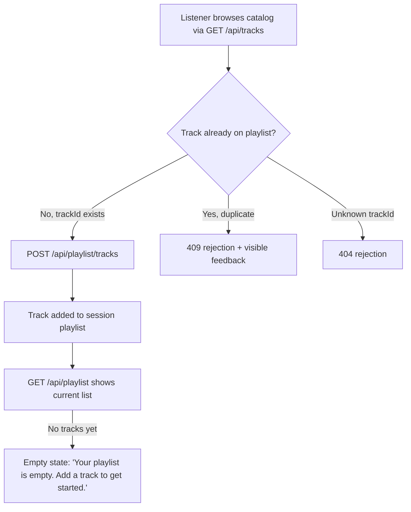

# Music Catalog Playlist Slice

> **PRD-2026-music-catalog-playlist-slice-001** | Status: draft | Version: 0.1.0 | Last Updated: 2026-10-07

## Executive Summary

This PRD translates the reviewed BRD at `docs/project-planning/music-catalog-playlist-slice-brd.md` into product requirements for a single, fixed-scope slice of the Music Catalog application: a listener can browse the track catalog and collect tracks into one in-memory playlist during a session. The underlying user problem — a listener choosing music for a listening moment needing a way to collect tracks into a short listening list — remains a **proposed hypothesis**, not a validated research finding, and the expected value (keeping selected tracks together during a session so the listener avoids repeatedly rescanning the catalog) **has not been measured**. This PRD does not add new requirements beyond the BRD's scope; it elaborates the same fixed delivery contract from `docs/project-planning/playlist-design-decisions.md` into product-facing detail.

Release horizon: this slice is the entire release boundary for this initiative (see MVP and Release Framing). All constraints, open questions, and unresolved stakeholder/ownership items from the BRD carry forward unchanged and are not re-litigated here.

---

## Product Context

The current Music Catalog lets a listener browse tracks but has no way to retain a subset of tracks across a browsing session. The proposed opportunity is that collecting tracks into a short list, instead of repeatedly scanning the full catalog, may reduce listening effort for a listener picking music for a particular moment. This framing is carried forward from the BRD as an explicit hypothesis, not a finding: the design-decisions source document notes its own Design Thinking exploration was a single simulated conversation and did not validate the explored concept, and that the explored concept did not need to be a playlist. The playlist scope in this PRD comes from the separate, fixed Level 3 delivery contract in that same document, not from the DT exploration.

No market or competitive discovery was performed; this is an internal, in-memory, single-session feature slice.

---

## Users and Personas

**Listener** (working persona, not yet validated with a real user)
- Primary jobs-to-be-done: Browse the track catalog; pick tracks for a particular listening moment.
- Key pain points (hypothesized, unvalidated): Repeatedly rescanning the full catalog to re-find tracks already considered.
- Success outcome (hypothesized, unmeasured): Selected tracks stay together in one place during the session so the listener can see their choices without rescanning.

No other persona is in scope. There are no user accounts; "listener" refers to the single anonymous session actor (see CON-003).

---

## Design Decisions

| Decision ID | Decision | Rationale | Decision Maker | Date | Related IDs |
|---|---|---|---|---|---|
| DD-001 | Carry forward BRD DD-001: the fixed delivery contract in `docs/project-planning/playlist-design-decisions.md` is the sole authoritative source of scope; DT exploration findings and the candidate "dismiss" idea are excluded from requirements. | Preserves BRD scope authority into the PRD; avoids importing unvalidated exploration as requirements. | Proposer (BRD) | 2026-10-07 | GOAL-001, CON-001 through CON-004 |
| DD-002 | Note the candidate "dismiss" idea only as an unvalidated, explicitly out-of-scope future candidate in MVP and Release Framing; it receives no requirement, acceptance criterion, or constraint in this PRD. | User direction during PRD drafting: reference it for continuity without treating it as scoped work. | Proposer | 2026-10-07 | (none — informational only) |

---

## Product Goals

```text
GOAL-001: A listener can browse the catalog and collect tracks in a single playlist during a session.
Priority: MUST
KPI: Not yet defined — carried forward from BRD OQ-003 (how to assess the expected-value benefit is unresolved).
```

**SMART Evaluation** (assessed at Validate→Finalize gate):

- [ ] **S**pecific: Goal statement is specific; the measurable benefit behind it is not yet defined.
- [ ] **M**easurable: No KPI, baseline, or target has been agreed (BRD OQ-003).
- [ ] **A**chievable: Not assessed.
- [ ] **R**elevant: Not assessed against broader product strategy (none supplied).
- [ ] **T**ime-bound: No release-cycle deadline set beyond "this slice."

**Status**: deferred

---

## Functional Requirements

**FR-001**: A listener can browse the track catalog.
- Actor: Listener.
- Trigger: Listener opens or navigates the catalog view.
- Expected Outcome: The full track catalog is displayed via `GET /api/tracks`.
- Acceptance Criteria: AC-001.
- Product Goals: GOAL-001.

**FR-002**: A listener can add a browsed track to the single session playlist.
- Actor: Listener.
- Trigger: Listener selects an add action on a track.
- Expected Outcome: The track is appended to the one in-memory playlist via `POST /api/playlist/tracks` with a JSON body containing `trackId`.
- Acceptance Criteria: AC-002.
- Product Goals: GOAL-001.

**FR-003**: The system rejects an add for a track already on the playlist, with visible, accessible feedback to the listener.
- Actor: System (responding to listener action).
- Trigger: Listener attempts to add a `trackId` already present in the playlist.
- Expected Outcome: The request is rejected with HTTP 409, and the listener sees accessible, perceivable feedback that the add was rejected. The specific UI treatment for this feedback is left open per the source decision record.
- Acceptance Criteria: AC-003.
- Product Goals: GOAL-001.

**FR-004**: The system rejects an add for an unknown track id.
- Actor: System (responding to listener action).
- Trigger: Listener attempts to add a `trackId` not present in the catalog.
- Expected Outcome: The request is rejected with HTTP 404.
- Acceptance Criteria: AC-003.
- Product Goals: GOAL-001.

**FR-005**: A listener can see the current state of their playlist, including when it is empty.
- Actor: Listener.
- Trigger: Listener views the playlist area while it has no tracks.
- Expected Outcome: The front end displays the empty-state text "Your playlist is empty. Add a track to get started." via `GET /api/playlist`.
- Acceptance Criteria: AC-004.
- Product Goals: GOAL-001.

---

## Non-Functional Requirements

*Organized by NIST SP 800-160 NFR category buckets*

### Performance and Capacity

(none specified; not a stated acceptance target.)

---

### Reliability and Resilience

(none specified beyond in-memory operation during a session; see CON-002.)

---

### Security

(none specified; no authentication or user accounts are in scope — see CON-003.)

---

### Privacy

(none specified; no user data is collected or persisted.)

---

### Scalability and Elasticity

(none specified.)

---

### Maintainability and Operability

**NFR-002**: The implementation passes the repository's existing API test suite (`tests/api`, xUnit) and front-end test suite (Vitest + Testing Library) for this slice's behavior.

---

### Observability

(none specified.)

---

### Usability and Accessibility

**NFR-001**: All catalog and playlist controls (browse, add, duplicate-feedback, empty-state) are accessible by role and label, with perceivable status feedback for duplicate/unknown-track rejection.

---

### Compatibility and Interoperability

(none specified.)

---

### Portability

(none specified.)

---

## Constraints

**CON-001**: Exactly one playlist exists; no support for multiple playlists or playlist creation.
- Imposing source: Fixed delivery contract (`docs/project-planning/playlist-design-decisions.md`); carried forward from BRD CON-001.
- Affected boundary: Scope.
- Non-negotiability: Supplied as a fixed contract for this exercise, independent of the DT exploration.
- Category: Organizational.
- Impact: Requirement and design.

**CON-002**: Playlist and catalog state is held in memory only; no persistence across restarts.
- Imposing source: Fixed delivery contract; repository-wide convention (state is in-memory only, no database or file writes); carried forward from BRD CON-002.
- Affected boundary: Technology.
- Non-negotiability: Fixed contract and existing repository architecture.
- Category: Technical.
- Impact: Design and delivery.

**CON-003**: No user accounts, authentication, or per-user state.
- Imposing source: Fixed delivery contract; carried forward from BRD CON-003.
- Affected boundary: Scope.
- Non-negotiability: Fixed contract for this exercise.
- Category: Organizational.
- Impact: Requirement and design.

**CON-004**: No reorder, remove, search, or playlist-creation capability in this slice.
- Imposing source: Fixed delivery contract; carried forward from BRD CON-004.
- Affected boundary: Scope.
- Non-negotiability: Fixed contract for this exercise.
- Category: Organizational.
- Impact: Requirement and acceptance.

---

## Process Models



---

## Acceptance Criteria

**AC-001**: Given the catalog view, When a listener opens it, Then all tracks in the catalog are visible with accessible, labelled controls.
- Covers: FR-001.
- Status: Not Started.

**AC-002**: Given a browsed track not yet on the playlist, When the listener adds it, Then the track appears on the single session playlist.
- Covers: FR-002.
- Status: Not Started.

**AC-003**: Given a track already on the playlist (or an unknown trackId), When the listener attempts to add it, Then the system returns HTTP 409 (duplicate) or HTTP 404 (unknown) respectively, with visible, accessible feedback for the duplicate case.
- Covers: FR-003, FR-004.
- Status: Not Started.

**AC-004**: Given no tracks have been added yet, When the listener views the playlist, Then the empty-state text "Your playlist is empty. Add a track to get started." is visible.
- Covers: FR-005.
- Status: Not Started.

All AC-### items above are demonstrated only once the repository's API (xUnit) and front-end (Vitest + Testing Library) tests pass for this slice.

---

## Traceability Matrix

### Feasibility Candidate Disposition

(not applicable) — no feasibility-to-PRD handoff was supplied for this PRD.

### FR-to-AC Coverage

| FR | Linked AC | Covered? |
|---|---|---|
| FR-001 | AC-001 | Yes |
| FR-002 | AC-002 | Yes |
| FR-003 | AC-003 | Yes |
| FR-004 | AC-003 | Yes |
| FR-005 | AC-004 | Yes |

Coverage: 5 of 5 FR rows have at least one AC link = **100.0%** (meets the 80.0% threshold).

### FR-to-GOAL Alignment

| FR | Linked GOAL | Covered? |
|---|---|---|
| FR-001 | GOAL-001 | Yes |
| FR-002 | GOAL-001 | Yes |
| FR-003 | GOAL-001 | Yes |
| FR-004 | GOAL-001 | Yes |
| FR-005 | GOAL-001 | Yes |

Coverage: **100.0%** (meets the 100.0% target; no waiver needed).

---

## MVP and Release Framing

This entire slice is the MVP and the full release boundary — there is no further phased rollout planned within this PRD. All of FR-001 through FR-005 ship together; none is deferred.

**Future-Release candidate (informational only, not scoped here):** The design-decisions source document records a separate candidate idea — a session-only "dismiss" interaction letting a listener mark a track "not relevant" with a lightweight confirm step for the rest of the browser session. It is explicitly unvalidated beyond a single simulated conversation, was not part of the BRD's reviewed scope, and carries no FR, AC, NFR, or constraint in this PRD. Any future work on it requires its own discovery and a new PRD or PRD revision.

---

## Success Metrics

| Metric | Baseline | Target | Measurement window | Data source | Linked Goal |
|---|---|---|---|---|---|
| Not yet defined — see Open Questions OQ-003 | Not measured | Not set | Not set | Not yet agreed | GOAL-001 |

No success metric is finalized. The BRD's open question on how to assess the expected value (qualitative reviewer feedback, a usability signal, or another measure) carries forward unresolved; this PRD does not invent a KPI, baseline, or target in its absence.

---

## Risks and Assumptions

### Key Assumptions

| ID | Assumption | Evidence status | Impact if false | Mitigation | Source |
|---|---|---|---|---|---|
| ASM-001 | A listener choosing music for a listening moment needs a way to collect tracks into a short listening list. | Untested (carried forward from BRD; explicitly a hypothesis, not a research finding) | The feature may not address a real listener need. | Confirm via the planned person-to-person review and any later real listener validation. | BRD ASM-001 |
| ASM-002 | Keeping selected tracks together during a session reduces repeated catalog scanning and is valuable to the listener. | Untested (carried forward from BRD; explicitly not yet measured) | Delivered feature may show no measurable benefit. | Agree a measurement approach (BRD OQ-003) before treating this as validated. | BRD ASM-002 |

### Research Finding Dispositions

(not applicable) — no bounded `rpi-research` evidence was requested or considered for this PRD. The DT exploration notes in `.copilot-tracking/dt/music-catalog-listening/` remain local, uncommitted coaching context, superseded for scope purposes by `docs/project-planning/playlist-design-decisions.md`, and are not treated as PRD evidence.

### Risk Register

| Risk | Probability | Impact | Mitigation |
|---|---|---|---|
| The underlying user-need hypothesis is wrong, and the feature does not address a real listener need. | Medium | Medium | Validate through the planned person-to-person review before further investment. |
| The expected value is never measured, so it is impossible to know whether the feature delivered benefit. | Medium | Medium | Agree a measurement approach as part of BRD Open Questions resolution. |
| Decision ownership is ambiguous until confirmed, risking unclear sign-off authority for this PRD as well. | Medium | Low | Resolve decision ownership and reviewer identity before Finalize. |

---

## Glossary

| Term | Definition | Context |
|---|---|---|
| Listening moment | An unvalidated framing for the occasion a listener is choosing music for (could be mood, activity, or time of day — not resolved). | Proposed user problem, carried forward from BRD. |
| Session playlist | The single, in-memory playlist a listener can add tracks to during one browsing session; no persistence, no user accounts. | FR-002, CON-001, CON-002, CON-003. |

---

## Sign-Off

### Approval Checklist

* Product Sponsor: Unconfirmed — carried forward from BRD OQ-002.
* Product Owner: Unconfirmed — carried forward from BRD OQ-002.
* Technical Lead: Not applicable for this PRD scope unless named later.
* Quality Lead: Not applicable for this PRD scope unless named later.
* Legal/Compliance: Not applicable; no regulatory scope identified.

Approval date: Not yet approved.

### Waivers

(none) — FR-to-AC and FR-to-GOAL coverage both meet their targets; no waiver is required at this time.

### Handoff Readiness

Not ready for Finalize exit. Pending, all carried forward from the BRD: reviewer identity and actual feedback (OQ-001), confirmed decision-owner roles (OQ-002), and an agreed value-assessment approach (OQ-003). No backlog planning handoff has been produced.

---

## Open Questions

Carried forward unchanged from the BRD (`docs/project-planning/music-catalog-playlist-slice-brd.md`); none are resolved here.

| ID | Question or gap | Why it matters | Owner | Status | Source |
|---|---|---|---|---|---|
| OQ-001 | Who is the listener-perspective reviewer (name/role), and what is their actual feedback on the proposed need, objective, and scope? | Needed for Users/Personas validation and sign-off; feedback must not be simulated. | Proposer | Open | BRD OQ-001 |
| OQ-002 | Beyond "both proposer and reviewer," what are the specific decision-owner roles (e.g., who has final go/no-go authority)? | Needed to complete Sign-Off routing. | Proposer and reviewer | Open | BRD OQ-002 |
| OQ-003 | How should the expected value (keeping selected tracks together during a session) be assessed — qualitative reviewer feedback, a usability signal, or another measure? | Needed to complete GOAL-001 KPI, baseline, and target, and the Success Metrics table. | Proposer and reviewer | Open | BRD OQ-003 |

---

## Disclaimer

> [!CAUTION]
> **Disclaimer:** This agent is an assistive tool only. It does not provide product management approval, technical feasibility validation, or business sign-off and does not replace product managers, engineering leads, business stakeholders, or other qualified human reviewers. The output consists of suggested requirements, acceptance criteria, and product specifications to support a user's own product planning and decision-making. All Product Requirements Documents, functional requirements, non-functional requirements, and constraint definitions generated by this tool must be independently reviewed and validated by appropriate product and engineering reviewers before adoption. Outputs from this tool do not constitute product approval, requirements sign-off, or engineering commitment.

---

## Document Metadata

* Template Version: 1.0.0.
* Canonical Template: `requirements-author/templates/prd/prd-full.md`.
* License: CC-BY 4.0 (Microsoft HVE-Core).
* Attribution: Microsoft HVE-Core Team.
