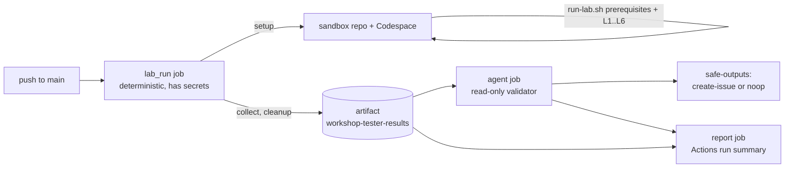

# Workshop tester: AI SDLC with Github Copilot and HVE Core

An agentic workflow that replays the full AI SDLC with Github Copilot and HVE Core lab ([docs/afternoon-2/workshop.md](../../../docs/afternoon-2/workshop.md)) whenever a change reaches `main`. It runs in a throwaway sandbox repository and Codespace, both deleted at the end of the run. When any step fails or the lab and its results diverge, it files a `[Workshop tester]` issue in this repository.

## How it works



| File | Runs on | Role |
| --- | --- | --- |
| [`.github/workflows/workshop-tester.md`](../../../.github/workflows/workshop-tester.md) | gh-aw source | Trigger, `lab_run` custom job, validator prompt, safe outputs. Compile with `gh aw compile workshop-tester`. |
| [`orchestrate.sh`](orchestrate.sh) | Actions runner | `setup` (snapshot of the tested commit into a private sandbox repo, Codespace creation), `run` (starts the lab and polls), `collect`, `cleanup` (always deletes the Codespace and sandbox and sweeps orphans). |
| [`run-lab.sh`](run-lab.sh) | Codespace | Checks introductory starter prerequisites, then executes Levels 1 to 6 and records one JSON line per check or step in `results.jsonl`. |
| [`extract-prompts.mjs`](extract-prompts.mjs) | Codespace | Reads the copy-paste prompts and L6 form values directly from `workshop.md`, preserving each HVE command and its task as one message. |
| [`lib.sh`](lib.sh) | Codespace | Step and check recording, token redaction, Copilot CLI prompt replay. |

Every step has a mode that the validator reports:

- `literal`: the command is run as written in the lab.
- `translated`: same intent, adapted for a non-interactive shell (for example `copilot -p` with `--continue` instead of the chat UI, or `awk` instead of a manual edit).
- `emulated`: a UI-only action replaced by the closest CLI check (for example `/plugin` emulated with `copilot plugin list`).
- `skipped`: impossible headless (for example the VS Code fallback). It is reported, never counted as a pass.

The validator agent compares the lab's steps against the result ids to detect coverage drift. It classifies each problem as a lab defect, a solution or code defect, a product or environment change, a tester limitation, or an infrastructure failure.
It must use only the lab's guided steps, supplied links, and captured results. It does not browse for alternate instructions or infer undocumented procedures. The `report` job writes an Actions run summary with job status, per-level counts, and failed or warned steps, even when the validator cannot finish. Missing results or interrupted jobs are marked **Incomplete**, not passed; the downloadable artifact retains detailed logs.

The published **Toggle solution / Toggle example** blocks are the tester's curated conversation reference, not optional inspiration for inventing its own answers. The extractor saves their text plus ordered DT and BRD messages. Each Copilot invocation receives a replay policy pointing to that reference. Level 2 sends the nine DT contributions and BRD example steps 2–11 one message at a time, waiting for each invocation to finish and retaining conversation context with `--continue`. It selects the matching HVE agent explicitly and stops the sequence after a failed invocation. Changes to the number of example blocks fail extraction rather than silently changing the script.

The examples supply a learner's facts and choices, not a document outline or substitute for HVE's native procedures. After the DT recap and note checks, the tester switches to Documentation to save the delivery brief before starting BRD Builder. It does not ask DT Coach to publish its private working artifacts or resume the BRD conversation to manufacture a DT record.

The Level 2 later-slice choice and its curated `dt-later-slice.md` record are extracted but skipped by the replay: they require a real learner decision. The sandbox retains the documented Remove a track fallback rather than claiming that fixture came from authentic DT coaching. Interactive learners commit their reviewed later-slice decision and use it for Level 5 issue creation and delegation without BRD/PRD Builder.

This is **example replay**, not authentic user research or proof of method completion. The tester checks that coaching state and the BRD draft exist, but does not infer evidence quality, human review, or sign-off from those files. BRD steps 12–13 remain skipped because they depend on actual human inspection and approval; PRD/backlog execution remains skipped until that gate is satisfied. Missing answers and readiness gaps must be reported, not improvised or waived by the tester.

Interactive learners select the HVE command with Tab and add their task before sending. The headless tester emulates that completed message, not the keyboard/autocomplete interaction. DT startup and each RPI phase replay the combined published block in one invocation; extraction supports a task on the command line or following lines, but command-only HVE blocks fail. The tester resolves returned same-task artifact paths and substitutes the published placeholders. Missing, unreadable, or ambiguous paths stop the sequence; it does not select by recency. Review must leave source files and commits unchanged. The independent API checks use `POST /api/playlist/tracks` with a JSON `trackId` body; they are not extra manual learner steps.

Level 3 creates `feature/playlist-slice` before implementation, then publishes the reviewed change to the disposable sandbox as a pull request after local tests and RPI review. If the sandbox token cannot publish the branch/PR or safely merge without a bypass, the replay stops before Level 4; it never pushes the feature directly to `main` or uses an administrator bypass. The human review/merge gate is recorded as skipped because the unattended tester cannot make that decision. To continue later levels, it may merge the sandbox PR as a **translation** only; that automated merge is not human review, human acceptance, or evidence of live ruleset enforcement.

Level 3 captures `HEAD` before implementation and compares the approved source/test paths afterward, including untracked files. Implementation commits count as edits even when the working tree is clean. The checkpoint commits only a nonempty index; staging or commit errors still fail the step. Run the local regression fixtures with `bash tests/workshop/afternoon-2/git-checkpoint.test.sh`.

All AI SDLC workshop learner commits use `/hve-core:git-commit.prompt`. The extractor
retains ten scoped commit requests, but the headless runner does not send them
with fabricated whole-path or staged-set approvals. Native commit gates are
recorded as skipped; deterministic commits in the disposable sandbox are explicitly
`translated` checkpoints, not evidence the prompt ran or humans approved the files.
Level 3's already-committed/clean-tree case remains a no-op. Post-APM commit prompt
discovery must still be verified in a live client. The template/import prerequisite
provides an existing `HEAD`; no learner bootstrap raw commit is prescribed.

The lab's remaining Git operations are scoped Copilot requests, not copy-paste
Git commands. The extractor retains all 22 inspection, branch, publication and
sync/cleanup requests as `git-*.txt`, including three HVE pull-request requests.
The runner's deterministic Git operations are sandbox translations, not evidence
these requests ran. Level 3's native PR publication confirmation is explicitly
skipped before the sandbox push/PR translation. Live prompt execution, learner
publication approval and facilitator cleanup consent remain unverified.

Run all guide, catalog, source-transition, APM gate and report regression checks
with `node --test tests/workshop/afternoon-2/*.test.mjs`.

`marketplace.test.mjs` checks remote entry semantics and runs isolated Bash
source-transition/failure mocks. These are control-flow tests, not successful client
installs. The sandbox registers its own root catalog, browses it, inspects personal
HVE provenance, removes only the known upstream identity, verifies absence, and
installs the curated copy. Unknown/duplicate/managed or malformed inventory stops
before mutation; failed registration, browse, removal, install, APM/agent checks,
disable, policy, audit or restore stops dependent publication. Expected deny exits
with exactly 1. Source replacement is authorized only in the disposable sandbox,
not evidence of learner consent. Fresh CLI agent-picker, VS Code and app checks
remain skipped and do not establish actual capabilities.

The learning-flow checks cover the opt-in task mutation filters/caps, revision-bound
closure contract, visible commands and gates, proctor-only demos, and committed
planning context. They do not prove an agent's judgment or live workflow behavior.
The tester verifies an initial planning-evidence comment and an open issue; repeated
PR reconciliation and post-merge closure require prepared integration cases and a
human merge decision. The tester never claims to have exercised those gates.

Run the APM PR gate regression checks with `node --test tests/workshop/afternoon-2/apm-ci.test.mjs`. The failure-propagation cases use a Bash mock, not an APM installation or network request.

Run the local artifact-binding and HTTP request fixtures with `bash tests/workshop/afternoon-2/rpi-flow.test.sh`. They use temporary files and a mock `curl`; no Copilot invocation or network request runs.

The independent [pedagogy review agentic workflow](../../../.github/workflows/workshop-pedagogy-review.md) runs automatically when a PR is opened with `workshop.md` changes (`**/workshop.md`); it needs no enable variable and does not wait for this tester. It imports the [Workshop Pedagogy Reviewer](../../../.github/agents/workshop-pedagogy-reviewer.agent.md), asks for `workshop.md` content and their supporting documentation to be reviewed at the opening PR head SHA without prescribing guide paths, and requests one deduplicated `pedagogy-review` report through safe outputs. gh-aw provides the default runtime and setup; no application dependencies or custom preparation/validation scripts are needed. It does not replay commands, change workshop files, or close or assign backlog tasks. See the [maintainer setup and boundaries](../../../docs/maintainer-handbook.md#independent-pedagogy-review-on-pr-creation) and run its configuration checks with `node --test tests/workshop/pedagogy/review.test.mjs`.

## Setup

The workflow is opt-in. It does nothing until the variable below is set, so forks, attendee copies and the sandbox itself never run it.

| Kind | Name | Value |
| --- | --- | --- |
| Variable | `WORKSHOP_TESTER_ENABLED` | `true` |
| Variable (optional) | `WORKSHOP_TESTER_OWNER` | Account or organization that owns the sandbox repos. Defaults to this repository's owner. |
| Variable (optional) | `WORKSHOP_TESTER_MACHINE` | Codespace machine type. Defaults to `standardLinux32gb`. |
| Secret | `WORKSHOP_TESTER_TOKEN` | Runner-only classic PAT for a dedicated tester account with scopes `repo`, `workflow`, `delete_repo`, `codespace`. It creates and deletes the sandbox and Codespace and pushes the initial snapshot. It never enters the Codespace; the lab uses `WORKSHOP_TESTER_SANDBOX_TOKEN` for workflow runs and cloud-agent assignment. |
| Secret | `WORKSHOP_TESTER_COPILOT_TOKEN` | Fine-grained PAT for the same account with the **Copilot Requests** permission, used by Copilot CLI and by the sandbox's gh-aw workflows. Falls back to `WORKSHOP_TESTER_TOKEN` if unset. |
| Secret | `WORKSHOP_TESTER_SANDBOX_TOKEN` | Fine-grained PAT forwarded into the Codespace as `GH_TOKEN`. Required: the run fails closed without it. |
| Variable (optional) | `WORKSHOP_TESTER_EGRESS_LOCK` | `true` blocks unlisted egress from the Codespace. Unset, egress is only audited. See [Security guardrails](#security-guardrails). |

### Token permissions

| Secret | Token type | Exact permissions | Why |
| --- | --- | --- | --- |
| `WORKSHOP_TESTER_TOKEN` | Classic PAT | `repo`, `workflow`, `delete_repo`, `codespace` | Runner only: create and push the private sandbox, create and delete the Codespace, delete the sandbox. It never enters the Codespace. Fine-grained PATs cannot yet cover all of these for a user-owned sandbox created at run time. |
| `WORKSHOP_TESTER_SANDBOX_TOKEN` | Fine-grained PAT | Resource owner: the sandbox owner. Repository access: **All repositories** (the sandbox is created at run time). Repository permissions: **Contents**, **Issues**, **Pull requests**, **Actions** and **Workflows** read and write; **Metadata** read. | Used inside the Codespace by the lab: push workflow files, run `gh aw run`, read runs, create the issue and assign it to the Copilot cloud agent. The Copilot review request also needs organization-read authorization; if GitHub reports missing `read:org`, the step remains failed with a credential-limitation note. No `delete_repo`, no `codespace` scope, or infrastructure token is sent to the Codespace. |
| `WORKSHOP_TESTER_COPILOT_TOKEN` | Fine-grained PAT | Account permission **Copilot Requests: Read** only, no repository access | Copilot CLI inference and the sandbox gh-aw engine. |

Store **all three** tokens as **Actions** repository secrets (Settings > Secrets and variables > Actions). A Codespaces secret is not visible to the workflow; the orchestrator injects the sandbox and Copilot tokens into the sandbox Codespace itself.

Hardening: issue all three tokens from a dedicated bot account, not a personal account; use a short expiry and rotate; keep `WORKSHOP_TESTER_ENABLED` unset until all three secrets exist. A dedicated sandbox organization narrows the sandbox token's **All repositories** access to throwaway repositories. If the Codespace token used for the Copilot review request lacks organization-read authorization (the API may report the required classic scope as `read:org`), the tester records the step as failed with a credential-limitation note; it does not bypass the review or expose the runner's infrastructure token to the Codespace.

The tester account also needs:

- A Copilot license with Copilot CLI, Copilot cloud agent and agentic workflows allowed by its organization policy.
- Permission to create Codespaces billed to the sandbox owner.
- The sandbox's root marketplace and required HVE/APM source (`microsoft/hve-core`) reachable. Java and WorkIQ entries are browse-only, with no optional service setup.

Then run it once by hand: `gh workflow run workshop-tester.lock.yml`, or `gh aw run workshop-tester`.

> [!IMPORTANT]
> gh-aw compiled this workflow in safe update mode and flagged the tester secrets as new restricted secrets. They are used only in the `lab_run` custom job, which runs outside the agent firewall. The agent and detection jobs never receive them and only read the uploaded artifact.

## Security guardrails

The Codespace runs model-driven Copilot CLI sessions with a GitHub token, so the tester limits what it can reach and records what it did. GitHub documents that a Codespace has its own isolated network, blocks inbound connections, and **allows outbound internet access** ([Security in GitHub Codespaces](https://docs.github.com/codespaces/reference/security-in-github-codespaces)). There is no product setting that restricts Codespace egress, so the egress controls below are workshop-level hardening.

| Control | Kind | What it does |
| --- | --- | --- |
| Scoped sandbox token (`WORKSHOP_TESTER_SANDBOX_TOKEN`) | Configuration option (fine-grained PAT) | The Codespace never receives the classic infrastructure token. Copilot CLI prompts also run with `GH_TOKEN` and `GITHUB_TOKEN` removed from their environment. |
| Idle timeout `--idle-timeout 45m` | Product capability ([`gh codespace create`](https://cli.github.com/manual/gh_codespace_create)) | A Codespace orphaned by a lost runner stops after 45 minutes; the next run's orphan sweep deletes it. |
| Copilot CLI tool limits | Configuration option (Copilot CLI flags) | Prompts run with `--deny-tool` for `curl`, `wget`, `gh auth`, `git push` and `ssh`, and `--allow-url` only for `github.com` and `api.github.com`. `--add-dir` grants access to the results folder `/tmp/workshop-tester`. |
| Egress audit (always on) | Workshop-level hardening ([`egress.sh`](egress.sh)) | A local proxy on `127.0.0.1:3128` logs every destination that honors `HTTPS_PROXY`/`HTTP_PROXY` and marks it `listed` or `unlisted` against the allowlist. The validator reports every unlisted host. |
| Egress lock (opt-in, `WORKSHOP_TESTER_EGRESS_LOCK=true`) | Workshop-level hardening (`iptables` in the Codespace) | The proxy refuses unlisted hosts, and an `iptables`/`ip6tables` chain matched to the lab user's uid rejects new direct outbound connections except loopback and DNS. The proxy itself runs as root, outside that match. Established connections such as the active SSH session are kept. If the lock cannot be applied, the lab is skipped and the run is reported as an infrastructure failure. |
| Validator firewall `network: allowed: [defaults, github]` | Product capability (gh-aw network permissions) | Limits the **validation agent** only. It does not apply to the Codespace. |

The allowlist is [`egress-allowlist.txt`](egress-allowlist.txt) (GitHub, npm, NuGet/.NET, PyPI hosts) plus the domains GitHub publishes for Codespaces and Copilot in its meta API (`gh api meta --jq '.domains'`, see [Troubleshooting your connection to GitHub Codespaces](https://docs.github.com/codespaces/troubleshooting/troubleshooting-your-connection-to-github-codespaces) and the [Copilot allowlist reference](https://docs.github.com/copilot/reference/copilot-allowlist-reference)). Evidence lands in the artifact under `lab/workshop-tester/egress/` (`mode`, `hosts.txt`, `connections.log`, `allowlist.txt`).

Do not use an organization IP allow list to restrict the sandbox owner: GitHub Codespaces cannot be used with repositories owned by an organization that enables one ([Managing allowed IP addresses for your organization](https://docs.github.com/enterprise-cloud@latest/organizations/keeping-your-organization-secure/managing-security-settings-for-your-organization/managing-allowed-ip-addresses-for-your-organization)).

Residual risks:

- The audit only sees traffic that honors the proxy variables. Node.js `fetch` honors them only with `NODE_USE_ENV_PROXY=1` (Node.js 24 and later), which `egress.sh` sets; other clients may bypass the audit unless the lock is on.
- The lock needs passwordless `sudo` and `NET_ADMIN` in the dev container image. That is not verified for every image; a failure skips the lab rather than running it unguarded.
- The lock may interrupt `gh codespace ssh` if the SSH agent shares the user id, which is why it is opt-in. Validate it with one manual run before enabling it.
- Whether a fine-grained PAT can assign an issue to Copilot or push workflow files in every account setup is not yet verified by a live run. The replay skips assignment and dependent Level 6 PR work before those credentials are exercised; skipped steps are not evidence that those permissions work.

## Cost and usage

Each run consumes several independent usage units. Do not add them up as one "cost":

- **Codespaces compute and storage** for one Codespace, billed to the sandbox owner.
- **Copilot CLI usage** for the DT and RPI prompts. The run saves a `usage/*.json` per prompt (`--usage-output-file`).
- **Agentic workflow inference** for this validator. Attendees may also incur usage for the daily-backlog workflow after completing its gates; the sandbox replay skips that Stage 5b path.
- **Copilot cloud agent and code-review usage** apply to the attendee delegation path, not to this replay: Stage 5b and dependent Level 6 work are skipped when the active no-bypass APM rule cannot be verified.
- **Actions minutes** for the Level 4 APM audit workflow, the Level 5 CI workflow, and Copilot setup steps.
- **Actions minutes** for the runner that orchestrates the run, up to 6 hours (the lab itself is capped at 4 hours by `LAB_TIMEOUT_S`).

See the official GitHub billing documentation for current rates; this repository makes no price claims. Path filters (`docs/afternoon-2/**`, `solutions/afternoon-2/**`, `src/**`, `tests/**`, `.github/**` and the dev container) limit runs to relevant changes.

## Known limitations

- Level 2's learner-led nine-method sampler and generated-note inspection are skipped, not simulated as successful coaching. The tester replays the separate implementation handoff but cannot verify learner contributions, a 10–15 minute interaction, peer feedback, or personal inspection. A missing exploration recap is an evidence gap, not permission to invent learner decisions.
- Copilot CLI prompts are model output. The checks verify the lab's acceptance criteria (endpoints, status codes, tests, files), not identical code.
- Whether `copilot -p` expands plugin commands such as `/hve-core:rpi-research`, and how `--continue` behaves with `-p`, depend on the Copilot CLI version. A failure there is reported as a tester limitation, not a lab defect.
- The introduction's **Dev Environment Setup** offers a template path and GitHub import fallback, both with an existing `HEAD`. The sandbox is a single-commit snapshot of the tested tree; it does not exercise importer UI or preserve imported history. The `infra-template` preflight warns while this repository is not marked as a template, because the template path then fails for participants.
- Resources are always deleted, even on failure. Debug with the `workshop-tester-results` artifact (per-step logs, Copilot session exports, gh-aw run logs, the Copilot cloud agent PR JSON, the Copilot code review JSON).
- Level 5 is reported as separate 5a and 5b stages. The tester runs the 5a CI and APM checks, then skips the Stage 5b setup PR and dependent delegation steps because its sandbox token cannot apply or verify the active no-bypass APM ruleset. The solution JSON is checked statically; that is not live enforcement.
- Because the Stage 5b gate is unavailable, the tester does not copy or publish the backlog workflow or planning brief, create or opt in an issue, run daily reconciliation, or assign Copilot. It neither bypasses checks nor claims an open setup PR, automated merge, human approval, or delegation as completed. Human review and any replay-only merge remain distinct gates, not automated evidence.
- Publishing a deferred review finding is skipped because it needs a genuine finding and a human decision to defer it; the tester does not invent replacement findings.
- The Level 4 curated CLI install is replayed; its VS Code/app UI and live agent-picker are skipped. The retained private screenshot is optional historical context. Level 5 accessibility remains a proctor-only demonstration; the tester does not run `a11y-review`.
- The tester disables the personal HVE-Core CLI plugin only after repository agent files exist. Managed-policy rejection remains a failure/limitation; fresh interactive picker verification is not simulated.
- The shared Project configuration and intermediate fields (`l5-project-progress`) are skipped. The repository token does not grant Project access.
- Because Stage 5b is skipped, Level 6 PR detection (`l6-pr`), review request (`l6-code-review`), workflow approval (`l6-approve-checks`), and acceptance/merge (`l6-accept-and-reconcile`) are recorded as skipped. The replay does not imply a Copilot review or human decision occurred.
- The recap's facilitator-only push-protection demo is recorded as skipped. It needs GitHub Secret Protection on a licensed proctor repository, plus settings-UI steps (custom pattern and dry run) that the tester does not automate.
- The extended tracks are always recorded as skipped:
  - **Level 2 Product Manager track:** multi-turn agent Q&A, and a human confirms before `/backlog-execute` writes issues.
  - **Level 3 Tech Lead extension:** human-gated agents.
  - **Level 5 security delegation:** a second Copilot pull request would collide with the Level 6 PR detection, and the gh-aw variant needs a `GH_AW_AGENT_TOKEN` PAT.
  - Extended-track prompts do not replace the core prompts. The one-line ADR request is extracted for structural coverage only; the human-gated Tech Lead extension is not executed.

## Run the lab script by hand

Inside a Codespace on a scratch repository you own:

```bash
export SANDBOX_REPO=<owner>/<scratch-repo> GH_TOKEN=<sandbox-scoped-fine-grained-token> COPILOT_GITHUB_TOKEN=<fine-grained-token>
bash tests/workshop/afternoon-2/egress.sh start   # optional: audit egress; EGRESS_LOCK=true to block unlisted hosts
set -a; . ~/.workshop-tester.env; set +a
bash tests/workshop/afternoon-2/run-lab.sh
cat /tmp/workshop-tester/summary.json
```
